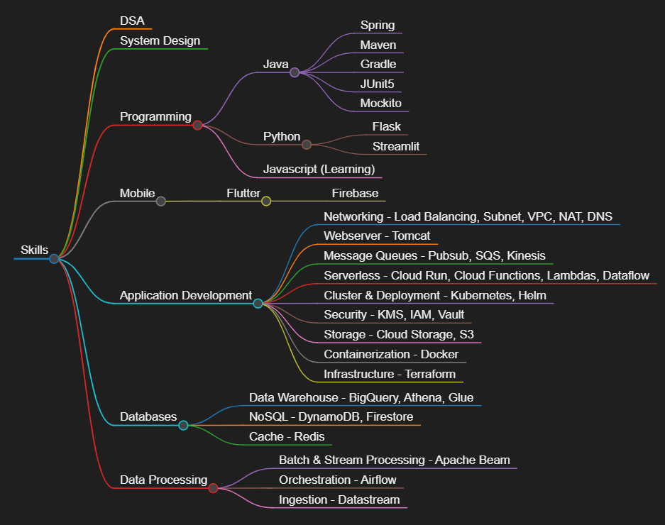

+++
title = 'About Me'
date = 2024-06-12T09:56:00+01:00
author = "Me"
showToc = false
TocOpen = false
draft = false
hidemeta = false
comments = false
disableShare = true
disableHLJS = false
hideSummary = false
searchHidden = true
ShowReadingTime = false
ShowShareButtons = false
ShowBreadCrumbs = false
ShowPostNavLinks = false
ShowWordCount = false
ShowRssButtonInSectionTermList = true
UseHugoToc = false
+++

My expertise lies in software architecture, system design, and data structures and algorithms. I am passionate about mentoring and continuously improving my skills. My technical skills encompass a wide range of cloud computing platforms, including GCP and AWS, with a focus on data engineering, AI, and machine learning. I am proficient in programming with Java and Python, mobile app development using Flutter and Firebase, and various DevOps practices. Additionally, I have experience with static and secure code analysis tools.

In my current role at Equifax, I lead Dev and SRE teams to deliver enterprise-level platform solutions, designed and developed a multimodal Chatbot, and processed high-volume financial transactions using a multi-cloud infrastructure. Previously, at Boeing, I managed large-scale data processing, optimized storage costs, and implemented Kubernetes clusters. My early career at Tayana involved benchmarking MySQL NDB and developing telecom protocols. I hold a B.E. in Electronics & Communication Engineering from Visveswaraya Technological University, with a project at ISRO and an internship at BSNL. My work has been recognized multiple times for exceptional performance and innovation.

