+++
title= "Architectural Patterns"
tags = [ "system-design", "architecture", "hld", "architectural-patterns" ]
date = 2024-08-26T00:01:00+05:30
author = "Me"
showToc = true
TocOpen = false
draft = true
hidemeta = false
comments = false
disableShare = false
disableHLJS = false
hideSummary = false
searchHidden = true
ShowReadingTime = true
ShowBreadCrumbs = true
ShowPostNavLinks = true
ShowWordCount = true
ShowRssButtonInSectionTermList = true
UseHugoToc = true
+++

## Architectural Building Blocks

### API Gateway

#### Overview

An API Gateway is an API management service that acts as an intermediary between clients and backend services. It uses the API composition pattern to aggregate multiple backend services into a single API endpoint that clients interact with. This abstraction provides several key benefits:

#### Benefits of an API Gateway

1. **Seamless Internal Changes**:
   - Facilitates internal system changes without impacting external API consumers. For example, it enables the splitting of a frontend service into different services for various devices without altering the external API.

2. **Consolidated Security**:
   - Centralizes security, authentication, and authorization. The API Gateway can handle SSL termination, enforce rate limits, and control access, ensuring secure interactions and protecting against malicious requests.

3. **Improved Performance**:
   - **Request Routing**: Routes client requests to the appropriate backend services and aggregates responses into a single response, reducing the number of client-side calls.
   - **Caching**: Stores responses to common requests, improving response times by serving cached data instead of querying backend services repeatedly.

4. **Enhanced Monitoring and Alerting**:
   - Provides real-time visibility into system traffic patterns and load. Enables monitoring and alerting for traffic anomalies, helping in system observability and proactive issue management.

5. **Protocol Translation**:
   - Handles protocol and format translation between clients and backend services. Supports integration with various external systems by converting different protocols and data formats as needed.

#### Best Practices and Anti-Patterns

1. **Avoid Business Logic**:
   - The API Gateway should not include business logic. Its primary functions should be API composition and request routing. Adding business logic can lead to a monolithic architecture and undermine the benefits of service decomposition.

2. **Single Point of Failure**:
   - An API Gateway can become a single point of failure. To address this, deploy multiple instances behind a load balancer and ensure robust release management to prevent service disruptions.

3. **Performance Overhead**:
   - While an API Gateway introduces some performance overhead, the overall benefits generally outweigh this. Avoid bypassing or over-optimizing the API Gateway, as this can reintroduce tight coupling and complicate client interactions.

### API Gateway Solutions & Cloud Technologies

#### Open Source API Gateways

##### Netflix Zuul
- **Description**: Zuul is a free and open-source application gateway written in Java.
- **Capabilities**: Provides dynamic routing, monitoring, resiliency, security, and more.

#### Cloud-Based API Gateways

##### Amazon API Gateway
- **Description**: A fully managed service for creating, publishing, maintaining, monitoring, and securing APIs at any scale.
- **Supports**: RESTful APIs and WebSocket APIs (bi-directional communication between client and server).

##### Google Cloud Platform API Gateway
- **Description**: Enables secure access to services through a well-defined REST API consistent across all services.
##### Microsoft Azure API Management
- **Description**: Helps organizations publish APIs to external, partner, and internal developers to unlock the potential of their data and services.

### Load Balancer

A **load balancer** is a fundamental building block in software architecture, especially for large-scale systems. Its primary role is to distribute incoming network traffic across multiple servers, ensuring no single server is overwhelmed. This distribution helps achieve high availability and horizontal scalability by running multiple instances of an application on different servers.

#### Motivation for Using Load Balancers

Without a load balancer, a client application would need to know the addresses and number of server instances directly. This tight coupling makes it challenging to modify the system's internal structure without affecting the client application. Load balancers provide an abstraction layer, making the entire system appear as a single server with immense computing power and memory.

#### Quality Attributes Provided by Load Balancers

1. **High Scalability**: 
   - Allows for scaling the system horizontally by adding or removing servers based on demand. In cloud environments, this can be automated with policies that react to metrics like request rate and bandwidth usage.

2. **High Availability**: 
   - Load balancers can monitor server health and route traffic only to healthy servers, ensuring continuous availability even if some servers fail.

3. **Performance**: 
   - While load balancers may introduce minimal latency, they enable higher throughput by distributing requests across multiple servers.

4. **Maintainability**: 
   - Facilitates rolling updates and maintenance by allowing servers to be taken offline for upgrades without disrupting the overall system.

##### Types of Load Balancers

1. **DNS Load Balancing**:

   - Uses DNS to map a domain name to multiple IP addresses. The list of addresses is rotated, balancing the load. However, this method lacks health checks and only supports simple round-robin strategies, making it less reliable and secure.

2. **Hardware Load Balancers**:
   - Dedicated devices optimized for load balancing tasks. They offer features like health checks, intelligent traffic distribution, and can secure the system by hiding internal server details.

3. **Software Load Balancers**:
   - Programs running on general-purpose hardware. They provide similar features to hardware load balancers but can be more flexible and cost-effective.

4. **Global Server Load Balancer (GSLB)**:

   - Combines DNS and load balancer functionalities, intelligently routing users based on location, server load, response time, and more. GSLBs are essential for multi-data center deployments and disaster recovery scenarios.

#### Load Balancing Solutions & Cloud Technologies

##### Open Source Software Load Balancing Solutions

###### HAProxy
HAProxy is a free and open-source, reliable, high-performance TCP/HTTP load balancer. It is particularly well-suited for high-traffic websites and powers many of the world's most visited ones. HAProxy is considered the de-facto standard open-source load balancer and is included with most mainstream Linux distributions. It supports most Unix-style operating systems.

###### NGINX
NGINX is a free, open-source, high-performance HTTP server and reverse proxy (load balancer). Known for its performance, stability, rich feature set, and simple configuration, NGINX is a popular choice for many applications. 

##### Cloud-Based Load Balancing Solutions

###### AWS - Elastic Load Balancing (ELB)
Amazon ELB is a highly scalable load balancing solution designed for use with AWS services. It operates in four modes:
- **Application (Layer 7) Load Balancer**: Ideal for advanced load balancing of HTTP and HTTPS traffic.
- **Network (Layer 4) Load Balancer**: Ideal for load balancing TCP and UDP traffic.
- **Gateway Load Balancer**: Ideal for deploying, scaling, and managing third-party virtual appliances.
- **Classic Load Balancer (Layer 4 and 7)**: Ideal for routing traffic to EC2 instances.

###### GCP - Cloud Load Balancing
Google Cloud Platform Load Balancer is a scalable and robust load-balancing solution. It allows you to put your resources behind a single IP address that is either externally accessible or internal to your Virtual Private Cloud (VPC) network. Available load balancer types include:
- **External HTTP(S) Load Balancer**: Externally facing HTTP(s) (Layer 7) load balancer.
- **Internal HTTP(S) Load Balancer**: Internal Layer 7 load balancer.
- **External TCP/UDP Network Load Balancer**: Externally facing TCP/UDP (Layer 4) load balancer.
- **Internal TCP/UDP Load Balancer**: Internally facing TCP/UDP (Layer 4) load balancer.

###### Microsoft Azure Load Balancer
Microsoft Azure provides three types of load balancers:
- **Standard Load Balancer**: Public and internal Layer 4 load balancer.
- **Gateway Load Balancer**: High performance and high availability load balancer for third-party Network Virtual Appliances.
- **Basic Load Balancer**: Ideal for small-scale applications.

##### GSLB Solutions

###### Amazon Route 53
Amazon Route 53 is a highly available and scalable cloud Domain Name System (DNS) web service.

###### AWS Global Accelerator
AWS Global Accelerator is a networking service that improves the availability, performance, and security of public applications.

###### Google Cloud Platform Load Balancer & Cloud DNS
Google Cloud Platform offers reliable, resilient, low-latency DNS services from its worldwide network, with comprehensive domain registration, management, and serving capabilities.

###### Azure Traffic Manager
Azure Traffic Manager provides DNS-based load balancing.

### Message Brokers: The Building Block for Asynchronous Architectures

A message broker is a software component that uses the queue data structure to store and manage messages between senders and receivers. Unlike load balancers, which manage external traffic and are visible to clients, message brokers operate internally within a system and are not exposed externally.

#### Synchronous Communication Drawbacks

In synchronous communication, both the sender and receiver must be active and maintain an open connection for the transaction to complete. This can lead to several issues:
- **Connection Dependence**: Both services must be healthy and running simultaneously.
- **Long Processing Times**: Services that take a long time to process requests can cause delays and hold up the entire system.
- **Traffic Handling**: Synchronous communication lacks the ability to handle sudden increases in traffic effectively.

**Example**: In a ticket reservation system, a frontend service must wait for the backend service to complete several operations before providing a response to the user. This creates a delay and can be problematic if the backend service crashes or if there’s a sudden spike in requests.

#### Benefits of Message Brokers

##### Decoupling and Asynchronous Processing

Message brokers allow services to communicate without requiring them to be available simultaneously. For instance:
- **Asynchronous Responses**: In the ticket reservation system, the user receives an immediate acknowledgment and the system processes the ticket reservation and payment in the background.
- **Service Decoupling**: Services can be broken down into smaller components, each handling a part of the transaction, and communicate through the message broker.

##### Buffering and Handling Traffic Spikes

Message brokers can queue messages, helping absorb traffic spikes. For example:
- **Order Fulfillment**: In an online store, orders can be queued during high traffic periods and processed sequentially when the load decreases.

##### Publish-Subscribe Pattern

Message brokers support the publish-subscribe pattern where:
- **Multiple Subscribers**: Different services can subscribe to the same channel to receive notifications or updates.
- **Flexible Integration**: New services can be added without altering existing systems, such as adding analytics or notification services.

#### Quality Attributes of Message Brokers

- **Fault Tolerance**: Message brokers enhance fault tolerance by allowing services to communicate even if some are temporarily unavailable.
- **Message Reliability**: They prevent message loss, contributing to higher system availability.
- **Scalability**: They help the system scale to handle high traffic by buffering messages.

#### Performance Considerations

While message brokers provide superior availability and scalability, they introduce some latency due to the indirection involved. However, this performance penalty is generally minimal for most systems.

#### Message Brokers Solutions & Cloud Technologies

#### Open Source Message Brokers

- **Apache Kafka**: The most popular open-source message broker today. Apache Kafka is a distributed event streaming platform used by thousands of companies for high-performance data pipelines, streaming analytics, data integration, and mission-critical applications.

- **RabbitMQ**: A widely deployed open-source message broker used globally by both small startups and large enterprises.

#### Cloud-Based Message Brokers

- **Amazon Simple Queue Service (SQS)**: A fully managed message queuing service that enables you to decouple and scale microservices, distributed systems, and serverless applications.

- **GCP Pub/Sub and Cloud Tasks**: Publisher/Subscriber and message queue solutions offered by Google Cloud Platform. 

- **Microsoft Azure**:
  - **Service Bus**: A fully managed enterprise message broker with message queues and publish-subscribe topics.
  - **Event Hubs**: A fully managed real-time data ingestion service that allows streaming millions of events per second from any source. Integrates seamlessly with Apache Kafka clients without code changes. Ideal for Big Data.
  - **Event Grid**: A reliable, serverless event delivery system at a massive scale. Uses the publish-subscribe model and is dynamically scalable. It offers a low-cost pay-as-you-go model and guarantees "at least once delivery of an event."

### Content Delivery Networks (CDNs)

#### Problem Addressed by CDNs
Even with distributed web hosting and technologies like Global Server Load Balancing, significant latency remains due to the physical distance between users and hosting servers, as well as the multiple network hops between routers.

#### Example of Latency Without CDN
- **User Location**: Brazil
- **Server Location**: East Coast, USA
- **Initial Latency**: 200 milliseconds
- **TCP Connection Latency**: 600 milliseconds (3-way handshake)
- **HTTP Request Latency**: 400 milliseconds
- **Asset Loading Latency**: 2,000 milliseconds
- **Total Latency**: Over 3 seconds

#### Introduction to CDNs
- **Definition**: A Content Delivery Network (CDN) is a globally distributed network of servers designed to speed up content delivery to end users.
- **Purpose**: Reduces latency by caching content on edge servers closer to users.
- **Usage**: Delivers webpage content, assets (images, text, CSS, JavaScript), and video streams.

#### Benefits of CDNs
1. **Faster Page Loads**: Reduces total latency to under one second by serving cached content from edge servers.
2. **Improved Availability**: Content is distributed, reducing the impact of server issues.
3. **Enhanced Security**: Protects against DDoS attacks by distributing traffic across multiple servers.

#### CDN Caching Strategies

##### Pull Strategy

- **How It Works**: CDN caches content on first request, subsequent requests are served from the cache.
- **Advantages**: Lower maintenance, CDN manages cache updates.
- **Drawbacks**: Initial latency for uncached assets, potential traffic spikes when assets expire simultaneously.

##### Push Strategy

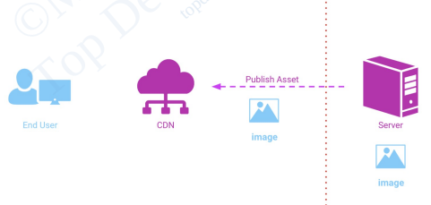

- **How It Works**: Content is manually or automatically uploaded to the CDN. Updates require re-publishing.
- **Advantages**: Reduces traffic to the origin server, maintains high availability even if the origin server is down.
- **Drawbacks**: Requires active management to update content, risk of serving outdated content if not updated.

#### CDN Solutions & Cloud Technologies

#### Cloudflare
- **Description**: Offers ultra-fast static and dynamic content delivery over a global edge network.
- **Benefits**: Reduces bandwidth costs and provides built-in unmetered DDoS protection.

#### Fastly
- **Description**: Deliver@Edge is a modern, efficient, and highly configurable CDN.
- **Benefits**: Provides control over content caching to deliver user-requested content quickly.

#### Akamai
- **Description**: Offers a variety of services including API Acceleration, Global Traffic Management, Image & Video Management, and Media Delivery.

#### Amazon CloudFront
- **Description**: A high-performance CDN service built for security and developer convenience.
- **Use Cases**: Delivers fast, secure websites, accelerates dynamic content and APIs, supports live streaming, and video-on-demand.

#### Google Cloud Platform CDN
- **Description**: Provides fast, reliable web and video content delivery with global scale and reach.

#### Microsoft Azure Content Delivery Network
- **Description**: Offers global coverage, full integration with Azure services, and a simple setup.

## Scalability Patterns

### Load Balancing in Scalable System Architectures

Load balancing is a software architecture pattern used to distribute incoming requests across multiple servers, allowing systems to scale efficiently and maintain performance under high traffic conditions. Single cloud servers are insufficient for handling high volumes of requests, leading to crashes or performance issues. Upgrading servers only postpones the problem. A dispatcher routes incoming requests to available worker servers, enabling load distribution and scalability.

#### Use Cases

- **HTTP Requests:** Distributes front-end requests (web/mobile) to back-end servers.
- **Microservices Architecture:** Manages service instances, enabling independent scaling for each service.

#### Implementation Methods

- **Cloud Load Balancing Services:**
  - Managed services that route requests and can scale automatically.
  - Avoid becoming a single point of failure.
    
- **Message Brokers:**
  - Used for asynchronous, one-directional communication between services.
  - Useful for internal load balancing of message queues.
    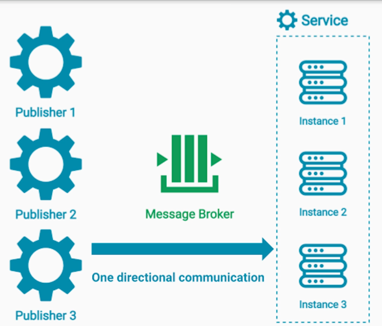

#### Routing Algorithms

- **Round Robin:** Sequentially distributes requests, suitable for stateless applications. Example: Most of the stateless API's
- **Sticky Sessions:** Routes requests from the same client to the same server, ideal for stateful applications. Example: Banking, Financial transactions, Multipart file upload.
- **Least Connection:** Directs requests to servers with the fewest active connections, suitable for long-term connections. Example: SQL, LDAP.

#### Auto Scaling Integration

- **Auto Scaling:** Automatically adjusts the number of servers based on metrics like CPU usage and traffic.
- Works in conjunction with load balancing to optimize resource use and cost.

##### Example of Auto Scaling Integration

**Scenario:**
A cloud-based e-commerce platform experiences variable traffic, with peaks during sales events and lower traffic during off-peak hours.

**Auto Scaling Integration Steps:**

1. **Monitoring and Metrics Collection:**

   - Server instances in the cloud environment run monitoring agents to collect metrics such as CPU utilization, memory usage, and network traffic.

2. **Defining Auto Scaling Policies:**

   - Policies are established based on the collected metrics. For example:
     - **Scale Up Policy:** Add more server instances if the average CPU utilization exceeds 70% for 5 consecutive minutes.
     - **Scale Down Policy:** Remove server instances if the average CPU utilization drops below 30% for 10 consecutive minutes.

3. **Load Balancer Coordination:**

   - The load balancer is configured to recognize the dynamic pool of server instances. It automatically adjusts the routing of incoming requests based on the current set of available instances.

4. **Implementation Example:**
   - **Cloud Load Balancer:** Utilizes a cloud provider's load balancing service to distribute incoming traffic across a pool of identical web server instances.
   - **Auto Scaling Group:** The web server instances are managed as an auto-scaling group within the cloud provider's infrastructure.
   - **Elasticity in Action:**
     - During a flash sale, the traffic spikes, causing the average CPU utilization to rise above 70%. The auto-scaling policy triggers, launching additional server instances to handle the increased load.
     - The load balancer detects the new instances and routes traffic to them, balancing the load.
     - After the sale, as traffic decreases, the average CPU utilization falls below 30%. The auto-scaling policy triggers the removal of excess instances, reducing costs.

**Benefits:**

- **Dynamic Scalability:** Automatically adapts to traffic changes, ensuring optimal performance.
- **Cost Efficiency:** Reduces infrastructure costs by scaling down during low-traffic periods.
- **Resilience:** Prevents server overload and potential crashes by distributing the load and adding capacity when necessary.

This example illustrates how auto scaling, combined with a load balancer, efficiently manages variable workloads in a cloud environment, providing both scalability and cost-effectiveness.

References

- [Google Compute Engine Autoscaling Groups](https://cloud.google.com/compute/docs/autoscaler)
- [GKE Cluster Autoscaling](https://cloud.google.com/kubernetes-engine/docs/concepts/cluster-autoscaler)
- [Amazon EC2 Autoscaling](https://docs.aws.amazon.com/autoscaling/ec2/userguide/what-is-amazon-ec2-auto-scaling.html)

#### Considerations

- **Session Management:** Choosing the right routing algorithm depends on whether the application is stateless or stateful.
- **Scalability and Cost Efficiency:** Combining load balancing with auto scaling helps in dynamically resizing the backend infrastructure, ensuring optimal resource utilization and cost savings.

This documentation outlines the essential aspects of implementing and managing load balancing in scalable system architectures, highlighting methods, algorithms, and practical considerations for effective deployment.

### Pipes and Filters Architecture Pattern

#### Overview

- **Analogy:** Data flows like water through a series of pipes and filters.
- **Components:**
  - **Data Source:** Origin of the data, e.g., backend services, sensors.
  - **Filters:** Isolated software components that process data.
  - **Pipes:** Mechanisms like distributed queues or message brokers that connect filters.
  - **Data Sink:** Final destination for processed data, e.g., databases, external services.

#### Key Concepts

- **Filters:** Perform single operations, unaware of the rest of the pipeline.
- **Pipes:** Can store data temporarily or use message systems for notifications.

#### Benefits

1. **Decoupling:**
   - Allows different processing tasks to use different programming languages and technologies.
2. **Hardware Optimization:**
   - Each task can run on the most suitable hardware (e.g., specialized hardware for machine learning).
3. **Scalability:**
   - Each filter can be scaled independently based on workload needs.

#### Real-World Use Cases

- **Digital Advertising:** Processing streams of user activity data.
- **Internet of Things (IoT):** Data processing from end devices.
- **Media Processing:**
  - Video and audio processing pipelines, including chunking, thumbnail creation, resolution resizing, adaptive streaming, and captioning.

#### Example: Video Sharing Service

1. **Video Processing Pipeline:**

- **Chunking:** Split video into smaller chunks.
- **Thumbnail Extraction:** Select frames as thumbnails.
- **Resolution and Bitrate Adjustment:** Resize chunks for adaptive streaming.
- **Encoding:** Encode chunks into different formats.

2. **Audio Processing Pipeline:**
   - **Transcription:** Convert speech to text.
   - **Captioning and Translation:** Provide captions and translate into different languages.
   - **Content Moderation:** Detect copyrighted or inappropriate content.

#### Considerations

1. **Complexity:**
   - Maintaining this architecture can be complex, especially with granular filters.
2. **Stateless Filters:**
   - Each filter should be independent and stateless.
3. **Transaction Handling:**
   - Not suitable for scenarios requiring a single transaction across the entire pipeline.

The pipes and filters pattern is valuable for scenarios needing flexible, scalable, and decoupled processing pipelines but may not be ideal for transactional data processing.

### Scatter-Gather Architecture Pattern

#### Overview

- **Components:**
  - **Sender/Requester:** Initiates the request.
  - **Workers:** Respond to the request; can be internal or external services.
  - **Dispatcher:** Distributes the request to all workers and collects responses.
  - **Aggregator:** Combines responses from workers into a single response.

#### Key Concepts

- **Parallel Processing:**
  - Requests are sent to all workers simultaneously, allowing for parallel processing.
  - Workers can be diverse, performing different functions or accessing different data.

#### Use Cases

1. **Search Services:**

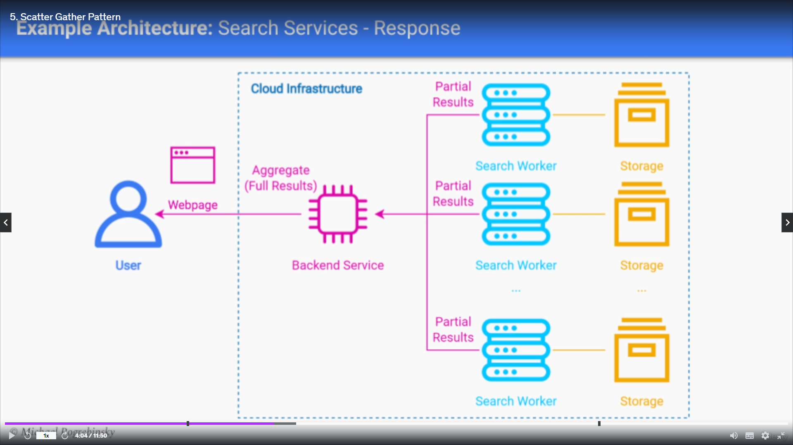

   - Users send a query, and internal workers search through various data subsets.
   - Results are aggregated and returned as a ranked list.

2. **Hospitality Services:**

   - A request for hotel availability is sent to multiple hotels.
   - Responses are collected and sorted based on criteria like price or rating.

#### Considerations

1. **Timeouts:**
   - Set an upper limit for waiting for worker responses to avoid delays due to unresponsive workers.
2. **Decoupling:**
   - Use a message broker to decouple the dispatcher and workers, facilitating asynchronous communication.
3. **Long-running Tasks:**
   - For tasks requiring extensive processing, separate the dispatcher and aggregator.
   - Use unique identifiers for tracking and retrieving results.

#### Example Workflow

1. **Immediate Response Use Case:**

   - Dispatcher sends a request to workers.
   - Workers process and return responses quickly.
   - Aggregator compiles the results and sends them to the user.

2. **Long-running Task Use Case:**
   - Dispatcher assigns a unique ID to the request and sends it to workers.
   - Workers return partial results with the same ID.
   - Aggregator stores and compiles results, accessible via the unique ID.

##### Benefits

- **Scalability:**
  - Supports high scalability by enabling parallel processing across numerous workers.
- **Flexibility:**
  - Can integrate diverse internal and external services.
- **Resilience:**
  - Can continue processing even if some workers are unavailable or slow.

The scatter-gather pattern is versatile and widely used in many production systems, providing efficient parallel processing and aggregation of results.

### Execution Orchestrator Pattern

#### Overview
- **Purpose:** Manages a sequence of operations across multiple services in microservices architecture.
- **Analogy:** Like a conductor in an orchestra, the orchestrator directs services without performing the business logic itself.

#### Key Concepts
- **Execution Orchestrator:** A centralized service that:
  - Calls different services in the right order.
  - Handles exceptions and retries.
  - Maintains the state of the flow until completion.
- **Microservices:** Individual services responsible for specific business logic, typically stateless and independently scalable.

#### Use Case Example: Video on Demand Service

- **User Registration Flow:**
  1. User fills out a registration form (username, password, payment).
  2. **Orchestrator Service** handles:
     - **User Service:** Validates username and password.
     - **Payment Service:** Authorizes credit card via a third-party API.
     - **Location Service:** Registers user location for content access.
     - **Recommendation Service:** Sets up user preferences.
     - **Email Service:** Sends a confirmation email with details.

#### Considerations
1. **Scalability:** 
   - Orchestrator and microservices can be scaled independently.
   - Orchestrator can be deployed across multiple instances for reliability.
2. **Failure and Recovery:**
   - Orchestrator handles errors, retries, and manages the flow's state.
   - Maintains a database to persist the state for recovery in case of failures.
3. **Avoiding Monolithic Tendencies:**
   - Keep the orchestrator focused on coordination, not business logic.

#### Benefits
- **Decoupling:** Microservices operate independently and are unaware of the orchestration.
- **Efficiency:** Supports parallel and sequential operations.
- **Flexibility:** Easy to modify the flow by updating the orchestrator.

This pattern is particularly useful in complex systems requiring coordination of multiple independent services, offering a scalable and maintainable solution for executing business logic workflows.

### Choreography Pattern

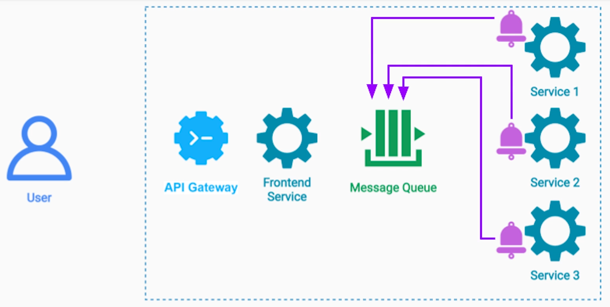

#### Overview
- **Purpose:** Helps scale complex flows of business transactions in microservices architecture.
- **Comparison:** Unlike the orchestration pattern, choreography uses asynchronous events without a central orchestrator.

#### Key Concepts
- **Microservices:** Decoupled services that communicate through a message broker.
- **Message Broker:** A distributed message queue that stores and distributes events.

#### Advantages
- **Loose Coupling:** Services operate independently and are not tightly coupled through a central orchestrator.
- **Scalability:** Easy to add or remove services and scale operations.
- **Cost Efficiency:** Services can be implemented as functions that only run when triggered, saving resources.

#### Example: Job Search Service

1. **User Registration:** 
   - User submits a form with their details and resume.
   - **Candidate Service:** Stores data and emits an event.
2. **Email Confirmation:** 
   - Triggered by the event, an email confirmation is sent to the user.
3. **Skills Parsing:** 
   - **Skills Parser Service:** Extracts and stores skills data, then emits an event.
4. **Job Search:** 
   - **Job Search Service:** Searches for job matches and emits results as an event.
5. **Job Notifications:** 
   - **Candidate Service:** Updates user records.
   - **Email Service:** Sends job notifications based on user preferences.

#### Considerations
1. **Debugging Challenges:** 
   - Troubleshooting issues can be difficult due to lack of a central coordinator.
   - Harder to trace the flow of events and identify issues.
2. **Testing Complexity:** 
   - Requires complex integration tests to catch issues before production.
   - Becomes more challenging as the number of services grows.

## Performance Patterns

### MapReduce Pattern

#### Overview
- **Origin:** Introduced by Jeff Dean and S.J. Ghemawat from Google in 2004.
- **Purpose:** Simplifies processing of large data sets by distributing computation across many machines.

#### Key Concepts
- **Map Function:** Transforms input key-value pairs into intermediate key-value pairs.
- **Reduce Function:** Aggregates and processes intermediate pairs to produce final output.

#### Example: Word Count in Text Files
1. **Input:** Key-value pairs (filename, content).
2. **Map Function:** Emits (word, 1) for each word in the content.
3. **Shuffle and Sort:** Groups intermediate pairs by word.
4. **Reduce Function:** Sums the counts for each word.

#### Architecture

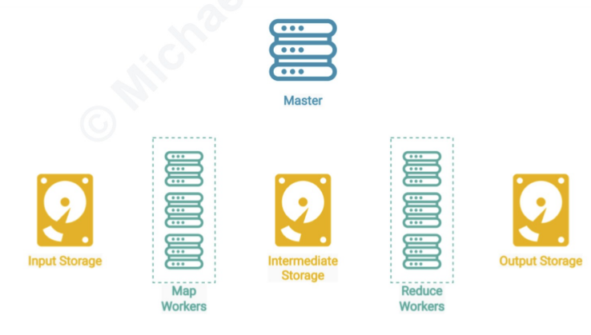
> TODO: Add backup master and snapshot storage in the image

- **Master Node:** Orchestrates the computation, schedules tasks, and handles failures.
- **Worker Nodes:** Execute map and reduce tasks in parallel.
- **Data Distribution:** Input data is split into chunks for parallel processing.

#### Fault Tolerance
- **Worker Failures:** Master reassigns tasks and notifies reduce workers of new data locations.
- **Master Failures:** Can either restart the process or use a backup master to continue.

#### Cloud Integration
- **Scalability:** Cloud environments provide access to many machines, enabling large-scale data processing.
- **Cost Efficiency:** MapReduce's batch processing nature means paying only for resources used during the job, not for maintaining idle machines.

### Saga Pattern

#### Introduction
- **Context:** Microservices architecture, where each service has its own database.
- **Problem:** Ensuring data consistency across multiple databases without a central database, losing traditional ACID transactions.

#### Solution: Saga Pattern

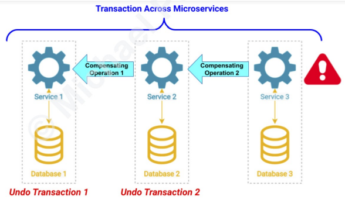

- **Definition:** Manages data consistency in distributed transactions by breaking them into a series of local transactions. If an operation fails, compensating transactions are executed to roll back.

#### Implementation Methods
1. **Execution Orchestrator Pattern:**
   - A central orchestrator service manages the transaction flow, calling services sequentially.
   - Decides whether to continue or rollback based on service responses.

2. **Choreography Pattern:**
   - No central orchestrator; services communicate through a message broker.
   - Each service listens for events and triggers subsequent steps or compensations as needed.

#### Example Scenario: Ticket Reservation System

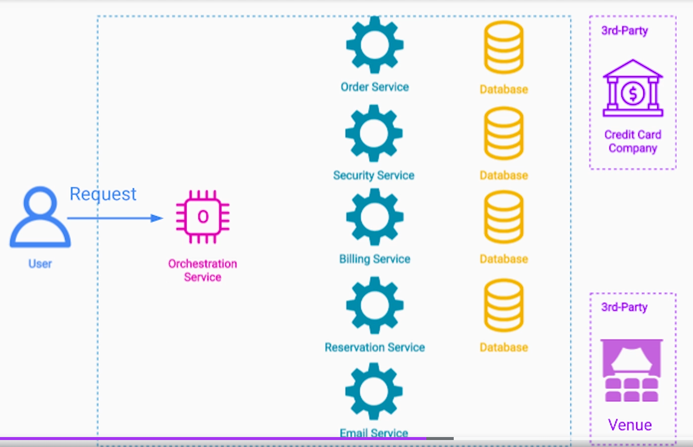

1. **Services Involved:** Order, Security, Billing, Reservation, Email, (Orchestration if using orchestrator pattern).
2. **Process:**
   - **Order Service:** Registers an order and sets it to pending.
   - **Security Service:** Validates the user (not a bot or blacklisted).
   - **Billing Service:** Authorizes the pending transaction on the user's credit card.
   - **Reservation Service:** Reserves the ticket for the user.
   - **Email Service:** Sends a confirmation email.

3. **Failure Handling:**
   - If any service returns a failure, compensating operations are triggered:
     - Cancel pending transactions.
     - Remove records from databases.
   - Compensating operations ensure consistency by undoing previous steps if necessary.

#### Conclusion
- **Purpose:** Maintains data consistency in a microservices environment by handling distributed transactions.
- **Flexibility:** Can be implemented using either the execution orchestrator pattern or the choreography pattern.
- **Resilience:** Provides mechanisms to complete transactions or roll back in case of failures.

The saga pattern is crucial for ensuring reliable operations and consistency in complex systems with distributed architectures.

### Transactional Outbox Pattern

#### Overview
- **Problem:** In event-driven architectures, ensuring that a database update and an event publication occur together reliably can be challenging. Specifically, there's a risk of losing events or data if a system crash occurs between these operations.

#### Solution: Transactional Outbox Pattern
- **Concept:** Involves adding an **Outbox Table** to the database to store messages intended for the message broker. Updates to both the business logic table (e.g., users) and the Outbox Table are performed within a single database transaction.

#### Implementation Steps
1. **Database Update and Message Logging:**
   - Instead of sending an event directly to the message broker, the service logs the message to the Outbox Table along with updating the primary business logic table.
   - Ensures atomicity: Both tables are updated together, or neither is, preventing partial updates.

2. **Message Sender/Relay Service:**
   - A separate service monitors the Outbox Table for new messages.
   - Upon finding a new message, it sends it to the message broker and marks it as sent (or deletes it).

#### Addressing Potential Issues
1. **Duplicate Events:**
   - **Cause:** A crash between sending a message and marking it as sent can result in duplicate events.
   - **Solution:** Implement "at least once" delivery semantics. Each message gets a unique ID. Consumers track processed message IDs to discard duplicates.

2. **Lack of Transaction Support:**
   - **Scenario:** Some databases, especially NoSQL ones, may not support multi-collection transactions.
   - **Solution:** Embed the Outbox message directly within the same document (or object) in the database. The sender service queries for documents with messages, sends them, and then clears the messages.

3. **Ordering of Events:**
   - **Problem:** Ensuring the order of related events, such as a user signup followed by a cancellation.
   - **Solution:** Assign each message a sequential ID. The sender service can then sort and send messages in the correct order based on these IDs.

#### Conclusion
- **Benefits:** The transactional outbox pattern provides a robust solution for ensuring data consistency and reliable event publication in distributed systems.
- **Considerations:** Addressing potential issues like duplicate events, lack of transaction support, and event ordering is crucial for effective implementation.

The transactional outbox pattern is an essential tool for maintaining consistency in microservices architectures, particularly in systems that rely heavily on event-driven communication.

### Materialized View Pattern

#### Overview
- **Purpose:** To optimize performance and cost efficiency in data-intensive applications by pre-computing and storing query results.

#### Problem Statement
1. **Performance:** Complex queries, especially those involving multiple tables or databases, can be slow.
2. **Cost:** Repeatedly running the same complex queries can be resource-intensive, leading to high costs in a cloud environment.

#### Solution: Materialized View
- **Concept:** Create a read-only table (materialized view) that stores the pre-computed results of a specific query. This allows for quick data retrieval without recalculating the query each time.

#### Implementation
1. **Data Storage:**
   - Store materialized views as separate tables in the same database or in a read-optimized separate database.
   - In cases of frequent data updates, the materialized view can be regenerated immediately or on a fixed schedule.

2. **Example Use Case:**
   - **Scenario:** An online education platform with tables for courses and reviews.
   - **Need:** Display top courses based on average ratings for a specific topic.
   - **Solution:** Create a materialized view storing pre-computed course ratings, which can be filtered quickly based on the topic.

3. **Benefits:**
   - **Performance:** Significantly reduces query time by avoiding complex aggregations and joins.
   - **Cost Efficiency:** Saves resources by reducing the need for repeated complex query execution.

#### Considerations
1. **Storage Space:** Materialized views require additional storage, increasing costs. The trade-off between performance and space must be evaluated.
2. **Update Frequency:** 
   - **Same Database:** If the database supports materialized views, updates can be automatic and efficient.
   - **External Storage:** Requires manual or programmatic updates, which can add complexity.

#### Conclusion
- The materialized view pattern is a powerful tool for optimizing the performance of data-intensive applications. By pre-computing and storing query results, this pattern improves user experience and reduces operational costs, especially in environments where resource usage incurs significant expenses.

### CQRS (Command and Query Responsibility Segregation)

#### Overview
- **Purpose:** To separate the command (write) and query (read) responsibilities in a system into distinct services and databases, optimizing each for its specific workload.

#### Key Concepts
1. **Command Operations:** Actions that mutate data, such as insertions, updates, and deletions.
2. **Query Operations:** Actions that read and return data without altering it.

#### Benefits of CQRS
1. **Separation of Concerns:** 
   - Command service handles business logic, validations, and data mutations.
   - Query service focuses solely on data retrieval and presentation.
2. **Independent Scalability:** 
   - The number of instances for each service can be scaled independently based on demand.
3. **Optimized Data Models:** 
   - Command database can be optimized for write operations.
   - Query database can be optimized for read operations, often using different database technologies.

#### Example Use Case: Online Store
- **Command Side:** 
  - Stores user reviews in a relational database.
  - Ensures business logic, such as validating purchases and review content.
- **Query Side:** 
  - Stores reviews and average ratings in a NoSQL database, optimized for quick retrieval.
  - Contains pre-aggregated data to minimize real-time computations.

#### Synchronization
- **Event Publishing:** 
  - On data mutation, the command service publishes events to keep the query database updated.
  - Can use message brokers or functions-as-a-service for event handling and data synchronization.
- **Eventual Consistency:** 
  - The system guarantees eventual consistency between command and query databases but not strict consistency.

#### Considerations
- **Complexity:** 
  - Requires managing multiple services, databases, and synchronization mechanisms.
  - Adds overhead but provides significant performance benefits.
- **Eventual Consistency:** 
  - Suitable for scenarios where eventual consistency is acceptable, not for strict consistency requirements.

### Combining CQRS and Materialized View Patterns in Microservices

#### Overview
- **Problem:** In a microservices architecture, data is often split across multiple services and databases, making it challenging to aggregate data efficiently for queries.
- **Solution:** Use a combination of CQRS and materialized view patterns to optimize data retrieval and maintain synchronization across services.

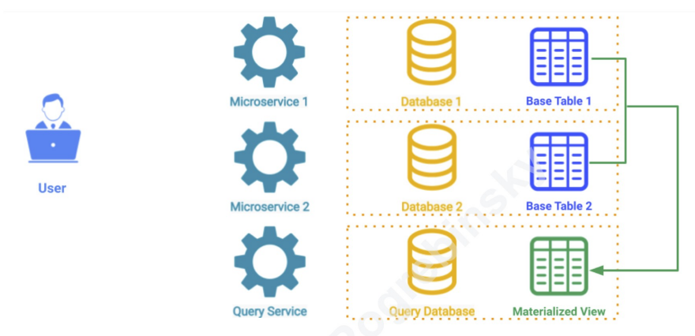

#### Key Concepts
1. **Microservices Split:** 
   - Initially, all data might reside in a single database. Splitting into microservices involves dividing this data into separate databases, each handled by a specific service.
   - This division prevents traditional join operations across different microservices' databases.

2. **Performance Challenges:** 
   - Aggregating data across multiple services requires API calls, database queries, and programmatic joins, leading to significant performance overhead.

#### Solution: Combining Patterns
1. **CQRS (Command and Query Responsibility Segregation):**
   - Create a new microservice with a read-optimized database specifically for querying aggregated data.
   - This microservice only handles queries and does not perform data mutations.

2. **Materialized View:**
   - A materialized view is created to pre-aggregate and store relevant data from multiple microservices.
   - The view includes data necessary for user queries, combining information from different microservices.

#### Synchronization Methods
1. **Message Broker:**
   - Each microservice publishes events to a message broker when data changes.
   - The query microservice listens to these events and updates the materialized view accordingly.

2. **Cloud Function:**
   - A function as a service monitors tables in different services' databases.
   - On detecting changes, the function updates the materialized view in the query database.

#### Real-World Example: Online Education Platform
- **Setup:**
  - *Courses Microservice:* Manages course data (name, description, price).
  - *Reviews Microservice:* Handles reviews and ratings.
  - *Course Search Service:* New service with a materialized view that includes course details and reviews.

- **Data Flow:**
  - Changes in the course details or reviews trigger events.
  - The Course Search Service updates its materialized view based on these events, ensuring quick access to aggregated data.

#### Benefits
- **Efficient Data Aggregation:** 
  - Combines data from multiple microservices into a single, query-optimized view.
- **Performance Optimization:** 
  - Reduces the need for complex, runtime data joins and minimizes latency.
- **Scalability and Maintainability:** 
  - Isolates query logic, making it easier to maintain and scale based on query load.

#### Conclusion
- The combination of CQRS and materialized views effectively addresses the challenges of data aggregation in microservices architectures. This approach optimizes data retrieval, maintains synchronization, and allows for scalable and maintainable systems.

### Event Sourcing Pattern

#### Overview
Event sourcing is an architecture pattern where the state of an application is derived from a sequence of events rather than storing the current state directly.

 

#### Traditional Data Handling
- **CRUD Operations:** Applications typically use Create, Read, Update, and Delete operations to manage data, focusing on the current state.
- **Current State:** The database stores the current state of entities, and any modifications overwrite previous states.

#### Need for Event Sourcing
- **Limited by Current State:** In some cases, knowing only the current state isn't sufficient. Historical data or the sequence of changes may be crucial.
- **Examples:**
  - **Banking:** Clients need to see transaction histories, not just current balances.
  - **E-commerce:** Merchants might need to understand inventory changes, not just the current stock level.

#### Event Sourcing Explained
- **Events Over State:** Instead of the current state, the system stores events that describe changes or facts about entities.
- **Immutability:** Events are immutable; once logged, they cannot be changed.
- **Replaying Events:** The current state is derived by replaying all events related to an entity.

#### Benefits of Event Sourcing
- **Complete History:** Retains a full history of changes, useful for auditing and troubleshooting.
- **Performance:** Improved write performance, as events are appended rather than updating a state.

#### Storing Events
1. **Database:** Each event can be stored as a record, allowing for complex queries and analytics.
2. **Message Broker:** Events can be published for consumption by other services, ensuring order and scalability.

#### Challenges and Optimizations
- **Replaying All Events:** Reconstructing state by replaying all events can be inefficient.
  - **Snapshots:** Periodically save the current state to reduce the number of events replayed.
  - **CQRS (Command Query Responsibility Segregation):** Separate systems for handling commands (writes) and queries (reads). This allows for efficient read operations using a read-optimized database.

#### Combining Event Sourcing and CQRS
- **Eventual Consistency:** Combining these patterns often results in eventual consistency, which may be acceptable depending on the use case.
- **Benefits:**
  - **Auditing and History:** Complete record of all changes.
  - **Efficient Writes and Reads:** Separate systems optimize performance.

### Big Data Processing and Lambda Architecture

#### Overview

In big data processing, two main strategies exist: batch processing and real-time processing. Batch processing allows for deep insights into historical data and the fusion of data from various sources, but it has a higher delay between data collection and availability for querying. Real-time processing provides immediate visibility and response to incoming data but is limited to recent information without deep historical context.

#### The Challenge

Deciding between batch and real-time processing can be difficult, as many systems require the benefits of both strategies. For instance, systems that aggregate logs and performance metrics, or those used in ride-sharing services, need both real-time insights for immediate actions and historical analysis for detecting patterns and optimizing performance.

#### Lambda Architecture

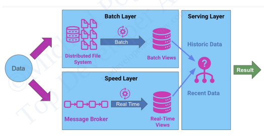

The Lambda Architecture addresses this challenge by combining batch and real-time processing, offering the best of both worlds. It consists of three layers:

1. **Batch Layer**: 
   - Manages the master dataset as a system of records, storing immutable data.
   - Pre-computes batch views for in-depth analysis and data corrections.
   - Operates on the entire dataset for perfect accuracy.

2. **Speed Layer**: 
   - Handles real-time data processing to provide low-latency views.
   - Processes data as it arrives and updates real-time views.
   - Focuses on recent data without complex corrections or historical context.

3. **Serving Layer**: 
   - Merges data from both batch and real-time views.
   - Responds to ad-hoc queries, providing a comprehensive view combining historical and real-time data.

#### Practical Application

A practical example of Lambda Architecture is in the ad tech industry, where advertisers and content producers interact through an ad-serving system. The system must process three types of events: ad views, ad clicks, and user purchases. These events are processed by both the batch and speed layers to provide:

- Real-time data, such as the number of users currently viewing ads.
- Combined data for queries like the total ads shown in the last 24 hours, merging batch and speed layer data.
- In-depth analysis, like determining the return on investment for advertisers, which requires historical data fusion and analytics.

#### Conclusion

Lambda Architecture effectively handles scenarios requiring both real-time and batch processing capabilities. It allows for comprehensive data analysis and immediate responsiveness, making it a versatile solution for modern big data systems.

## Software Extensibility Patterns 

### Extensibility Patterns: Sidecar

#### Overview
The **Sidecar** pattern is an extensibility pattern used to extend the functionality of a service without embedding additional logic directly into the service. This approach allows for modular and scalable systems.

#### Problem to Solve
- **Additional Functionality Needs:** Services often require extra capabilities like logging, monitoring, or configuration management, beyond their core business logic.
- **Challenges:**
  - **Library Reuse:** In a multi-language environment, reusing libraries across services is impractical and can lead to inconsistencies.
  - **Separate Services:** Deploying shared functionalities as separate services can be excessive and complex.

#### Sidecar Pattern

- **Analogy:** Like a sidecar on a motorcycle, this pattern adds extra functionality as a separate process or container alongside the main service.
- **Benefits:**
  - **Isolation:** Provides separation between the core service and the sidecar, reducing potential conflicts.
  - **Shared Resources:** Both the main service and the sidecar share the same host, allowing fast and reliable communication.
  - **Language Independence:** Sidecars can be implemented in any language and reused across different services.
  - **Simplified Updates:** Updates to sidecar functionalities can be rolled out across all services simultaneously.

#### Ambassador Sidecar
- **Function:** A specific type of sidecar that acts as a proxy for handling network requests.
- **Advantages:**
  - **Complexity Offloading:** Manages network communication complexities, including retries, authentication, and routing.
  - **Simplified Core Service:** Keeps the core service focused on business logic, while the ambassador handles network concerns.
  - **Distributed Tracing:** Enables instrumentation and tracing across services, aiding in troubleshooting and isolating issues.

### Anti-Corruption Adapter Pattern

#### Introduction
The **Anti-Corruption Adapter Pattern** is a crucial software architecture pattern used to manage interactions between systems with different technologies, protocols, or data models. It prevents the corruption of a new system by the legacy system during integration or migration processes.

#### Scenarios and Solutions

1. **Migration from Monolith to Microservices:**
   - **Problem:** During migration from a monolithic system to microservices, new services may need to interact with old technologies, APIs, or data models. This can corrupt the clean design of new services.
   - **Solution:** Implement an Anti-Corruption Adapter (ACA) service that acts as a mediator. The ACA translates communications, allowing new microservices to interact with the monolithic application using modern technologies, while the monolith continues to operate as before.

2. **Coexistence with Legacy Systems:**
   - **Problem:** Sometimes, parts of the legacy system cannot be fully migrated or replaced due to various constraints, such as high costs or critical dependencies.
   - **Solution:** The ACA enables the new system to leverage legacy components without inheriting outdated logic or technologies. This allows the legacy system to remain as-is, while the new system evolves independently.

#### Benefits
- **Isolation:** The ACA isolates new and old systems, preventing legacy logic from contaminating new architectures.
- **Seamless Integration:** It allows for smooth interaction between systems with different technologies or data models.
- **Gradual Migration:** Facilitates gradual migration from old to new systems without disrupting business operations.

#### Challenges
- **Development and Maintenance:** The ACA itself is a service that requires development, testing, and maintenance like any other component.
- **Performance Overhead:** The translation process can introduce latency and may require scaling to avoid becoming a bottleneck.
- **Cost:** In a cloud environment, the ACA can incur additional costs, particularly if run continuously. Deploying it as a Function-as-a-Service (FaaS) can help mitigate these costs if usage is infrequent.

#### Conclusion
The Anti-Corruption Adapter Pattern is valuable for maintaining the integrity and cleanliness of new systems while interacting with legacy components. It is particularly useful in scenarios involving system migration or the need for long-term coexistence with legacy systems. However, it comes with trade-offs, including potential latency and additional costs.

This pattern helps balance the evolution of technology stacks while minimizing disruption and preserving system integrity.

### Backends for Frontends (BFF) Pattern

#### Introduction
The **Backends for Frontends (BFF)** pattern addresses the challenges of supporting different frontend applications (e.g., web, mobile, desktop) with a single monolithic backend. This pattern involves creating separate backend services, each tailored to the specific needs and features of a particular frontend.

#### Problem Statement
In a typical e-commerce system with a microservices architecture:
- The frontend code running in browsers interacts with a backend that serves static and dynamic content.
- Over time, as the system grows and more frontend types (e.g., mobile, desktop) are introduced, the backend becomes complex, supporting diverse features and device-specific needs.
- This complexity leads to a monolithic backend that struggles to provide optimal experiences for different devices.

#### Solution: BFF Pattern

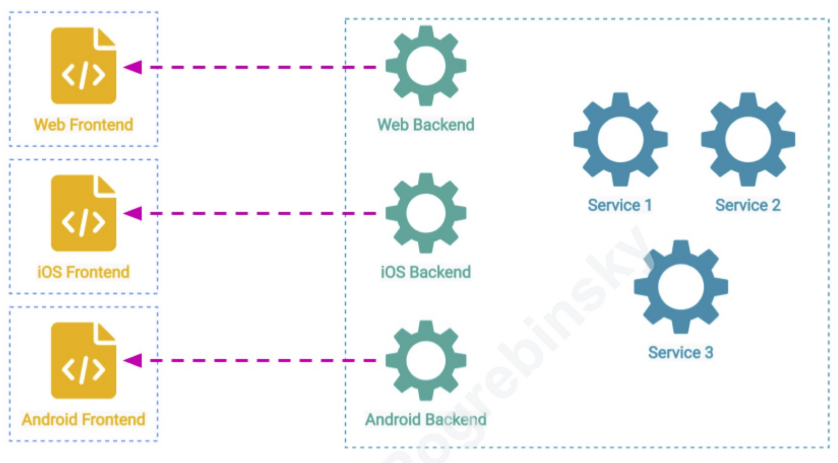

The BFF pattern proposes creating distinct backend services for each frontend type:
- **Frontend-Specific Backends:** Each backend service is dedicated to a particular frontend, containing only the relevant functionality. This results in smaller, more manageable codebases and services that can be optimized for specific devices (e.g., mobile vs. desktop).
- **Full Stack Teams:** Teams can work as full stack developers, managing both the frontend and the corresponding backend, streamlining the development and deployment process.

#### Benefits
- **Optimized User Experience:** Each backend is tailored to the unique capabilities and needs of its corresponding frontend, providing a better user experience.
- **Reduced Complexity:** Smaller, frontend-specific backends are easier to manage and evolve.
- **Independent Development:** Teams can work independently without depending on a separate backend team, reducing coordination overhead.

#### Challenges
1. **Shared Functionality:**
   - **Duplication Risk:** There may be shared logic or business rules needed across multiple backends (e.g., authentication, checkout process).
   - **Solutions:** 
     - **Shared Libraries:** Suitable for small, stable pieces of logic but can lead to tight coupling and maintenance issues.
     - **Separate Services:** Creating dedicated services for shared functionality with clear APIs and ownership, ensuring consistency without duplication.

2. **Granularity Decision:**
   - Determining the appropriate level of granularity depends on the uniqueness of the experiences across different platforms. For example, separate backends for Android and iOS are justified if their user experiences are significantly different.

3. **Cloud Deployment Considerations:**
   - In a cloud environment, smaller and less powerful virtual machines can replace the original monolithic backend. The choice of hardware can be optimized for the specific demands of each frontend (e.g., CPU or memory requirements).
   - Load balancing can be used to route requests to the appropriate backend, using URL paths, parameters, or HTTP headers like the user agent.

#### Conclusion
The BFF pattern helps manage the complexity and scalability of systems supporting multiple frontend types by creating dedicated backends. This approach improves user experience, reduces development friction, and allows for independent and efficient development. However, it requires careful management of shared functionality and thoughtful decisions regarding service granularity.

## Reliability & Error Handling Patterns

### Throttling or Rate Limiting Pattern

#### Introduction
The **Throttling or Rate Limiting** pattern is designed to enhance system reliability by controlling the rate at which resources are consumed. It helps prevent overconsumption of system resources, whether due to malicious activity, legitimate high traffic, or interactions with external services.

#### Problem Statement

Two main issues this pattern addresses:
1. **Overconsumption of Resources:** 
   - High request rates can lead to system overload, potentially causing slowdowns or outages.
   - Unexpected traffic spikes can trigger costly auto-scaling, resulting in financial strain.
2. **Overspending on External Services:** 
   - Systems interacting with external APIs or cloud services can accidentally consume more resources than budgeted, leading to unexpectedly high costs.

#### Types of Throttling
1. **Server-Side Throttling:** 
   - Limits the number of requests to protect the system's backend from overconsumption.
   - Common in scenarios where the system serves multiple clients through an API.

2. **Client-Side Throttling:** 
   - Prevents a client from exceeding a predetermined budget when calling external services.
   - Used when a system consumes external APIs or cloud services to avoid overspending.

#### Strategies for Handling Exceeding Limits
1. **Dropping Requests:** 
   - Requests exceeding the rate limit are dropped. An error response (e.g., HTTP 429 "Too Many Requests") can inform the client.
   - Suitable for non-critical services like fetching real-time data (e.g., stock prices).

2. **Queuing Requests:** 
   - Requests are queued and processed later when capacity allows.
   - Useful for critical operations like executing trades, where delaying is preferable to dropping.

3. **Service Degradation:** 
   - Adjust service quality instead of dropping or delaying requests, such as reducing video quality in streaming services.
   - Can also set an upper limit on resource usage, like the number of media items accessed per day.

#### Considerations for Implementation
1. **Global vs. Customer-Based Throttling:**
   - **Global Throttling:** A single limit applies to all clients, ensuring overall system stability but risking unfair resource allocation.
   - **Customer-Based Throttling:** Individual limits for each client, ensuring fair resource distribution but complicating total request rate management.

2. **External vs. Service-Based Throttling:**
   - **External Throttling:** Limits based on the overall number of API calls from clients, straightforward but can lead to internal service overload.
   - **Service-Based Throttling:** Specific limits for internal services, requiring complex tracking but better protecting individual system components.

#### Conclusion
Throttling is crucial for maintaining system reliability and controlling costs. The choice between different throttling strategies—global vs. customer-based, external vs. service-based—depends on the specific use case and system requirements. Understanding these considerations helps in implementing an effective throttling strategy that balances performance, cost, and resource allocation.

### Retry Pattern

#### Introduction
The **Retry Pattern** is a reliability architecture pattern used to handle errors by retrying operations that have failed. This pattern helps recover from transient issues in a system, such as network failures or temporary unavailability of services.

#### Problem Statement
In cloud environments, errors can occur at any time due to software, hardware, or network issues. When a client calls a service, which in turn may call another service, these errors can cause delays, timeouts, or outright failures. The Retry Pattern aims to handle such situations by retrying failed operations.

#### Key Considerations

1. **Error Categorization:**
   - **User Errors:** Errors caused by invalid user actions (e.g., HTTP 403 Unauthorized). These should not be retried; instead, return the error to the user.
   - **System Errors:** Internal errors that may be transient and recoverable (e.g., HTTP 503 Service Unavailable). These are candidates for retries.

2. **Choosing Errors to Retry:**
   - Only retry errors that are likely to be temporary and recoverable, such as timeouts or service unavailability.

3. **Delay and Backoff Strategies:**
   - **Fixed Delay:** A constant delay between retries (e.g., 100 ms).
   - **Incremental Delay:** Increasing the delay gradually after each retry (e.g., 100 ms, 200 ms, 300 ms).
   - **Exponential Backoff:** Exponentially increasing delay (e.g., 100 ms, 200 ms, 400 ms, 800 ms) to reduce load on recovering services.

4. **Randomization (Jitter):**
   - Adding randomness to the delay helps spread out retry attempts, reducing the chance of overloading the system simultaneously.

5. **Retry Limits and Time Boxing:**
   - Set limits on the number of retries or a maximum time period for retries to prevent indefinite retry attempts.

6. **Idempotency:**
   - Ensure that retrying an operation does not cause unintended side effects, such as double billing in a payment system. Only idempotent operations should be retried safely.

7. **Implementation Strategies:**
   - **Shared Library:** Implement retry logic in a reusable library or module.
   - **Ambassador Pattern:** Separate the retry logic from the main application code by running it as a separate process on the same server.

#### Conclusion
The Retry Pattern is a simple yet effective method for handling transient errors in a system. However, careful implementation is crucial to avoid pitfalls like retry storms, and to ensure retries are applied only in appropriate situations. Properly applying the Retry Pattern can enhance system reliability and provide a smoother experience for users.

### Circuit Breaker Pattern

#### Introduction
The **Circuit Breaker Pattern** is a software architecture pattern used to handle long-lasting errors and prevent cascading failures. It contrasts with the Retry Pattern, which is used for short, recoverable issues. The Circuit Breaker Pattern prevents requests from being sent to a failing service, thus saving resources and improving system stability.

#### Real-Life Example
Consider an online dating service that fetches profile images from an image service. If the image service is down for a significant time, retrying requests is futile. Instead, using a circuit breaker can prevent further attempts and conserve resources.

#### Key Concepts

1. **Circuit States:**
   - **Closed:** All requests are allowed through, and the system tracks success and failure rates.
   - **Open:** No requests are allowed through; failures are assumed to continue. The system immediately returns errors.
   - **Half-Open:** A limited number of requests are allowed to test if the service has recovered.

2. **Operation**
   - The circuit starts in a **Closed** state, allowing requests and tracking failures. If failures exceed a certain threshold, the circuit moves to an **Open** state, blocking requests. After a timeout, it transitions to a **Half-Open** state to test the service's health. Depending on the results, it either closes the circuit or returns to the open state.

#### Implementation Considerations

1. **Handling Requests in Open State:**
   - **Drop Requests:** Simply ignore them, with proper logging for analysis.
   - **Log and Replay:** Record the requests for later processing, useful in critical systems like e-commerce.

2. **Response Strategy in Open State:**
   - **Fail Silently:** Return empty responses or placeholders (e.g., a placeholder image in a dating app).
   - **Best Effort:** Provide cached or old data if available.

3. **Separate Circuit Breakers for Each Service:**
   - Each external service should have its own circuit breaker to prevent one failing service from affecting others.

4. **Asynchronous Health Checks:**
   - Instead of real requests in the Half-Open state, use small, asynchronous health checks to determine service recovery. This approach conserves resources and reduces impact on the recovering service.

5. **Implementation Location:**
   - As with the Retry Pattern, the Circuit Breaker can be implemented as a shared library or through an Ambassador Sidecar, especially useful for services in different programming languages.

#### Conclusion
The Circuit Breaker Pattern is crucial for managing long-lasting errors, preventing resource waste, and improving system resilience. It involves careful consideration of how to handle failed requests, the state management of the circuit, and the method of implementation. Properly implementing this pattern can significantly enhance the stability and reliability of a distributed system.

### Dead Letter Queue Pattern

#### Overview
The **Dead Letter Queue (DLQ)** pattern is designed to handle message delivery failures in an event-driven architecture. It helps manage errors in publishing and consuming messages through a message broker or distributed messaging system.

#### Event-Driven Architecture

In an event-driven system, three key components are involved:
- **Event Publishers:** Produce messages or events.
- **Message Broker:** Manages channels, topics, or queues for message distribution.
- **Consumers:** Read and process incoming messages.

While this architecture offers benefits like decoupling and scalability, it also introduces potential points of failure.

#### Real-Life Example
Consider an online store with:
- **Order Service:** Publishes order events.
- **Inventory, Payment, Fulfillment Services:** Subscribe to these events and process them based on the product type (physical vs. digital).

Potential issues include:
- Order service publishing to a non-existent or full queue.
- Consumers facing issues reading or processing messages, which could clog the queue and delay other messages.

#### Dead Letter Queue (DLQ)

1. **Purpose:**
   - A special queue for messages that cannot be delivered or processed successfully.
   - Helps in isolating problematic messages and preventing them from affecting the main queue.

2. **Message Entry into DLQ:**
   - **Programmatic Publishing:** Consumers or publishers manually move messages to the DLQ if they encounter issues.
   - **Automated Configuration:** Message brokers can be configured to automatically move messages to the DLQ due to delivery failures or other issues.

3. **Configuration Support:**
   - Most open-source or cloud-based message brokers support DLQ functionality.

4. **Processing Messages in DLQ:**
   - **Monitoring and Alerting:** Regular monitoring ensures that messages in the DLQ are addressed and not forgotten.
   - **Error Details:** Attach headers or additional information to messages to understand and fix issues.
   - **Handling:**
     - **Automatic Republishing:** Once issues are resolved, messages can be moved back to the original queue for normal processing.
     - **Manual Processing:** Rare cases or special scenarios might require manual intervention.

## Deployment Patterns

### Rolling Deployment

**Overview:**
The Rolling Deployment pattern is used for upgrading production servers without significant downtime. It involves gradually replacing application instances with a new version while maintaining service availability.

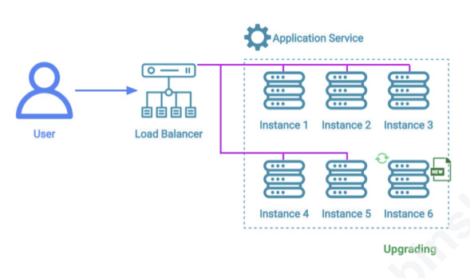

**How It Works:**
1. **Load Balancing:** Stop sending traffic to one server at a time using a load balancer.
2. **Upgrade:** Replace the old application instance with the new version on the server.
3. **Testing:** Optionally run tests on the upgraded server.
4. **Reintegration:** Add the updated server back into the load balancer's rotation.
5. **Repeat:** Continue the process for all servers until all are running the latest version.

**Benefits:**
- **No Downtime:** The system remains operational throughout the upgrade.
- **Gradual Release:** New versions are released gradually, reducing risk compared to a "big bang" approach.
- **Cost-Effective:** No need for additional hardware or infrastructure.

**Downsides:**
- **Cascading Failures:** New versions might cause failures that could impact old servers still in operation.
- **Compatibility Issues:** Running two versions side by side may cause issues if the new version is not fully compatible with the old one.

### Blue Green Deployment

**Overview:**
The Blue Green Deployment pattern is used to release a new version of software by maintaining two separate environments—Blue and Green. This approach aims to minimize risks and ensure a smooth transition between versions.

**How It Works:**

1. **Blue Environment:** The old version of the application continues running on this set of servers.
2. **Green Environment:** A new set of servers is provisioned, and the new version of the application is deployed here.
3. **Verification:** After deployment, the new instances in the Green environment are tested to ensure they work as expected.
4. **Traffic Shift:** Traffic is gradually redirected from the Blue environment to the Green environment using a load balancer.
5. **Rollback:** If issues are detected, traffic can be switched back to the Blue environment. If all is well, the Blue environment can be decommissioned or kept for the next release cycle.

**Benefits:**
- **No Downtime:** The Blue environment remains operational during the transition, ensuring continuous service availability.
- **Safe Rollbacks:** If problems arise, traffic can be easily shifted back to the old version, minimizing risk.
- **Consistent User Experience:** Customers experience only one version of the software at a time, reducing compatibility issues.

**Downsides:**
- **Increased Costs:** Running both Blue and Green environments simultaneously means needing twice the server capacity during the release.
- **Resource Usage:** Additional servers are required, which can lead to higher operational costs.

### Canary Release and A/B Testing

**Canary Release:**
The Canary Release pattern blends elements from both rolling and blue-green deployment strategies to offer a balanced approach to deploying new software versions.

**How It Works:**

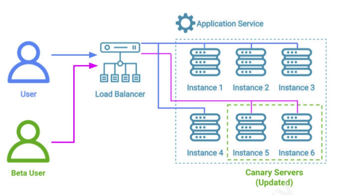

1. **Initial Deployment:** Deploy the new version of the software to a small subset of existing servers (the Canary servers).
2. **Traffic Management:** Redirect either all or a subset of traffic (e.g., internal users or beta testers) to these Canary servers.
3. **Monitoring:** Observe the performance and functionality of the Canary servers compared to the rest of the servers running the old version.
4. **Rollout Decision:** If the Canary version performs well, gradually update the rest of the servers using a rolling release approach. If issues arise, traffic can be shifted back to the old servers.

**Benefits:**
- **Reduced Risk:** Issues affect only a small subset of users, making it easier to manage and rollback if needed.
- **Informed Decisions:** Provides confidence in the new version before a full-scale deployment.
- **Selective Traffic:** Directs traffic from internal users or beta testers to mitigate potential impacts.

**Challenges:**
- **Monitoring Complexity:** Requires clear success criteria and effective automation to monitor performance.
- **Resource Allocation:** Needs careful management to ensure that monitoring and rollback processes are efficient.

**A/B Testing:**
A/B Testing is similar to Canary Release but focuses on testing new features rather than full software versions.

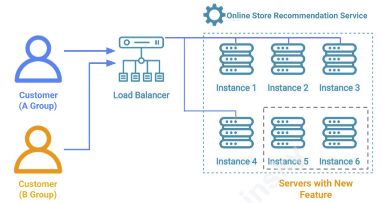

**How It Works:**
1. **Experimental Deployment:** Deploy a new feature or version on a small subset of servers.
2. **User Segmentation:** Redirect a portion of real user traffic to these experimental servers.
3. **Data Collection:** Gather data on user interactions and performance metrics.
4. **Evaluation:** Analyze the results to determine if the new feature should be rolled out to all users or if changes are needed.

**Benefits:**
- **Real User Feedback:** Provides genuine insights into how users interact with the new feature.
- **Informed Decisions:** Helps make data-driven decisions about future features or changes.
- **Testing in Production:** Allows testing of features under real-world conditions.

**Challenges:**
- **User Awareness:** Users are typically unaware they are part of an experiment, which can complicate feedback collection.
- **Reversion Process:** Requires careful handling to revert back to the original version after testing.

### Chaos Engineering

**Overview:**
Chaos Engineering is a production testing technique used to improve the resilience and reliability of distributed systems by deliberately injecting controlled failures into a live environment. This approach helps identify and address potential weaknesses before they lead to catastrophic issues during unexpected real-world events.

**Why Chaos Engineering?**
- **Inevitability of Failures:** In distributed systems, failures are inevitable due to infrastructure issues, network problems, or third-party outages.
- **Limitations of Traditional Testing:** Traditional testing methods (unit tests, integration tests) may not capture all possible failure scenarios, especially those that occur in production environments.

**Key Concepts:**
1. **Controlled Failures:** Introduce failures such as server terminations, latency, resource exhaustion, or loss of access to simulate potential issues.
2. **Monitoring and Analysis:** Observe how the system responds to these failures and analyze the performance.
3. **Improvement:** Identify and fix any issues found during testing to enhance system resilience.

**Common Failures to Inject:**
- **Server Termination:** Randomly terminate servers to test system recovery and redundancy.
- **Latency Injection:** Introduce delays between services or between a service and its database.
- **Resource Exhaustion:** Fill up disk space or other resources to observe how the system handles resource limitations.
- **Traffic Restrictions:** Disable traffic to specific zones or regions to test failover mechanisms.

**Process of Chaos Engineering:**
1. **Baseline Measurement:** Establish a performance baseline before injecting failures.
2. **Hypothesis Formation:** Define expected behavior and system responses.
3. **Failure Injection:** Introduce the failure and monitor its impact.
4. **Documentation:** Record findings and observations during the test.
5. **Restoration:** Restore the system to its original state post-testing.
6. **Continuous Improvement:** Address identified issues and continuously test to ensure ongoing resilience.

**Considerations:**
- **Minimize Blast Radius:** Ensure failures are contained and do not excessively impact the system.
- **Error Budget:** Avoid promising 100% availability; maintain flexibility for unexpected and deliberate failures.