+++
title= "System Design"
tags = [ "system-design", "software-architecture" ]
author = "Me"
showToc = true
TocOpen = false
draft = true
hidemeta = false
comments = false
disableShare = false
disableHLJS = false
hideSummary = false
searchHidden = true
ShowReadingTime = true
ShowBreadCrumbs = true
ShowPostNavLinks = true
ShowWordCount = true
ShowRssButtonInSectionTermList = true
UseHugoToc = true
+++

# Understanding the Importance of System Design in Software Engineering

System design is essential in software engineering because it ensures that software systems are scalable, reliable, maintainable, performant, cost-effective, secure, adaptable, and user-friendly. By investing time and effort into designing robust and efficient systems, organizations can build high-quality software products that meet the needs of their users and stakeholders.

# Requirements Gathering, Classifying, and Analyzing

1. **Purpose**:
   - Determine what needs to be built for the client.
   - Clarify high-level and vague requirements, often provided by non-technical clients.

2. **Challenges**:
   - **Scope and Ambiguity**: Large-scale systems involve broader scope and higher ambiguity than smaller tasks.
   - **Communication**: Transform vague client requests into precise technical requirements.

3. **Importance**:
   - Ensuring accurate requirements upfront is critical to avoid costly rework and delays.
   - Large projects involve significant engineering time, hardware, software licenses, and contractual obligations.

4. **Types of Requirements**:
   - **Functional Requirements (Features)**:
     - Describe the system's behavior and functionalities (e.g., user login, payment processing).
   - **Non-Functional Requirements (Quality Attributes)**:
     - Define properties like scalability, reliability, performance, and security.
   - **System Constraints**:
     - Include limitations such as deadlines, budget, and team size.

5. **Architectural Drivers**:
   - Requirements that influence architectural decisions and shape the system's design.

# Capturing and Documenting Functional Requirements

1. **Purpose**:
   - Define and document functional requirements methodically.

2. **Challenges**:
   - Complexity and ambiguity, especially with many features and actors.

3. **Methodology**:
   - **Use Cases and User Flows**: 
     - **Use Case**: Describes specific scenarios where the system is used to achieve a user's goal.
     - **User Flow**: Detailed, often graphical, representation of each use case.

4. **Steps to Capture Functional Requirements**:
   1. **Identify Actors**: 
      - Determine all users and actors interacting with the system.
   2. **Describe Use Cases**: 
      - List all scenarios of interaction between actors and the system.
   3. **Expand Use Cases**: 
      - Detail the flow of events and interactions in each use case, capturing actions and data flow.

5. **Example - Hitchhiking Service**:
   - **Actors**: Driver and Rider.
   - **Use Cases**:
     - User registration (Rider and Driver).
     - Logging in to initiate a ride.
     - Successful match between Rider and Driver.
     - Unsuccessful match (no driver found).

6. **Sequence Diagrams**:
   - Used to represent interactions between actors and the system.
   - **Features**:
     - Time progresses from top to bottom.
     - Entities represented as vertical lines.
     - Communication shown as arrows; responses as broken lines.

7. **Application of Sequence Diagrams**:
   - Example: Successful match in hitchhiking service.
   - Steps include driver availability, rider request, matching process, ride initiation, ride completion, payment, and notifications.

8. **API Identification**:
   - Each interaction in the user flow can correspond to an API call.
   - Data flowing between actors and the system forms the basis for API arguments.

9. **Key Takeaway**:
   - The three-step process and sequence diagrams provide a structured way to capture and visualize functional requirements, aiding in system design and API identification.

# Quality Attributes (Nonfunctional Requirements)

1. **Motivation**:
   - Systems are often redesigned due to inadequate quality attributes, not because of functional deficiencies.
   - Proper architecture that addresses quality attributes can prevent costly redesigns.

2. **Definition**:
   - Quality attributes describe the qualities of the system's functionality, measuring performance on specific dimensions.
   - They do not specify what the system does, but how well it performs.

3. **Examples**:
   - **Performance**: System responds to a search query within 100 milliseconds.
   - **Availability**: Online store available 99.9% of the time.
   - **Deployability**: System can be updated with new versions at least twice a week.

4. **Key Considerations**:
   1. **Measurability and Testability**:
      - Quality attributes must be quantifiable and verifiable.
      - E.g., defining "quickly" in terms of specific time, like 200 milliseconds.

   2. **Trade-offs**:
      - No single architecture can optimize all quality attributes.
      - Conflicting requirements require prioritization (e.g., speed vs. security in login processes).

   3. **Feasibility**:
      - Ensure the system can realistically meet the quality attributes.
      - Unrealistic expectations (e.g., 100% availability, perfect security) should be addressed early.

5. **Examples of Unfeasible Requirements**:
   - Unrealistic low latency (e.g., sub-100ms page loads with high network latency).
   - 100% system availability (no maintenance or upgrades).
   - Full protection against hackers.
   - Streaming high-resolution content in low-bandwidth areas.

6. **Conclusion**:
   - Quality attributes are critical for system success.
   - They must be measurable, involve trade-offs, and be feasible.
   - Proper consideration of these attributes helps avoid major redesigns and ensures system reliability and performance.

# System Constraints

1. **Definition**:
   - System constraints are pre-determined decisions that restrict architectural choices, either fully or partially. They can be viewed as non-negotiable guidelines that shape the architecture.

2. **Types of System Constraints**:
   - **Technical Constraints**:
     - Related to hardware, cloud vendors, programming languages, databases, platforms, browsers, or operating systems.
     - Example: Using a specific database due to existing infrastructure.

   - **Business Constraints**:
     - Arising from budget, deadlines, or business strategies.
     - Example: Limited budget or a strict deadline influences the choice of architecture.

   - **Legal Constraints**:
     - Related to regulations and laws specific to regions or industries.
     - Example: Compliance with HIPAA for healthcare systems or GDPR for handling personal data in the EU.

3. **Considerations**:
   1. **Distinguishing Real vs. Self-Imposed Constraints**:
      - Determine if constraints are truly non-negotiable or if there's room for flexibility.
      - Example: Re-evaluating the need for specific technologies or exploring alternative vendors.

   2. **Avoiding Tight Coupling**:
      - Design the architecture to allow future flexibility and minimize dependency on specific constraints.
      - Example: Abstracting the interaction with a specific database or third-party service to facilitate easy replacement.

4. **Conclusion**:
   - System constraints are a key architectural driver that define the boundaries within which the system must operate.
   - Properly identifying and managing these constraints helps in creating a resilient and adaptable architecture.
   - Ensuring flexibility in the system design allows for easier adaptation to future changes and potential relaxation of constraints.

# Quality Attribute: Performance

1. **Overview**:
   - Performance is a crucial quality attribute in large-scale systems. It encompasses various metrics that measure how efficiently a system processes requests and data.

2. **Performance Metrics**:
   - **Response Time**:
     - Defined as the time taken between sending a request and receiving a response. It includes:
       - **Processing Time**: Time spent actively handling the request within the system.
       - **Waiting Time**: Time spent in transit or in queues, often referred to as latency or end-to-end latency.
     - Importance: Critical for user experience, especially in systems where immediate feedback is expected.

   - **Throughput**:
     - Measures the amount of work or data processed by the system per unit of time.
     - Can be expressed as tasks per second or data (bytes) per second.
     - Importance: Vital for systems handling large volumes of data, such as logging or analytics systems.

3. **Considerations for Measuring Performance**:
   1. **Accurate Measurement of Response Time**:
      - Ensure that both processing and waiting times are considered to avoid misleading conclusions about system performance.

   2. **Response Time Distribution Analysis**:
      - Use histograms and percentile distributions to understand the range of response times experienced by users.
      - Key terms:
        - **Median**: The 50th percentile, indicating the response time for 50% of requests.
        - **Tail Latency**: The response times in the higher percentiles (e.g., 95th, 99th), indicating the longest delays experienced by a small percentage of users.
      - Setting Goals: Define acceptable response times in terms of percentiles, e.g., 95th percentile response time should be under 30 milliseconds.

   3. **Performance Degradation**:
      - Identify the point at which performance degrades as load increases.
      - Key factors include CPU utilization, memory consumption, network limitations, and queue capacities.
      - Importance: Understanding degradation helps in capacity planning and ensuring system stability under load.

4. **Conclusion**:
   - Performance metrics like response time and throughput are essential for assessing system efficiency and user experience.
   - Proper measurement and analysis of these metrics, including consideration of tail latency and performance degradation, are crucial for maintaining a high-quality system.

### Quality Attribute: Scalability

1. **Motivation for Scalability**:
   - System load or traffic is dynamic and can vary based on seasonal patterns, daily fluctuations, global events, and business growth.
   - As the load increases, systems may reach a performance degradation point, beyond which performance declines.

2. **Definition of Scalability**:
   - Scalability is the ability of a system to handle a growing amount of work in a cost-effective and easy manner by adding resources.
   - Ideal scalability scenarios include:
     - **Linear Scalability**: Doubling resources results in doubling the amount of work the system can handle.
     - **Diminishing Returns**: Adding resources provides decreasing increments in performance improvement.
     - **Negative Scalability**: Adding resources worsens performance due to overhead and coordination costs.

3. **Scalability Dimensions**:
   1. **Vertical Scalability (Scaling Up)**:
      - Involves upgrading the existing hardware (e.g., faster CPUs, more memory) to handle increased load.
      - **Pros**:
        - Simple to implement; does not typically require code changes.
        - Easy migration, especially with cloud services.
      - **Cons**:
        - Limited by the maximum capacity of a single machine.
        - Centralized system design, which lacks high availability and fault tolerance.

   2. **Horizontal Scalability (Scaling Out)**:
      - Involves adding more instances of the same resource, such as multiple servers or databases, to distribute the load.
      - **Pros**:
        - Virtually unlimited scalability potential.
        - Can inherently provide high availability and fault tolerance.
      - **Cons**:
        - More complex to implement and manage, requiring significant changes in system architecture.
        - Increased coordination and management overhead.

   3. **Team or Organizational Scalability**:
      - Focuses on increasing the productivity of the development team as more engineers are hired.
      - **Challenges**:
        - Increased coordination overhead, meetings, and merge conflicts as team size grows.
        - Larger codebases require more onboarding and testing time, slowing down productivity.
      - **Solutions**:
        - Modularization: Splitting the codebase into separate modules or libraries to reduce interference.
        - Microservices: Breaking down a monolithic application into independent services with separate codebases and release cycles.

4. **Conclusion**:
   - Scalability is a critical quality attribute that ensures a system can grow and adapt to increasing demands.
   - It can be achieved through vertical scalability (upgrading hardware), horizontal scalability (adding more instances), and team scalability (enhancing team productivity).
   - Understanding and implementing scalability strategies helps maintain system performance, reliability, and organizational efficiency as the system and team grow.

# Quality Attribute: Availability

1. **Importance of High Availability**:
   - **User Impact**: Availability directly affects user experience. Downtime can lead to frustration and loss of trust, especially if critical services (e.g., e-commerce, email, mission-critical systems) are inaccessible.
   - **Business Impact**:
     - **Revenue Loss**: When systems are down, the ability to generate revenue halts.
     - **Customer Loss**: Frequent or prolonged outages can drive users to competitors.

2. **Defining Availability**:
   - **Availability**: The fraction of time or probability that a service is operational and accessible to users.
   - **Uptime**: The time when the system is operational and accessible.
   - **Downtime**: The time when the system is not operational or accessible.

3. **Measuring Availability**:
   - **Basic Formula**: 
     \[
     \text{Availability} = \frac{\text{Uptime}}{\text{Uptime} + \text{Downtime}}
     \]
   - **MTBF and MTTR**:
     - **MTBF (Mean Time Between Failures)**: The average time the system operates without failure.
     - **MTTR (Mean Time to Recovery)**: The average time taken to detect and recover from a failure.
     - **Alternative Formula**:
       \[
       \text{Availability} = \frac{\text{MTBF}}{\text{MTBF} + \text{MTTR}}
       \]
     - This formula indicates that minimizing MTTR can significantly improve availability, even if MTBF is not optimal.

4. **Acceptable Levels of Availability**:
   - **100% Availability**: Ideal but impractical due to maintenance and unexpected failures.
   - **Industry Standards**:
     - **90% Availability**: Over two hours of downtime per day, not considered high availability.
     - **95% Availability**: About one hour of downtime per day, still insufficient for most use cases.
     - **99.9% Availability (Three Nines)**: Less than 1.5 minutes of downtime per day, generally acceptable.
     - **99.99% Availability (Four Nines)**: Less than 52.6 minutes of downtime per year, highly reliable.

   - **Terminology**: Availability percentages are often referred to by the number of nines (e.g., "three nines" for 99.9%).

# Achieving High Availability: Fault Tolerance Strategies

1. **Sources of Failures**:
   - **Human Error**: Mistakes like deploying faulty configurations, incorrect commands, or untested software versions.
   - **Software Errors**: Problems such as long garbage collections, crashes (out-of-memory exceptions, null pointer exceptions, segmentation faults), etc.
   - **Hardware Failures**: Issues like server, router, or storage device failures due to end-of-life, power outages from natural disasters, or network problems.

2. **Fault Tolerance Overview**:
   - **Definition**: The ability of a system to remain operational and available to users despite failures in one or more components.
   - **Objective**: Ensure system operation at the same or reduced performance level, preventing complete unavailability.

3. **Fault Tolerance Tactics**:

   - **Failure Prevention**:
     - **Eliminating Single Points of Failure**:
       - **Replication and Redundancy**: 
         - **Multiple Instances**: Run applications or databases on multiple servers to avoid single points of failure.
         - **Time Redundancy**: Repeating operations until successful or abandoned.
       - **Architectural Strategies**:
         - **Active-Active Architecture**: All replicas handle requests and must stay synchronized. Offers scalability but requires complex coordination.
         - **Active-Passive Architecture**: A primary replica handles all requests, with passive replicas maintaining state through periodic snapshots. Easier to implement but limits scalability.

   - **Failure Detection and Isolation**:
     - **Monitoring Systems**:
       - **Health Checks and Heartbeats**: Regular checks to ensure instances are operational.
       - **Detection of Faulty Instances**: Monitoring for software or hardware issues and isolating affected instances.
       - **False Positives vs. False Negatives**: Prioritizing avoiding false negatives, where a failure is undetected, over false positives.

   - **Recovery from Failure**:
     - **Traffic Management**: Redirect traffic from faulty instances.
     - **Restart Procedures**: Attempt to resolve issues by restarting affected instances.
     - **Rollbacks**: Revert to a stable version if the current one causes issues, commonly used in databases to maintain data integrity and system stability.

# Key Terms in Service Level Management

1. **Service Level Agreement (SLA)**:
   - **Definition**: A legal contract between the service provider and users that outlines the quality of service commitments, such as availability, performance, data durability, and response times to failures.
   - **Components**: Specifies penalties or compensation if the provider fails to meet the promised quality of service, such as refunds, service credits, or extensions.
   - **Application**: Primarily for external paying users, but can also apply to free users (e.g., trial extensions) and sometimes internal users.

2. **Service Level Objectives (SLOs)**:
   - **Definition**: Specific, measurable goals set for a system, representing target values or ranges for key metrics.
   - **Examples**: Availability (e.g., three nines), response time (e.g., <100ms at the 90th percentile), issue resolution time (e.g., 24-48 hours).
   - **Relation to SLA**: SLOs are components of an SLA, detailing specific commitments. Systems without an SLA still need SLOs to set user expectations.

3. **Service Level Indicators (SLIs)**:
   - **Definition**: Quantitative metrics used to assess whether SLOs are being met. They are derived from monitoring systems or log analysis.
   - **Examples**: Percentage of successful responses (for availability), response times, error rates.
   - **Purpose**: To measure actual performance against SLO targets and ensure compliance with SLAs.

### Considerations for Defining SLOs

1. **User-Centric Metrics**: Focus on the metrics that matter most to users and define SLOs around them. Select SLIs that accurately track these metrics.

2. **Minimal and Focused SLOs**: Limit the number of SLOs to prioritize key objectives and simplify system architecture. Too many SLOs can dilute focus and complicate management.

3. **Realistic and Conservative Goals**: Set achievable goals with a margin for error. Avoid over-promising by aligning external commitments conservatively compared to internal goals.

4. **Recovery Plan**: Prepare a plan for situations where SLIs indicate potential breaches of SLOs. This includes automatic alerts, failovers, restarts, rollbacks, auto-scaling policies, and handbooks for incident management.

These terms and considerations are crucial for designing reliable systems that meet user expectations and contractual obligations.

### References

- [Amazon SLA](https://aws.amazon.com/legal/service-level-agreements/?aws-sla-cards.sort-by=item.additionalFields.serviceNameLower&aws-sla-cards.sort-order=asc&awsf.tech-category-filter=*all)
- [GCP SLA](https://cloud.google.com/terms/sla)
- [Azure SLA](https://azure.microsoft.com/en-us/support/legal/sla/)
- [Github SLA](https://github.com/customer-terms/github-online-services-sla)
- [Atlassian Products SLA](https://support.atlassian.com/subscriptions-and-billing/docs/service-level-agreement-for-atlassian-cloud-products/)

# Designing an Application Programming Interface (API)

## Introduction and Motivation

An API is a contract between the developers who implement a system and the client applications that use it. For large-scale systems, APIs are typically accessed remotely over a network. These client applications can include front-end clients (like mobile apps or web browsers), other backend systems, or internal systems within an organization.

## Types of APIs

1. **Public APIs**:
   - **Definition**: Exposed to the general public; any developer can use them.
   - **Access Control**: Often require user registration to manage and monitor usage, enhance security, and enable blacklisting.

2. **Private APIs**:
   - **Definition**: Only accessible internally within a company, allowing different teams or departments to leverage the system's capabilities.

3. **Partner APIs**:
   - **Definition**: Similar to public APIs but restricted to users or companies with a business relationship, often defined by a customer agreement.

## Benefits of a Well-Defined API

- **Ease of Use**: Clients can enhance their business by integrating with the system without needing to understand its internal workings.
- **Parallel Development**: Clients can start integrating with the system based on the API definition, even before the system's implementation is complete.
- **Internal Architecture**: Defining the API helps in designing the internal structure by establishing clear endpoints and routes for different functionalities.
## Best Practices and Patterns for API Design

1. **Encapsulation**:
   - **Goal**: Hide internal design and implementation details from API users.
   - **Benefit**: Allows internal changes without breaking the API contract.

2. **Ease of Use and Simplicity**:
   - **Guidelines**: 
     - Provide a single way to perform tasks.
     - Use descriptive names for actions and resources.
     - Expose only necessary information and actions.
     - Maintain consistency throughout the API.

3. **Idempotency**:
   - **Definition**: Operations that produce the same result even if performed multiple times.
   - **Importance**: Ensures safe retrying of requests in case of network issues, as multiple requests won't alter the outcome.

4. **Pagination**:
   - **Purpose**: Handle large datasets by dividing them into manageable chunks.
   - **Example**: Displaying a limited number of emails or search results at a time, rather than overwhelming the client with the entire dataset.

5. **Asynchronous Operations**:
   - **Use Case**: For long-running tasks where partial results aren't meaningful (e.g., big data analysis, large file compression).
   - **Mechanism**: Clients receive an immediate response with a tracking identifier to check the status and retrieve the final result later.

6. **API Versioning**:
   - **Purpose**: Manage changes over time, especially non-backward compatible updates.
   - **Approach**: Maintain multiple API versions, allowing clients to transition gradually while maintaining stability.

### Remote Procedure Calls (RPC)

#### Introduction and How It Works

A **Remote Procedure Call (RPC)** allows a client application to execute a subroutine on a remote server, making the call appear like a local method invocation. This concept, known as **local transparency**, simplifies the developer's experience as the remote method call syntax closely resembles that of local methods. RPCs often support multiple programming languages, enabling interoperability between different systems.

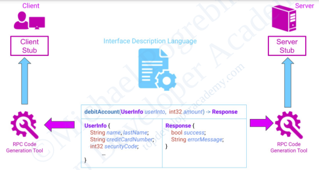

**Key Components:**
1. **Interface Description Language (IDL)**:
   - Defines the API and data types used in the methods.
   - Serves as a schema for communication between the client and server.

2. **Stubs**:
   - **Client Stub**: Auto-generated implementation for the client, handles serialization (marshalling) of data, and initiates the connection to the server.
   - **Server Stub**: Auto-generated implementation on the server, listens for client messages, deserializes (unmarshalling) data, and invokes the corresponding method.

3. **Data Transfer Objects (DTOs)**:
   - Auto-generated classes or structs representing custom data types defined in the IDL.

**Process Flow**:
- The client calls an RPC method, the client stub serializes the data and sends it to the server.
- The server stub receives, deserializes, and processes the request, then returns the result.
- The client stub receives and deserializes the response, providing the result to the caller.

#### Benefits of RPC

1. **Convenience**:
   - Simplifies the developer's task by abstracting away the complexities of network communication.
   - Error handling is straightforward, with communication failures resulting in exceptions or errors similar to local method calls.

2. **Language and Platform Agnosticism**:
   - Multiple programming languages can be used for both client and server implementations.

#### Drawbacks of RPC

1. **Slowness**:
   - Unlike local methods, RPC calls involve network communication, which can introduce latency and unpredictability in performance.
   - Developers may inadvertently block execution while waiting for slow RPC responses, making it necessary to provide asynchronous versions of potentially slow methods.

2. **Unreliability**:
   - Network issues can cause messages to be lost or delayed, leading to confusion about the state of operations. For instance, a failed transaction might leave the client unsure whether an operation was completed.

**Mitigation**:
   - Use idempotent operations to ensure repeated calls have the same effect, minimizing risks in case of communication failures.

#### When to Use RPC

- **Backend-to-Backend Communication**:
  - Ideal for communication between different backend systems or components within a large-scale system.

- **Complete Abstraction**:
  - Suitable when the goal is to abstract network communication details and focus solely on the actions performed.

- **Action-Oriented APIs**:
  - RPCs are well-suited for APIs focused on actions rather than data or resources, with methods representing distinct actions.

#### When Not to Use RPC

- **Frontend Clients**:
  - Generally less common for frontend clients like web browsers.

- **Need for Network Details**:
  - Not ideal when direct access to network elements like HTTP cookies or headers is required.

- **Data-Centric APIs**:
  - For APIs centered around data and CRUD operations, other styles may be more appropriate.

## References

- [gRPC](https://grpc.io/)
- [Apache Thrift](https://thrift.apache.org/)
- [Java RMI](https://docs.oracle.com/javase/tutorial/rmi/)

### REST API: Representational State Transfer

#### Introduction and Overview

**REST** stands for **Representational State Transfer**, an architectural style introduced by Roy Fielding in 2000. Unlike standards or protocols, REST provides a set of constraints and best practices for designing APIs, primarily for the web. A **RESTful API** adheres to these principles, offering a resource-oriented approach rather than a method-centric one, as seen in RPC APIs.

**Key Characteristics of REST APIs**:
1. **Resource-Oriented**: The primary focus is on resources, which represent entities within the system.
2. **Statelessness**: Each request from a client contains all the information needed for the server to fulfill the request.
3. **Cacheability**: Responses are explicitly labeled as cacheable or non-cacheable, aiding performance and reducing server load.

#### Comparison with RPC

- **RPC**: Focuses on exposing methods and functions to perform operations.
- **REST**: Emphasizes resources, where operations are limited to a few standard methods.

#### REST API Concepts

1. **Resources and URIs**:
   - Resources represent entities and are accessed using **Uniform Resource Identifiers (URIs)**.
   - Organized hierarchically, resources can be simple (individual entities) or collections (groups of entities).

2. **Resource Representations**:
   - Resources are represented in various formats like JSON, XML, HTML, or others.
   - The server provides a representation of the resource's state, which can differ from its internal implementation.

3. **Hypermedia as the Engine of Application State (HATEOAS)**:
   - REST APIs often include hypermedia links in responses, guiding clients on possible next actions.

#### Key Benefits of REST APIs

1. **Scalability**: Statelessness allows easy load distribution across multiple servers.
2. **High Availability**: No dependency on session state enables failover and redundancy.
3. **Performance**: Caching reduces latency and server load.

#### Naming and Organizing Resources

- **Best Practices**:
  - Use **nouns** for resource names to clearly distinguish resources from actions.
  - Distinguish between **collection resources** (plural names) and **simple resources** (singular names).
  - Ensure resource names are **clear and meaningful**, avoiding generic terms like "items" or "objects".
  - Resource identifiers should be **unique** and **URL-friendly**.

#### Operations on REST API Resources

1. **Standard HTTP Methods**:
   - **POST**: Create a new resource.
   - **GET**: Retrieve the state of a resource or a list of resources in a collection.
   - **PUT**: Update an existing resource.
   - **DELETE**: Remove a resource.

2. **Idempotency**:
   - Methods like GET, PUT, and DELETE are idempotent, meaning multiple identical requests have the same effect as a single request.

3. **Safety and Cacheability**:
   - GET requests are safe (do not modify resource state) and cacheable. POST requests can also be cacheable with appropriate headers.

#### Designing a REST API: A Step-by-Step Example

**Example: Movie Streaming Service**

1. **Identify Entities**:
   - Users, movies, reviews, actors.

2. **Map Entities to URIs**:
   - Define resources and their hierarchy, e.g., `/movies`, `/movies/{movieId}`, `/movies/{movieId}/reviews`.

3. **Define Representations**:
   - Use JSON to represent resource states, e.g., a movie's information and links to related resources like reviews and actors.

4. **Assign HTTP Methods**:
   - Example operations:
     - **POST** on `/users`: Register a new user.
     - **GET** on `/users/{userId}`: Retrieve user information.
     - **PUT** on `/users/{userId}`: Update user profile.
     - **DELETE** on `/users/{userId}`: Remove a user.

#### Conclusion

REST API design emphasizes a resource-oriented approach with a small set of standard operations. This style facilitates high performance, scalability, and ease of use. By following best practices and leveraging HTTP methods, developers can create robust and intuitive APIs.

# Key Principles and Goals of System Design

System design aims to achieve several key principles and goals to ensure the success and effectiveness of software systems. Here's a deep dive into some of the most important ones:

## Scalability

- **Description:** Scalability refers to the ability of a system to handle increasing loads or demands by adding resources or scaling out horizontally without significantly impacting performance.
- **Principles:**
  - Horizontal scalability: Adding more instances of components or distributing workload across multiple nodes to handle increased traffic.
  - Vertical scalability: Increasing the capacity of individual components, such as upgrading hardware resources or optimizing algorithms.
- **Goals:**
  - Ensure responsiveness and performance under high loads.
  - Enable growth and accommodate increases in user base or data volume.
  - Minimize downtime and maintain service availability during scaling operations.

## Reliability

- **Description:** Reliability refers to the ability of a system to consistently perform its intended functions under normal and adverse conditions without unexpected failures or errors.
- **Principles:**
  - Fault tolerance: Designing systems to continue operating even in the presence of hardware failures, software bugs, or network issues.
  - Redundancy: Duplication of critical components or data to eliminate single points of failure and increase system resilience.
- **Goals:**
  - Ensure high uptime and availability of services.
  - Minimize the impact of failures on system functionality and user experience.
  - Implement robust error handling, monitoring, and recovery mechanisms to detect and respond to failures proactively.

## Availability

- **Description:** Availability refers to the ability of a system to remain operational and accessible to users, typically measured as the percentage of time that the system is functional and responsive.
- **Principles:**
  - High availability: Designing systems with redundant components, failover mechanisms, and load balancing to ensure continuous operation.
  - Disaster recovery: Implementing backup and recovery strategies to recover from catastrophic events or data loss.
- **Goals:**
  - Maintain service uptime and accessibility to meet user expectations.
  - Minimize service disruptions and downtime due to planned maintenance or unexpected failures.
  - Provide seamless failover and recovery processes to mitigate the impact of outages on users and business operations.

## Maintainability

- **Description:** Maintainability refers to the ease with which a system can be modified, extended, or repaired over time by developers or administrators.
- **Principles:**
  - Modularity: Breaking down the system into smaller, independent components with well-defined interfaces and responsibilities.
  - Code readability and documentation: Writing clean, understandable code and documenting design decisions, APIs, and configuration settings.
- **Goals:**
  - Facilitate efficient troubleshooting, debugging, and code reviews.
  - Enable rapid iteration and evolution of the system to adapt to changing requirements or business needs.
  - Reduce technical debt and minimize the cost of ongoing maintenance and support.

## Security

- **Description:** Security refers to protecting a system and its data from unauthorized access, disclosure, modification, or destruction, ensuring confidentiality, integrity, and availability.
- **Principles:**
  - Defence in depth: Implementing multiple layers of security controls, such as authentication, authorization, encryption, and intrusion detection.
  - Least privilege: Granting users or components only the minimum level of access and permissions required to perform their tasks.
- **Goals:**
  - Safeguard sensitive data and assets from external threats and attacks.
  - Prevent unauthorized access or misuse of system resources.
  - Ensure compliance with regulatory requirements and industry standards for data protection and privacy.

## Performance

- **Description:** Performance refers to the speed, responsiveness, and efficiency of a system in processing user requests, executing operations, and handling workload.
- **Principles:**
  - Optimization: Identifying and eliminating performance bottlenecks, reducing latency, and improving throughput through code optimization, caching, and resource management.
  - Load testing: Simulating realistic user traffic and workload scenarios to assess system performance and identify potential scalability or performance issues.
- **Goals:**
  - Provide a fast and seamless user experience with minimal latency and response times.
  - Ensure efficient resource utilization and scalability to handle peak loads and spikes in demand.
  - Continuously monitor and optimize system performance to maintain high levels of responsiveness and efficiency.

## Flexibility and Adaptability

- **Description:** Flexibility and adaptability refer to the ability of a system to evolve, scale, and integrate with new technologies or requirements over time.
- **Principles:**
  - Loose coupling: Designing components with minimal dependencies and well-defined interfaces to facilitate integration, replacement, or modification.
  - API-driven architecture: Exposing functionality through well-documented APIs to enable interoperability, extensibility, and integration with external systems.
- **Goals:**
  - Enable seamless integration with third-party services, tools, or frameworks.
  - Support rapid prototyping and experimentation to explore new features or technologies.
  - Facilitate business agility and innovation by adapting quickly to changing market conditions or user needs.

## Cost Effectiveness

- **Description:** Cost effectiveness refers to optimizing the resources and expenses associated with building, operating, and maintaining a system, ensuring that the benefits outweigh the costs over the system's lifecycle.
- **Principles:**
  - Efficiency: Maximizing resource utilization and minimizing waste through effective resource management, automation, and optimization techniques.
  - Total cost of ownership (TCO): Considering the full lifecycle costs of the system, including development, deployment, maintenance, and support.
- **Goals:**
  - Reduce development costs and time-to-market by leveraging reusable components, open-source software, and cloud services.
  - Optimize infrastructure costs by right-sizing resources, using cost-effective hosting solutions, and implementing efficient scaling strategies.
  - Minimize operational expenses through automation, monitoring, and proactive maintenance to prevent costly downtime or outages.

## User Experience

- **Description:** User experience (UX) refers to the overall quality of interaction and satisfaction that users have when using a system, encompassing aspects such as usability, accessibility, and aesthetics.
- **Principles:**
  - User-centred design: Prioritizing the needs, preferences, and expectations of users throughout the design and development process.
  - Usability: Designing intuitive interfaces and workflows that are easy to navigate, understand, and use effectively.
- **Goals:**
  - Enhance user satisfaction and engagement by providing a seamless, intuitive, and enjoyable user experience.
  - Ensure accessibility for users of all abilities, including those with disabilities, by adhering to accessibility standards and guidelines.
  - Continuously gather feedback from users and iterate on the design to address usability issues, improve functionality, and meet evolving user needs.

By adhering to these key principles and goals of system design, software engineers can build robust, scalable, maintainable, and secure systems that meet the needs of users and stakeholders while accommodating future growth and evolution.

# Introduction to Software Architectural Patterns

## What Are Software Architectural Patterns?

Software architectural patterns are general, repeatable solutions to commonly occurring system design problems. Unlike design patterns—such as singleton, factory, or strategy—which organize code within a single application, architectural patterns address problems involving multiple components running as separate runtime units, like applications or services.

Over time, software architects have observed how companies in similar industries solved design challenges. They identified successful strategies and learned from others' mistakes, thus forming software architectural patterns.

## Why Use Software Architectural Patterns?

1. **Efficiency and Resource Savings**: Leveraging proven solutions can save time and resources. If a pattern has worked for organizations with similar challenges, it often makes sense to adopt it rather than reinvent the wheel.

2. **Avoiding Anti-Patterns**: One significant risk is creating a "big ball of mud," an anti-pattern characterized by a lack of structure, tightly coupled services, global or duplicated information, and unclear component responsibilities. Such systems are difficult to develop, maintain, and scale, potentially harming the business.

3. **Consistency and Continuity**: Using well-known patterns ensures that other engineers and architects can easily understand and continue working within the same architectural framework. This consistency simplifies maintenance and evolution.

## Flexibility and Evolution

Architectural patterns are guidelines, not rigid rules. The goal is to define the best architecture for the specific use case and adapt the patterns as necessary. As systems evolve, the chosen pattern may no longer fit, necessitating a migration to a different pattern. Many companies have successfully navigated such transitions, providing best practices for smooth and safe migrations.

# Monolithic Architecture

## Overview:

Monolithic architecture is a traditional software design approach where all components of an application are tightly coupled and interconnected within a single codebase. In a monolithic architecture, the entire application is built, deployed, and scaled as a single unit.

## Key Components:

1. **User Interface (UI):** The UI layer handles the presentation logic of the application, including user interaction and rendering of graphical elements.
2. **Business Logic:** The business logic layer contains the core functionality and rules of the application, such as data processing, calculations, and workflow orchestration.
3. **Data Access:** The data access layer interacts with the database or external data sources to read and write data, perform CRUD (Create, Read, Update, Delete) operations, and manage data transactions.
4. **Integration:** The integration layer may handle communication with external systems, services, or APIs, enabling data exchange and interoperability with third-party components.

## Characteristics:

- **Simplicity:** Monolithic architectures are relatively simple to develop, deploy, and manage, as all components are contained within a single codebase and deployment unit.
- **Tight Coupling:** Components in a monolithic architecture are tightly coupled, meaning changes to one component may require modifications to other interconnected components.
- **Scalability Challenges:** Scaling a monolithic application can be challenging, as all components scale together, leading to potential resource wastage or performance bottlenecks.
- **Limited Flexibility:** Monolithic architectures may lack flexibility, making it difficult to adopt new technologies, update dependencies, or introduce changes without impacting the entire application.
- **Deployment Complexity:** Deploying updates or new features to a monolithic application may require downtime or result in longer deployment cycles, especially for large and complex codebases.

## Benefits:

- **Simplicity:** Monolithic architectures are straightforward to develop, debug, and deploy, making them suitable for smaller or less complex applications.
- **Single Codebase:** Having all components in a single codebase simplifies version control, code sharing, and collaboration among development teams.
- **Performance:** Monolithic applications may exhibit better performance compared to distributed architectures, as there is no overhead associated with inter-service communication.

## Challenges:

- **Scalability:** Scaling monolithic applications can be challenging, especially for rapidly growing or highly trafficked systems, as all components scale together.
- **Maintainability:** Large monolithic codebases can become difficult to maintain and extend over time, leading to increased technical debt and decreased agility.
- **Technology Stack Limitations:** Monolithic architectures may be limited in their ability to adopt new technologies or programming languages, as all components must use the same technology stack.
- **Deployment Complexity:** Deploying changes to a monolithic application may require downtime or result in longer deployment cycles, impacting availability and user experience.

## Use Cases:

- **Small to Medium-Sized Applications:** Monolithic architectures are well-suited for small to medium-sized applications with simpler requirements and lower scalability demands.
- **Prototyping and MVPs:** Monolithic architectures can be used to quickly prototype ideas or develop minimum viable products (MVPs) due to their simplicity and ease of development.

## Monolitic Failure Studies

1. **Twitter's Fail Whale:** In the early days of Twitter, the platform experienced frequent outages and performance issues, often symbolized by the "Fail Whale" error message. Twitter's monolithic architecture struggled to handle the rapidly growing user base and high traffic volumes, leading to scalability and reliability challenges.
2. **Amazon's Holiday Outage:** In 2013, Amazon experienced a significant outage during the holiday shopping season, impacting the availability of its retail website and causing disruptions for millions of users. The outage was attributed to issues with Amazon's monolithic architecture, which struggled to handle the surge in traffic and transaction volumes.

3. **NASA's Mars Climate Orbiter Failure:** In 1999, NASA's Mars Climate Orbiter mission ended in failure when the spacecraft entered the Martian atmosphere at too low an altitude and disintegrated. The failure was attributed to a discrepancy between metric and imperial units in the software used to control the spacecraft, which was part of a monolithic software system.
4. **Netflix's Dependency Cascade:** In the early days of Netflix's streaming service, the platform experienced downtime and performance issues due to a phenomenon known as the "dependency cascade." Changes to one part of the monolithic codebase often led to unexpected side effects and cascading failures across the entire system.

5. **Etsy's Deployment Bottleneck:** Etsy adopted a strategy of "breaking the monolith" by decomposing its monolithic application into smaller, more manageable components and gradually transitioning to a microservices architecture. This architectural transformation enabled Etsy to achieve faster release cycles, improved developer productivity, and greater agility in responding to customer needs.

6. **Uber's Service Ownership Challenges:** Uber, a transportation network company, faced challenges with service ownership and collaboration within its monolithic architecture. Different teams were responsible for maintaining different parts of the monolithic codebase, leading to coordination overhead, communication barriers, and difficulties in making changes across the entire system.

7. **BBC's Content Management System Overload:** The BBC, a public service broadcaster, encountered performance and scalability issues with its monolithic content management system (CMS). As the volume of digital content grew, the monolithic architecture struggled to handle the increasing workload, resulting in slow response times and occasional outages.

These examples illustrate the real-world challenges faced by organizations due to the limitations of monolithic architecture and the benefits of transitioning to more distributed, modular, and scalable architectural patterns.

## Conclusion

Monolithic architecture, while simple and straightforward, may not be suitable for all applications, especially those with high scalability, maintainability, or flexibility requirements. However, for smaller projects or applications with well-defined scope and limited scalability needs, a monolithic architecture can provide a cost-effective and efficient solution for software development and deployment.

# Client-Server Architecture

## Overview:

Client-server architecture is a common architectural pattern in which client devices or applications communicate with a centralized server to request and receive services or resources. This architecture divides the responsibilities between clients and servers, with clients initiating requests and servers providing responses.

## Key Components:

1. **Client:** The client component represents the user interface or application running on end-user devices, such as desktop computers, mobile devices, or web browsers. Clients initiate communication with servers by sending requests for services or data.
2. **Server:** The server component hosts and manages resources or services requested by clients. Servers receive requests from clients, process them, and return responses containing the requested data or services.

## Communication Protocol:

Client-server communication typically follows a request-response model, where clients send requests to servers, and servers respond with the requested data or services. This communication is facilitated through various network protocols, such as HTTP, TCP/IP, or WebSocket, depending on the application requirements.

## Characteristics:

- **Centralized Control:** Client-server architecture centralizes control and management of resources or services on the server side, enabling consistent enforcement of security policies, access control, and data integrity.
- **Scalability:** Client-server architecture can be scaled vertically by upgrading server hardware or horizontally by adding more servers to handle increasing client loads, making it suitable for applications with varying scalability requirements.
- **Reliability:** Centralized servers can implement redundancy, failover mechanisms, and backup strategies to ensure high availability and fault tolerance, minimizing service disruptions and downtime.
- **Security:** Centralized servers can implement security measures such as authentication, authorization, and encryption to protect sensitive data and resources from unauthorized access or tampering.
- **Client Diversity:** Client-server architecture supports a diverse range of client devices and platforms, including desktop computers, mobile devices, web browsers, and IoT devices, allowing clients to access services from anywhere.

## Use Cases:

- **Web Applications:** Client-server architecture is widely used in web development, where web browsers act as clients, and web servers host web applications and services.
- **Mobile Apps:** Many mobile applications follow a client-server architecture, with mobile devices acting as clients and backend servers providing data storage, processing, and business logic.
- **Enterprise Systems:** Client-server architecture is prevalent in enterprise systems, such as email servers, database servers, and file servers, where centralized servers manage and distribute resources to client devices across the organization.

## Benefits:

- **Centralized Management:** Client-server architecture enables centralized management, administration, and maintenance of resources or services on the server side, simplifying system management and updates.
- **Scalability:** Client-server architecture supports scalable deployment models, allowing organizations to scale servers vertically or horizontally to accommodate growing client loads and user bases.
- **Security:** Centralized servers facilitate the implementation of robust security measures to protect data, resources, and communications, reducing the risk of security breaches or unauthorized access.
- **Flexibility:** Client-server architecture provides flexibility in deploying and accessing services from diverse client devices and platforms, enabling organizations to support a wide range of user needs and preferences.

## Challenges:

- **Single Point of Failure:** Centralized servers can become single points of failure, leading to service disruptions or downtime if the server fails or becomes overwhelmed by client requests.
- **Network Latency:** Client-server communication relies on network connectivity, and latency issues can arise if clients are geographically distant from the server, affecting response times and user experience.
- **Scalability Limits:** Client-server architecture may face scalability limits, especially if servers cannot handle increasing client loads or if server resources are insufficient to meet demand.
- **Data Consistency:** Centralized data management on servers can introduce challenges in maintaining data consistency and synchronization, especially in distributed or geographically dispersed environments.

## Real World Scenarios with Client-Server Architecture

1. **Distributed Denial of Service (DDoS) Attacks:**

   - **Scenario:** A popular online gaming platform experiences a DDoS attack, where a large number of compromised devices flood the game servers with excessive traffic, overwhelming the server infrastructure and rendering the game unplayable for legitimate users.
   - **Example:** In 2016, the Dyn DNS service experienced a massive DDoS attack that disrupted major internet services, including Twitter, Netflix, and Spotify. The attack targeted Dyn's client-server architecture, exploiting vulnerabilities in the DNS infrastructure.

2. **Cloud Service Outages:**

   - **Scenario:** A cloud-based file storage service experiences an outage due to a technical issue in its server infrastructure, causing users to lose access to their files and data stored on the cloud platform.
   - **Example:** In 2017, Amazon Web Services (AWS) experienced a major outage in its US-East region, affecting a wide range of cloud services and platforms relying on AWS's client-server architecture. Businesses and organizations using AWS experienced disruptions in their operations due to the outage.

3. **Data Breaches and Security Incidents:**

   - **Scenario:** A healthcare organization's patient management system suffers a data breach, exposing sensitive patient records and medical information stored on the centralized servers to unauthorized access by malicious actors.
   - **Example:** In 2015, Anthem Inc., one of the largest health insurance providers in the US, experienced a data breach that compromised the personal information of millions of its customers. The breach exploited vulnerabilities in Anthem's client-server architecture, highlighting the risks of centralized data storage and management.

4. **Performance Degradation during Peak Usage:**

   - **Scenario:** A popular social media platform experiences performance degradation and slow response times during peak usage hours, such as during major events or holidays, as the centralized servers struggle to handle the surge in user activity and traffic.
   - **Example:** Twitter often experiences performance issues and slowdowns during major live events, such as sports tournaments or political debates, due to the high volume of tweets and user interactions. The centralized nature of Twitter's client-server architecture contributes to these performance challenges.

5. **Compliance and Regulatory Requirements:** Banks and financial institutions operating in regions with stringent data protection regulations, such as the GDPR in Europe or the CCPA in California, need to ensure that their client-server architecture meets regulatory requirements for data security, access control, and privacy protection.

These real-world scenarios illustrate the diverse challenges and implications of client-server architecture in various domains, including security, reliability, performance, and compliance.

## Conclusion:

Client-server architecture is a widely adopted architectural pattern that provides a centralized and scalable approach to building distributed systems. By dividing responsibilities between clients and servers, organizations can achieve centralized control, scalability, reliability, and security in delivering services to end users across diverse client devices and platforms.

# Microservice Architecture

## Overview:

Microservice architecture is an architectural style that structures an application as a collection of loosely coupled, independently deployable services, each representing a specific business capability. These services are organized around business domains and communicate with each other via lightweight protocols such as HTTP or messaging queues.

## Key Components:

1. **Microservices:** Microservices are small, autonomous services that encapsulate a specific business capability or function. Each microservice is responsible for a single concern and can be developed, deployed, and scaled independently of other services.
2. **Service Registry:** A service registry is a centralized directory that maintains a list of available microservices and their network locations. It enables service discovery and dynamic routing of client requests to appropriate service instances.
3. **API Gateway:** An API gateway is a reverse proxy that sits at the entry point of a microservices architecture and acts as a single entry point for client requests. It handles routing, authentication, authorization, and load balancing across multiple microservices.
4. **Message Broker:** A message broker facilitates asynchronous communication between microservices by decoupling producers and consumers of messages. It enables event-driven architectures and supports features such as publish-subscribe and message queuing.

## Characteristics:

- **Decentralization:** Microservice architecture decentralizes control and management by distributing functionality across multiple autonomous services. Each service can be developed, deployed, and scaled independently, enabling agility and autonomy in development teams.
- **Scalability:** Microservices support horizontal scaling by allowing individual services to be replicated or scaled independently based on demand. This fine-grained scalability enables efficient resource utilization and elasticity in response to varying workloads.
- **Resilience:** Microservice architecture promotes resilience through fault isolation and containment. Failures in one service do not necessarily affect the operation of other services, minimizing the blast radius and improving overall system reliability.
- **Flexibility:** Microservices offer flexibility in technology selection, allowing each service to be implemented using the most appropriate programming language, framework, or database technology. This polyglot approach enables teams to choose the right tools for the job and adapt to evolving requirements.
- **Continuous Delivery:** Microservice architecture facilitates continuous delivery and deployment practices by decoupling services and enabling independent release cycles. Teams can deploy changes to individual services without impacting the entire application, reducing deployment risks and accelerating time-to-market.

## Use Cases:

- **E-commerce Platforms:** Microservice architecture is well-suited for e-commerce platforms with complex business logic, diverse functionality, and high scalability requirements. Each microservice can handle specific features such as product catalogue, inventory management, checkout, and payment processing.
- **Content Management Systems:** Content management systems can benefit from microservice architecture by decoupling content authoring, publishing, and delivery functionalities into separate services. This enables flexibility, scalability, and customization of content management workflows.
- **IoT and Edge Computing:** Microservice architecture is suitable for IoT and edge computing applications that require distributed processing, real-time data ingestion, and event-driven communication. Microservices can handle device management, data processing, and analytics at the edge while integrating with centralized services in the cloud.

## Benefits:

- **Modularity:** Microservice architecture promotes modularity and encapsulation by breaking down monolithic applications into smaller, cohesive services. This modular design improves maintainability, reusability, and testability of software components.
- **Scalability:** Microservices support fine-grained scalability, allowing individual services to be scaled independently based on demand. This enables efficient resource utilization and elasticity in response to varying workloads.
- **Fault Isolation:** Microservice architecture enhances fault isolation and containment by isolating failures within individual services. Failures in one service do not propagate to other services, minimizing the impact on the overall system and improving resilience.
- **Technology Diversity:** Microservices enable technology diversity by allowing each service to be implemented using the most appropriate programming language, framework, or database technology. This flexibility empowers teams to choose the right tools for the job and adapt to changing requirements.
- **Continuous Delivery:** Microservice architecture facilitates continuous delivery and deployment practices by decoupling services and enabling independent release cycles. Teams can deploy changes to individual services without impacting the entire application, reducing deployment risks and accelerating time-to-market.

## Challenges:

- **Distributed Complexity:** Microservice architecture introduces distributed complexity, making it challenging to manage service interactions, data consistency, and transactional integrity across distributed systems.
- **Operational Overhead:** Operating and managing a microservices ecosystem can be complex and resource-intensive, requiring robust infrastructure, monitoring, logging, and DevOps practices to ensure reliability and performance.
- **Service Discovery and Communication:** Discovering and communicating with dynamically deployed microservices can be challenging, requiring robust service discovery mechanisms and resilient communication patterns such as circuit breaking and retry strategies.
- **Data Management:** Microservice architecture complicates data management, especially when dealing with distributed data stores, eventual consistency, and data synchronization challenges across multiple services.
- **Organizational Alignment:** Adopting microservices may require organizational changes, such as restructuring teams, fostering cross-functional collaboration, and promoting a culture of autonomy, ownership, and accountability.

## Real World Scenarios with Microservice Architecture

1. **Netflix's Chaos Monkey:**

   - **Scenario:** Netflix, a leading streaming platform, uses microservice architecture to deliver its video streaming services. To ensure resilience and fault tolerance, Netflix developed Chaos Monkey, a tool that randomly terminates instances of microservices in production environments.
   - **Example:** In 2015, during an episode of the hit TV show "House of Cards," Netflix experienced a widespread service outage due to issues with its recommendation engine, which relied on microservices. The Chaos Monkey tool helped Netflix identify and resolve the issue quickly by highlighting weaknesses in its microservices architecture.

2. **Amazon's Black Friday Resilience:**

   - **Scenario:** Amazon, one of the world's largest e-commerce platforms, relies on microservice architecture to handle the surge in traffic and transactions during peak shopping events such as Black Friday and Cyber Monday.
   - **Example:** During the Black Friday sales event in 2018, Amazon experienced record-breaking sales volumes, with millions of transactions processed per minute. Thanks to its microservices architecture, Amazon's platform remained resilient and performed well under the immense load, ensuring a seamless shopping experience for customers.

3. **Uber's Surge Pricing Optimization:**

   - **Scenario:** Uber, a global ride-hailing platform, leverages microservice architecture to implement dynamic pricing algorithms and optimize surge pricing during peak demand periods.
   - **Example:** During major events or adverse weather conditions, Uber's platform experiences spikes in ride requests, leading to surge pricing to incentivize more drivers to serve passengers. Microservices handle real-time data analysis, demand forecasting, and pricing adjustments to optimize driver availability and match supply with demand effectively.

4. **Spotify's Feature Experimentation:**

   - **Scenario:** Spotify, a popular music streaming service, uses microservice architecture to enable rapid experimentation and feature rollout across its platform.
   - **Example:** Spotify's engineering teams deploy changes to microservices independently and conduct A/B tests or feature flag experiments to gauge user feedback and performance metrics. This agile approach allows Spotify to iterate quickly on new features, personalize user experiences, and improve platform engagement.

5. **Airbnb's Service Autonomy:**

   - **Scenario:** Airbnb, a global online marketplace for lodging and travel experiences, embraces microservice architecture to empower service teams with autonomy and ownership.
   - **Example:** Each service team at Airbnb is responsible for developing, deploying, and operating their microservices independently. This autonomy enables teams to innovate rapidly, experiment with new features, and scale their services according to business needs while maintaining reliability and performance standards.

6. **Twitter's Fail Whale Mitigation:**
   - **Scenario:** Twitter, a social media platform, transitioned from a monolithic architecture to microservice architecture to address scalability and reliability challenges.
   - **Example:** Twitter's adoption of microservices helped mitigate the "Fail Whale" error message, which symbolized service outages and performance issues during peak usage periods. By decomposing its monolithic application into smaller, independently deployable services, Twitter improved scalability, fault isolation, and overall system resilience.

These real-world scenarios demonstrate the diverse applications and benefits of microservice architecture in addressing scalability, resilience, agility, and innovation challenges across various industries and domains.

## Real World Challenges with Microservice Architecture

1. **Service Dependency Management:**

   - **Challenge:** Microservice architecture introduces dependencies between services, making it challenging to manage service interactions, versioning, and compatibility. Changes in one service may require updates or coordination with dependent services, leading to complexity and potential service disruptions.
   - **Example:** In 2018, a backward-incompatible change in a microservice's API at Amazon Web Services (AWS) inadvertently caused disruptions for several internal services and customer-facing applications. The lack of effective dependency management led to compatibility issues and service failures across the microservices ecosystem.

2. **Distributed Data Management:**

   - **Challenge:** Microservice architecture complicates data management, especially when dealing with distributed data stores, eventual consistency, and data synchronization challenges across multiple services. Ensuring data integrity, consistency, and availability in a distributed environment requires robust data management strategies and coordination.
   - **Example:** Airbnb encountered challenges with data consistency and synchronization across its microservices ecosystem when implementing a new booking management system. Inconsistencies in booking data between different services led to discrepancies in availability and pricing, affecting the user experience and business operations.

3. **Operational Complexity:**

   - **Challenge:** Operating and managing a microservices ecosystem can be complex and resource-intensive, requiring robust infrastructure, monitoring, logging, and DevOps practices to ensure reliability, performance, and security. Managing deployments, scaling, and debugging across numerous microservices adds operational overhead and complexity.
   - **Example:** Etsy faced operational challenges with its microservices architecture when managing deployments and monitoring service health. The proliferation of microservices led to increased complexity in managing infrastructure, deployments, and service dependencies, requiring significant investments in automation and DevOps tooling to streamline operations.

4. **Service Discoverability and Communication:**

   - **Challenge:** Discovering and communicating with dynamically deployed microservices can be challenging, especially in dynamic or cloud-native environments where service instances may be ephemeral or auto-scaled. Effective service discovery mechanisms and resilient communication patterns are essential to ensure reliable and scalable interactions between microservices.
   - **Example:** Netflix encountered issues with service discoverability and communication in its microservices architecture when scaling its streaming platform to handle peak traffic during major events. Inadequate service discovery mechanisms and communication protocols led to latency issues and service degradation under heavy load, impacting the user experience.

5. **Testing and Debugging Across Services:**
   - **Challenge:** Testing and debugging distributed systems composed of numerous interconnected microservices can be challenging due to the complexity of interactions and dependencies between services. Ensuring comprehensive test coverage, identifying service bottlenecks, and troubleshooting issues across service boundaries require specialized testing and debugging strategies.
   - **Example:** Uber faced challenges with testing and debugging its microservices architecture when rolling out new features or optimizations across its ride-hailing platform. Inadequate testing of interactions between microservices led to performance regressions and service disruptions, requiring extensive debugging and rollbacks to mitigate impact on users.

These real-world challenges highlight the complexities and trade-offs involved in adopting microservice architecture and the importance of implementing robust solutions and best practices to address them effectively.

## Conclusion:

Microservice architecture offers numerous benefits, including modularity, scalability, resilience, flexibility, and continuous delivery. However, it also presents challenges related to distributed complexity, operational overhead, service discovery, data management, and organizational alignment. Organizations considering microservices should carefully weigh the benefits and challenges to determine whether microservices are the right architectural approach for their specific requirements and constraints.

# Service-Oriented Architecture (SOA)

## Overview:

Service-Oriented Architecture (SOA) is an architectural approach that structures software applications as a collection of loosely coupled, interoperable services. These services are designed to encapsulate specific business functionalities and can be accessed and reused by other services or applications over a network.

## Key Components:

1. **Services:** Services are self-contained, modular units of functionality that expose well-defined interfaces for communication. They encapsulate specific business logic or capabilities and can be invoked independently of each other.
2. **Service Registry:** A service registry is a centralized directory that maintains metadata and descriptions of available services within the SOA ecosystem. It facilitates service discovery, dynamic binding, and interoperability between services.
3. **Message Brokers:** Message brokers facilitate asynchronous communication and message-based interactions between services in an SOA environment. They decouple producers and consumers of messages, enabling scalable and resilient communication patterns such as publish-subscribe and message queuing.
4. **Service Contracts:** Service contracts define the interface and interactions between services, specifying the input parameters, output formats, communication protocols, and quality of service (QoS) requirements.

## Characteristics:

- **Loose Coupling:** SOA promotes loose coupling between services, allowing them to evolve independently without impacting other services. Loose coupling enhances flexibility, agility, and reusability, enabling easier integration and maintenance of complex systems.
- **Interoperability:** SOA facilitates interoperability between heterogeneous systems, platforms, and technologies by defining standard communication protocols, data formats, and service contracts. This interoperability enables seamless integration and collaboration across distributed environments.
- **Reusability:** SOA encourages service reuse by modularizing business functionalities into reusable services. Services can be shared and composed to build new applications or workflows, reducing development time and promoting consistency and standardization.
- **Scalability:** SOA supports scalable architectures by distributing workloads across multiple services and enabling horizontal scaling of individual services based on demand. This scalability enables systems to handle increasing loads and accommodate growth without sacrificing performance or reliability.
- **Service Lifecycle Management:** SOA emphasizes service lifecycle management practices, including service design, development, deployment, monitoring, and retirement. Effective lifecycle management ensures the availability, reliability, and maintainability of services throughout their lifecycle.

## Use Cases:

- **Enterprise Integration:** SOA is commonly used for integrating disparate systems, applications, and data sources within an enterprise environment. It enables seamless communication and data exchange between legacy systems, cloud services, and third-party applications.
- **Business Process Automation:** SOA facilitates business process automation by orchestrating and choreographing services to execute complex workflows and business processes. It enables organizations to streamline operations, improve efficiency, and respond quickly to changing business requirements.
- **Service-Oriented Applications:** SOA is used for developing service-oriented applications that leverage reusable services to build modular, scalable, and extensible software systems. Service-oriented applications can adapt to evolving business needs and integrate with diverse technologies and platforms.
- **API Management:** SOA is employed for API management and governance, allowing organizations to expose and manage APIs as reusable services. It enables fine-grained control over API access, security, versioning, and usage policies, facilitating secure and controlled access to backend services.

## Benefits:

- **Modularity:** SOA promotes modularity and encapsulation by breaking down complex systems into smaller, composable services. This modular design enhances maintainability, scalability, and agility, enabling easier development and evolution of software systems.
- **Interoperability:** SOA facilitates interoperability between heterogeneous systems and technologies by defining standard communication protocols and service contracts. This interoperability enables seamless integration and collaboration across diverse environments.
- **Reusability:** SOA encourages service reuse by modularizing business functionalities into reusable services. Services can be shared and composed to build new applications or workflows, reducing development time and promoting consistency and standardization.
- **Scalability:** SOA supports scalable architectures by distributing workloads across multiple services and enabling horizontal scaling of individual services based on demand. This scalability enables systems to handle increasing loads and accommodate growth without sacrificing performance or reliability.
- **Flexibility:** SOA offers flexibility in designing and deploying software systems by decoupling services and enabling independent evolution and scaling of services. This flexibility allows organizations to adapt quickly to changing business requirements and technology trends.

## Challenges:

- **Service Discovery and Orchestration:** Discovering and orchestrating services in an SOA environment can be challenging, especially in dynamic or distributed systems. Effective service discovery mechanisms and orchestration tools are essential to ensure reliable and scalable interactions between services.
- **Complexity and Governance:** Managing the complexity and governance of an SOA ecosystem requires robust governance frameworks, policies, and tools. Ensuring compliance with service contracts, security policies, and quality standards is crucial for maintaining system integrity and reliability.
- **Performance and Latency:** SOA introduces overhead and latency due to communication between services over a network. Optimizing performance and minimizing latency in service interactions require efficient communication protocols, caching strategies, and distributed computing techniques.
- **Data Consistency and Integrity:** Ensuring data consistency and integrity in distributed SOA environments can be challenging, especially when dealing with distributed data stores and eventual consistency models. Implementing effective data management and synchronization strategies is essential to maintain data integrity across services.

## Real World Challenges with Service-Oriented Architecture (SOA)

1. **Service Dependency Management:**

   - **Challenge:** SOA introduces dependencies between services, making it challenging to manage service interactions, versioning, and compatibility. Changes in one service may require updates or coordination with dependent services, leading to complexity and potential service disruptions.
   - **Example:** In 2014, a backward-incompatible change in the authentication service of a large e-commerce platform's SOA ecosystem caused disruptions for several downstream services relying on authentication. The lack of effective dependency management led to compatibility issues and service failures across the SOA infrastructure.

2. **Complexity and Governance:**

   - **Challenge:** Managing the complexity and governance of an SOA ecosystem requires robust governance frameworks, policies, and tools. Ensuring compliance with service contracts, security policies, and quality standards is crucial for maintaining system integrity and reliability.
   - **Example:** A financial services firm implementing SOA encountered challenges with governance and compliance when managing service contracts, access control policies, and regulatory requirements. Inadequate governance practices led to security vulnerabilities, compliance violations, and service inconsistencies across the SOA landscape.

3. **Performance and Latency:**

   - **Challenge:** SOA introduces overhead and latency due to communication between services over a network. Optimizing performance and minimizing latency in service interactions require efficient communication protocols, caching strategies, and distributed computing techniques.
   - **Example:** A healthcare provider using SOA for patient record management experienced performance issues and latency in accessing patient data across distributed services. Inefficient service interactions and network bottlenecks led to delays in retrieving and updating patient records, impacting clinical workflows and patient care.

4. **Service Discovery and Orchestration:**

   - **Challenge:** Discovering and orchestrating services in an SOA environment can be challenging, especially in dynamic or distributed systems. Effective service discovery mechanisms and orchestration tools are essential to ensure reliable and scalable interactions between services.
   - **Example:** A logistics company adopting SOA for supply chain management faced challenges with service discovery and orchestration when integrating with external partners' systems. Inadequate discovery mechanisms and manual orchestration processes led to delays and errors in data exchange and order fulfilment, affecting supply chain efficiency.

5. **Data Consistency and Integrity:**
   - **Challenge:** Ensuring data consistency and integrity in distributed SOA environments can be challenging, especially when dealing with distributed data stores and eventual consistency models. Implementing effective data management and synchronization strategies is essential to maintain data integrity across services.
   - **Example:** A retail company using SOA for inventory management encountered data consistency issues when updating inventory levels across distributed services. Inconsistent data synchronization and concurrent updates from multiple services led to inventory discrepancies, stockouts, and order fulfilment errors.

These real-world challenges highlight the complexities and trade-offs involved in adopting Service-Oriented Architecture (SOA) and the importance of implementing robust solutions and best practices to address them effectively.

## Conclusion:

Service-Oriented Architecture (SOA) is a flexible and scalable architectural approach for building distributed systems that promote loose coupling, interoperability, reusability, and scalability. While SOA offers numerous benefits, including modularity, interoperability, and scalability, it also presents challenges related to service discovery, complexity, performance, and data management. Organizations considering SOA should carefully evaluate the benefits and challenges to determine whether SOA is the right architectural approach for their specific requirements and constraints.

# Event-Driven Architecture (EDA)

## Overview:

Event-Driven Architecture (EDA) is an architectural paradigm in which the generation, detection, and consumption of events drive the design and behavior of interconnected systems. In EDA, components communicate asynchronously through the exchange of events, enabling loose coupling, scalability, and responsiveness.

## Key Components:

1. **Event Producers:** Event producers generate events based on changes in system state, user interactions, or external triggers. These events represent meaningful occurrences or notifications that other components may be interested in.
2. **Event Consumers:** Event consumers subscribe to specific types of events and react to them accordingly. They process incoming events, trigger actions or workflows, and update their own state or send new events in response.
3. **Event Broker:** An event broker acts as an intermediary for publishing and subscribing to events within an EDA ecosystem. It facilitates the decoupling of producers and consumers, ensures reliable event delivery, and supports features such as message routing, filtering, and replay.
4. **Event Store:** An event store is a persistent storage mechanism that captures and retains event data over time. It provides durability and auditability for events, enabling event sourcing, replay, and historical analysis.

## Characteristics:

- **Asynchronous Communication:** EDA promotes asynchronous communication between components through the exchange of events. This decouples producers and consumers, allowing them to operate independently and at their own pace.
- **Loose Coupling:** EDA encourages loose coupling between components by minimizing direct dependencies and interactions. Components communicate indirectly through events, reducing the risk of cascading failures and promoting flexibility and scalability.
- **Scalability:** EDA supports scalable architectures by enabling distributed processing and parallelism. Components can scale independently, and event-driven workflows can adapt dynamically to varying workloads and resource availability.
- **Responsiveness:** EDA enables responsive systems that react quickly to changes and events in real-time. Components can process events as they occur, triggering immediate actions or notifications without waiting for synchronous responses.

## Use Cases:

1. **Real-Time Analytics:** EDA promotes asynchronous communication between components through the exchange of events. This decouples producers and consumers, allowing them to operate independently and at their own pace.

   - **Example:** Twitter's Trending Topics
     - **Scenario:** Twitter utilizes EDA for real-time analytics to identify trending topics and hashtags based on incoming tweets and user interactions.
     - **Implementation:** Twitter's streaming platform analyses incoming tweets as events, processes them in real-time, and identifies trending topics using algorithms and analytics.
     - **Outcome:** Twitter displays trending topics in its user interface, enabling users to discover popular discussions and engage with relevant content in real-time.

2. **Microservices Integration:** EDA facilitates integration and communication between microservices in distributed systems. Microservices can exchange events to coordinate workflows, propagate state changes, and maintain consistency without tight coupling.

   - **Example:** Uber's Ride Matching Service
     - **Scenario:** Uber employs EDA for microservices integration to match riders with available drivers in real-time, considering factors such as location, demand, and driver availability.
     - **Implementation:** Uber's microservices exchange events to propagate ride requests, driver availability updates, and trip status changes across its distributed systems.
     - **Outcome:** Uber's ride matching service dynamically assigns available drivers to incoming ride requests, optimizing driver utilization and reducing wait times for riders.

3. **IoT and Sensor Networks:** EDA is employed in IoT and sensor networks for event-driven data collection, processing, and decision-making. Events generated by sensors or IoT devices trigger actions such as data aggregation, processing, and visualization in real-time.

   - **Example:** Smart City Traffic Management
     - **Scenario:** A smart city employs EDA in its traffic management system to monitor and optimize traffic flow using data from sensors installed on roads, intersections, and vehicles.
     - **Implementation:** Sensors collect traffic data, such as vehicle speed, volume, and congestion levels, and generate events in real-time. EDA processes these events to analyze traffic patterns and adjust traffic signals and routes accordingly.
     - **Outcome:** The smart city's traffic management system improves traffic flow, reduces congestion, and enhances road safety by dynamically adapting traffic signals and routes based on real-time data and events.

4. **Business Process Automation:** EDA enables business process automation by orchestrating event-driven workflows and decision-making processes. Events representing business events or transactions can trigger automated actions, approvals, or notifications across interconnected systems.
   - **Example:** Amazon's Order fulfilment System
     - **Scenario:** Amazon employs EDA for business process automation in its order fulfilment system to orchestrate the end-to-end process of receiving, processing, and shipping customer orders.
     - **Implementation:** Events representing order placements, inventory updates, and shipment notifications trigger automated actions and workflows across Amazon's distributed systems and fulfilment centers.
     - **Outcome:** Amazon's order fulfilment system automates order processing, inventory management, and shipping logistics, ensuring timely delivery and customer satisfaction while optimizing operational efficiency and resource utilization.

## Benefits:

- **Flexibility:** EDA offers flexibility in designing and evolving systems by decoupling components and enabling dynamic interactions through events. Components can be added, removed, or modified without disrupting the overall architecture.
- **Scalability:** EDA supports scalable architectures by distributing workloads and enabling parallel processing of events. Components can scale horizontally or vertically to handle increasing event volumes or processing demands.
- **Responsiveness:** EDA enables responsive and reactive systems that can quickly adapt to changes and events in real-time. Components can react to events as they occur, triggering immediate actions or notifications without delay.
- **Fault Tolerance:** EDA enhances fault tolerance and resilience by decoupling components and isolating failures. Components can continue to operate independently even if some services or components experience failures or disruptions.

## Challenges:

- **Event Ordering and Consistency:** Ensuring event ordering and consistency can be challenging in distributed EDA environments, especially when dealing with concurrent events and asynchronous processing. Implementing mechanisms for event ordering, idempotency, and eventual consistency is essential to maintain data integrity.
- **Event Delivery Guarantees:** Guaranteeing event delivery and processing semantics, such as at-least-once or exactly-once delivery, can be challenging in EDA systems. Implementing reliable messaging patterns, error handling mechanisms, and idempotent processing is critical for ensuring message reliability and integrity.
- **Complex Event Flows:** Managing complex event flows and dependencies between components can be challenging in EDA architectures. Understanding and visualizing event-driven workflows, orchestrating event-driven processes, and handling exceptions or error conditions require careful design and implementation.
- **Operational Complexity:** Operating and managing event-driven systems can be complex and resource-intensive, requiring robust infrastructure, monitoring, logging, and DevOps practices. Ensuring high availability, reliability, and performance of event-driven workflows and components is essential for system integrity and responsiveness.

## Real World Challenges with Event-Driven Architecture (EDA)

1. **Event Ordering and Consistency:**

   - **Challenge:** Ensuring event ordering and consistency can be challenging in distributed EDA environments, especially when dealing with concurrent events and asynchronous processing. Maintaining the correct sequence of events and ensuring data consistency across distributed components is crucial for preserving system integrity.
   - **Example:** A financial trading platform using EDA encountered challenges with event ordering when processing trade execution events. Inconsistent event ordering led to discrepancies in trade records and financial transactions, causing compliance issues and financial losses.

2. **Event Delivery Guarantees:**

   - **Challenge:** Guaranteeing event delivery and processing semantics, such as at-least-once or exactly-once delivery, can be challenging in EDA systems. Ensuring reliable message delivery and processing while avoiding duplicate or lost events requires robust messaging patterns and error handling mechanisms.
   - **Example:** A logistics company implementing EDA for order fulfilment experienced challenges with event delivery guarantees when processing delivery status updates. Inconsistent event delivery led to discrepancies in order tracking and customer notifications, impacting customer satisfaction and operational efficiency.

3. **Complex Event Flows:**

   - **Challenge:** Managing complex event flows and dependencies between components can be challenging in EDA architectures. Understanding and visualizing event-driven workflows, orchestrating event-driven processes, and handling exceptions or error conditions require careful design and implementation.
   - **Example:** A healthcare provider adopting EDA for patient care coordination faced challenges with complex event flows when managing patient admissions and treatments. Inconsistent event processing and dependencies between clinical systems led to delays in patient care and communication between healthcare providers.

4. **Operational Complexity:**

   - **Challenge:** Operating and managing event-driven systems can be complex and resource-intensive, requiring robust infrastructure, monitoring, logging, and DevOps practices. Ensuring high availability, reliability, and performance of event-driven workflows and components is essential for system integrity and responsiveness.
   - **Example:** A cloud-based gaming platform using EDA encountered operational challenges with event monitoring and management during peak usage periods. Inadequate monitoring and resource allocation led to performance degradation and service disruptions, affecting user experience and retention.

5. **Data Consistency and Integrity:**
   - **Challenge:** Maintaining data consistency and integrity across distributed components can be challenging in EDA environments. Ensuring that events are processed correctly and that data remains consistent across event-driven workflows and systems is essential for preserving data integrity and application functionality.
   - **Example:** An e-commerce platform utilizing EDA for inventory management experienced challenges with data consistency when processing product updates and inventory adjustments. Inconsistent event processing and data synchronization led to discrepancies in inventory levels and order fulfilment, impacting customer satisfaction and revenue.

These real-world challenges highlight the complexities and trade-offs involved in adopting Event-Driven Architecture (EDA) and the importance of implementing robust solutions and best practices to address them effectively.

## Conclusion:

Event-Driven Architecture (EDA) offers numerous benefits, including flexibility, scalability, responsiveness, and fault tolerance. However, it also presents challenges related to event ordering, consistency, delivery guarantees, complex event flows, and operational complexity. Organizations considering EDA should carefully evaluate the benefits and challenges to determine whether EDA is the right architectural approach for their specific requirements and constraints.

# Peer-to-Peer (P2P) Architecture

## Overview:

Peer-to-Peer (P2P) architecture is a decentralized computing architecture in which participants (peers) share resources, services, and information directly with one another, without the need for centralized servers or intermediaries. In P2P networks, each peer acts both as a client and a server, contributing resources and consuming resources from other peers.

## Key Components:

1. **Peers:** Peers are individual nodes or devices participating in the P2P network. Each peer has its own resources, such as processing power, storage, and bandwidth, which it shares with other peers in the network.
2. **Overlay Network:** The overlay network is a logical network formed by the connections and interactions between peers in the P2P network. Peers establish direct or indirect connections with each other to exchange data, services, or resources.
3. **Distributed Hash Table (DHT):** A DHT is a distributed data structure used in P2P networks to store and retrieve information in a decentralized manner. Peers use a DHT to locate and access resources or services distributed across the network.
4. **Routing Algorithms:** Routing algorithms determine how messages or requests are routed between peers in the P2P network. These algorithms facilitate efficient data exchange and resource discovery by selecting optimal paths through the overlay network.

## Characteristics:

- **Decentralization:** P2P architecture eliminates the need for centralized servers or authorities by distributing control and resources among participating peers. Decentralization promotes autonomy, resilience, and scalability in the network.
- **Self-Organization:** P2P networks are self-organizing systems where peers dynamically join, leave, and reconfigure connections based on network conditions and resource availability. Self-organization enables adaptive behavior and fault tolerance in the network.
- **Scalability:** P2P architecture supports scalability by allowing the network to grow organically as more peers join and contribute resources. Peers can share the burden of serving requests and distributing data, enabling linear scalability with the size of the network.
- **Fault Tolerance:** P2P networks exhibit robustness and fault tolerance against node failures, network partitions, or malicious attacks. The decentralized nature of P2P architecture ensures that the network can continue to function even if individual peers or components fail.

## Use Cases and Real-World Applications of Peer-to-Peer (P2P) Architecture

1. **File Sharing:**

   - **Use Case:** P2P networks are widely used for file sharing, allowing users to exchange files directly without relying on centralized servers.
   - **Real-World Example: BitTorrent**
     - **Scenario:** BitTorrent is a peer-to-peer file-sharing protocol that distributes large files across a decentralized network.
     - **Implementation:** Users download and upload data directly with other peers, leveraging collective bandwidth for faster downloads.
     - **Outcome:** Efficient and scalable file sharing, enhancing download speeds and reducing server load.

2. **Content Distribution:**

   - **Use Case:** P2P architecture facilitates content distribution networks (CDNs) by distributing large files or media content across a network of peers.
   - **Real-World Example: Akamai NetSession**
     - **Scenario:** Akamai NetSession uses peer-assisted content delivery to enhance the distribution of large files and media.
     - **Implementation:** Offloads content delivery from centralized servers to peers, reducing costs and improving delivery speeds.
     - **Outcome:** Enhanced performance and scalability for high-demand content by leveraging a distributed network.

3. **Decentralized Communication:**

   - **Use Case:** P2P networks enable decentralized communication and messaging, allowing users to connect directly without intermediaries.
   - **Real-World Example: Tox**
     - **Scenario:** Tox provides a decentralized messaging platform for secure and anonymous communication.
     - **Implementation:** Uses P2P technology for direct connections, supporting real-time messaging, voice, and video calls.
     - **Outcome:** Offers a private and censorship-resistant alternative to traditional messaging platforms.

4. **Distributed Computing:**
   - **Use Case:** P2P architecture supports distributed computing and collaborative processing, where peers contribute resources for complex tasks.
   - **Real-World Example: SETI@home**
     - **Scenario:** SETI@home is a distributed computing project analyzing radio signals for extra-terrestrial intelligence.
     - **Implementation:** Distributes data analysis tasks across volunteer computers worldwide.
     - **Outcome:** Accelerates scientific research by harnessing the collective computing power of volunteers.

## Benefits:

- **Decentralization:** P2P architecture eliminates single points of failure and control, enhancing resilience, censorship resistance, and user privacy.
- **Resource Efficiency:** P2P networks leverage resources distributed across multiple peers, leading to more efficient resource utilization and lower infrastructure costs.
- **Scalability:** P2P architecture scales organically with the number of peers in the network, allowing it to accommodate increasing demand and workload.
- **Autonomy:** P2P networks empower individual peers with autonomy and control over their resources, fostering collaboration and cooperation among participants.

## Challenges:

- **Security and Trust:** P2P networks face challenges related to security, trust, and identity management, as peers may be anonymous or untrusted entities. Ensuring data integrity, authentication, and privacy in P2P environments is crucial.
- **Performance and Latency:** P2P architecture may introduce performance and latency issues, especially in large-scale networks with heterogeneous peers and varying network conditions. Optimizing routing algorithms and data exchange mechanisms is essential to mitigate these challenges.
- **Content Availability:** P2P networks rely on the availability of resources across participating peers. Ensuring sufficient availability and redundancy of resources, especially for popular or frequently accessed content, can be challenging.
- **Regulatory Compliance:** P2P networks may encounter regulatory challenges related to copyright infringement, illegal content distribution, or network neutrality. Addressing legal and regulatory concerns while preserving the benefits of P2P architecture is a significant challenge.

## Real World Challenges with Peer-to-Peer (P2P) Architecture

1. **Security and Trust:**

   - **Challenge:** P2P networks face challenges related to security, trust, and identity management, as peers may be anonymous or untrusted entities. Ensuring data integrity, authentication, and privacy in P2P environments is crucial.
   - **Example:** The eDonkey network, a popular P2P file-sharing platform, faced security challenges when malicious users distributed malware-infected files disguised as legitimate content. These malicious files compromised the security and privacy of users' systems, leading to malware infections and data breaches.

2. **Performance and Latency:**

   - **Challenge:** P2P architecture may introduce performance and latency issues, especially in large-scale networks with heterogeneous peers and varying network conditions. Optimizing routing algorithms and data exchange mechanisms is essential to mitigate these challenges.
   - **Example:** The BitTorrent protocol encountered performance challenges during peak usage periods when the network experienced congestion and bandwidth limitations. These performance issues led to slower download speeds and increased latency for users, impacting their overall experience and satisfaction.

3. **Content Availability:**

   - **Challenge:** P2P networks rely on the availability of resources across participating peers. Ensuring sufficient availability and redundancy of resources, especially for popular or frequently accessed content, can be challenging.
   - **Example:** The Napster file-sharing network faced content availability challenges due to copyright enforcement actions and legal disputes. When copyrighted content was removed or blocked from the network, users experienced reduced availability and difficulty finding desired files, affecting the usability and appeal of the platform.

4. **Regulatory Compliance:**
   - **Challenge:** P2P networks may encounter regulatory challenges related to copyright infringement, illegal content distribution, or network neutrality. Addressing legal and regulatory concerns while preserving the benefits of P2P architecture is a significant challenge.
   - **Example:** The Grokster P2P file-sharing network faced legal challenges and regulatory scrutiny due to its association with copyright infringement and piracy. The network was eventually shut down following a legal ruling that held it liable for facilitating copyright violations, highlighting the regulatory risks associated with P2P networks.

These real-world challenges highlight the complexities and trade-offs involved in adopting Peer-to-Peer (P2P) Architecture and the importance of implementing robust solutions and best practices to address them effectively.

## Conclusion:

Peer-to-Peer (P2P) architecture offers a decentralized approach to computing and networking, enabling peers to share resources, services, and information directly with each other. While P2P architecture offers numerous benefits, including decentralization, resource efficiency, scalability, and autonomy, it also presents challenges related to security, performance, content availability, and regulatory compliance. Organizations considering P2P architecture should carefully evaluate the benefits and challenges to determine whether P2P is the right architectural approach for their specific requirements and constraints.

### Event Sourcing and CQRS

#### Overview:

Event Sourcing and Command Query Responsibility Segregation (CQRS) are architectural patterns used in building complex and scalable software systems. While they are often used together, each pattern serves distinct purposes in designing and implementing robust, scalable, and maintainable systems.

#### Event Sourcing:

Event Sourcing is a pattern where the state of an application is determined by a sequence of events that are stored as a log. Instead of storing the current state of an entity, Event Sourcing stores a series of state-changing events. These events represent facts that describe changes to the system's state over time. By replaying these events, the application can reconstruct the current state of the system at any point in time. Event Sourcing provides an immutable audit log of all changes to the system, enabling features such as auditing, versioning, and temporal querying.

# Command Query Responsibility Segregation (CQRS):

CQRS is a pattern that separates the responsibility of handling commands (write operations) from queries (read operations) into separate components. In a CQRS architecture, commands are responsible for mutating the state of the system, while queries are responsible for retrieving data from the system. By decoupling read and write operations, CQRS enables greater flexibility, scalability, and performance optimization. CQRS allows for the optimization of read and write models independently, allowing each to be tailored to their specific requirements. This can lead to improved performance, scalability, and maintainability.

## Key Components:

1. **Event Store:** The event store is a persistent log or database that stores all events generated by the system. It serves as the single source of truth for the state of the system and enables event replay and querying.
2. **Command Handler:** Command handlers are responsible for processing commands, validating input, and executing business logic to produce events. They ensure that commands are executed atomically and consistently, maintaining the integrity of the system's state.
3. **Event Handler:** Event handlers are responsible for consuming events from the event store and updating the read model or materialized views used for querying. They denormalize and transform event data into a format optimized for query operations.
4. **Read Model:** The read model represents a denormalized and optimized view of the system's data tailored for query operations. It may consist of one or more materialized views or projections derived from events stored in the event store.

## Characteristics:

- **Scalability:** Event Sourcing and CQRS enable greater scalability by allowing read and write operations to be scaled independently based on workload demands.
- **Flexibility:** By decoupling commands and queries, CQRS provides greater flexibility to optimize each aspect of the system's behavior independently.
- **Auditability:** Event Sourcing provides a complete audit trail of all changes to the system's state, enabling comprehensive auditing, versioning, and temporal querying.
- **Consistency:** Event Sourcing ensures strong consistency by recording all state-changing events in the system's event store and replaying them to reconstruct the current state of the system.

## Real World Use Cases for Event Sourcing and CQRS

1. **Financial Systems:** Event Sourcing and CQRS are commonly used in financial systems to ensure auditability, consistency, and scalability in handling transactions and account balances.

   - **Example:** Banking Transaction Processing
     - **Scenario:** A banking system employs Event Sourcing and CQRS to manage transaction processing, account balances, and auditing.
     - **Implementation:** Each financial transaction, such as deposits, withdrawals, and transfers, is recorded as an immutable event in the event store. Command handlers process incoming transaction requests, validate transaction details, and generate corresponding events. Event handlers update the account balances and transaction logs in the read model for querying and reporting.
     - **Outcome:** Event Sourcing ensures a complete audit trail of all financial transactions, enabling comprehensive auditing, compliance reporting, and forensic analysis. CQRS allows for efficient querying of account balances and transaction history, providing real-time insights into financial activities.

2. **E-commerce Platforms:** Event Sourcing and CQRS enable e-commerce platforms to handle complex order processing workflows, inventory management, and pricing strategies efficiently.

   - **Example:** Order Processing and Inventory Management
     - **Scenario:** An e-commerce platform utilizes Event Sourcing and CQRS to manage order processing, inventory management, and pricing strategies.
     - **Implementation:** Orders, inventory updates, and pricing changes are recorded as events in the event store. Command handlers process incoming orders, update inventory levels, and adjust pricing based on business rules and events. Event handlers update the read model with order details, inventory status, and pricing information for querying and reporting.
     - **Outcome:** Event Sourcing provides a reliable audit trail of all order transactions and inventory changes, enabling accurate inventory management, demand forecasting, and pricing optimization. CQRS enables efficient querying of order statuses, inventory availability, and pricing information, improving customer experience and operational efficiency.

3. **Healthcare Systems:** Event Sourcing and CQRS are utilized in healthcare systems for patient record management, electronic health records (EHR), and clinical decision support systems (CDSS).

   - **Example:** Electronic Health Records (EHR) Management
     - **Scenario:** A healthcare system implements Event Sourcing and CQRS to manage electronic health records (EHR), patient treatments, and clinical workflows.
     - **Implementation:** Patient admissions, treatments, and medical procedures are recorded as events in the event store. Command handlers process patient interactions, update treatment plans, and record medical observations as events. Event handlers update the read model with patient demographics, medical histories, and treatment records for querying and analysis.
     - **Outcome:** Event Sourcing ensures a complete audit trail of all patient interactions and medical procedures, facilitating compliance with regulatory requirements and clinical standards. CQRS enables efficient querying of patient records, treatment histories, and clinical outcomes, improving care coordination and decision-making.

4. **Supply Chain Management:**
   - **Example:** Inventory Tracking and Logistics
     - **Scenario:** A supply chain management system employs Event Sourcing and CQRS to track inventory movements, monitor logistics operations, and optimize supply chain processes.
     - **Implementation:** Inventory shipments, warehouse transfers, and order fulfilments are recorded as events in the event store. Command handlers process inventory transactions, update shipment statuses, and allocate resources based on demand and events. Event handlers update the read model with inventory levels, shipment statuses, and logistics metrics for querying and reporting.
     - **Outcome:** Event Sourcing provides a transparent and auditable record of all inventory movements and logistics operations, enabling real-time visibility into supply chain activities. CQRS enables efficient querying of inventory statuses, shipment tracking, and performance metrics, facilitating data-driven decision-making and process optimization.

These real-world use cases demonstrate the applicability and benefits of Event Sourcing and CQRS in building complex, scalable, and maintainable software systems across various domains, including finance, e-commerce, healthcare, and supply chain management.

## Benefits:

- **Auditability:** Event Sourcing provides a complete audit trail of all changes to the system's state, enabling comprehensive auditing and compliance reporting.
- **Scalability:** CQRS enables greater scalability by allowing read and write operations to be scaled independently based on workload demands.
- **Flexibility:** Event Sourcing and CQRS provide greater flexibility to optimize read and write models independently to meet specific performance and scalability requirements.

## Real World Challenges with Event Sourcing and CQRS

1. **Complexity and Learning Curve:** Implementing Event Sourcing and CQRS introduces additional complexity in managing event sourcing, event handling, and maintaining consistency between read and write models.

   - **Challenge:** Event Sourcing and CQRS introduce additional complexity compared to traditional architectures, requiring developers to understand new concepts and design patterns. Implementing and maintaining Event Sourcing and CQRS systems may require a significant learning curve for development teams.
   - **Example:** A software development team transitioning from a monolithic architecture to Event Sourcing and CQRS for a complex financial application faced challenges in understanding the intricacies of event sourcing, event handling, and maintaining consistency between read and write models.

2. **Consistency and Concurrency Control:** Ensuring consistency and handling concurrency control in a distributed environment with event-driven architectures can be challenging and require careful coordination and synchronization mechanisms.

   - **Challenge:** Ensuring consistency and handling concurrency control in a distributed environment with Event Sourcing and CQRS can be challenging. Coordinating and synchronizing updates between read and write models while maintaining strong consistency can lead to complex data synchronization and conflict resolution scenarios.
   - **Example:** A healthcare system utilizing Event Sourcing and CQRS encountered challenges with data consistency and concurrency control when processing concurrent updates to patient records from multiple healthcare providers. Resolving conflicts and ensuring data integrity required implementing sophisticated conflict resolution strategies and synchronization mechanisms.

3. **Operational Overhead:** Managing event storage, event replay, and maintaining consistency between read and write models can incur additional operational overhead and infrastructure costs.

   - **Challenge:** Managing event storage, event replay, and maintaining consistency between read and write models can incur additional operational overhead and infrastructure costs. Scaling event storage and processing resources to handle increasing event volumes and query workloads may require significant infrastructure investments.
   - **Example:** An e-commerce platform implementing Event Sourcing and CQRS faced challenges with operational overhead and infrastructure costs associated with managing event storage and processing resources. Scaling event storage and processing to accommodate peak traffic and workload demands required provisioning additional compute and storage resources.

4. **Performance and Scalability:**
   - **Challenge:** Event Sourcing and CQRS may introduce performance and scalability challenges, especially in systems with high event volumes or complex event processing requirements. Optimizing event handling, event storage, and query performance to meet stringent performance and scalability requirements can be challenging.
   - **Example:** A real-time analytics platform leveraging Event Sourcing and CQRS faced challenges with performance and scalability when processing and analyzing large volumes of streaming data. Optimizing event processing pipelines, query performance, and resource utilization required extensive performance tuning and optimization efforts.

These real-world challenges highlight the complexities and trade-offs involved in implementing Event Sourcing and CQRS architectures and the importance of addressing them effectively to ensure the success of such projects.

## Conclusion:

Event Sourcing and CQRS are powerful architectural patterns that provide scalability, auditability, and flexibility in building complex and scalable software systems. While they introduce additional complexity and operational overhead, they offer significant benefits in terms of auditability, scalability, and flexibility. Organizations considering Event Sourcing and CQRS should carefully evaluate their requirements and constraints to determine whether these patterns are suitable for their specific use cases.

# Layered Architecture

## Overview:

Layered Architecture is a widely-used architectural pattern that organizes software components into distinct layers, each with a specific responsibility and abstraction level. In a layered architecture, components within the same layer communicate with each other, while components in adjacent layers interact through well-defined interfaces. This separation of concerns promotes modularity, flexibility, and maintainability in software systems.

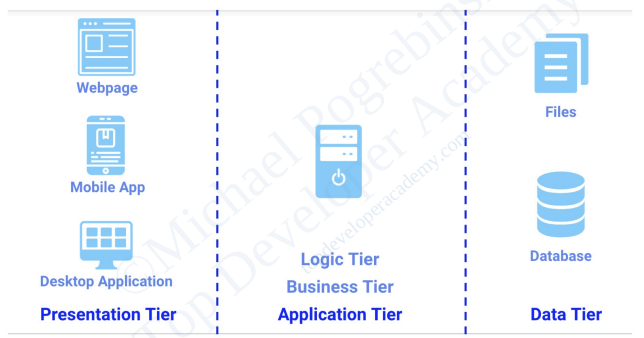

## Key Components:

1. **Presentation Layer:** The presentation layer is responsible for handling user interaction and presenting information to users. It consists of user interfaces, presentation logic, and UI components such as screens, forms, and widgets.
2. **Business Logic Layer:** The business logic layer contains the core business rules and processing logic of the application. It encapsulates domain-specific logic, workflow orchestration, and business rules validation.
3. **Data Access Layer:** The data access layer manages data persistence and retrieval operations. It interacts with databases, file systems, or external services to perform CRUD (Create, Read, Update, Delete) operations on data.
4. **Infrastructure Layer:** The infrastructure layer provides foundational services and infrastructure components required for the operation of the application. It includes services for logging, configuration, security, and cross-cutting concerns such as caching and authentication.

## Characteristics:

- **Modularity:** Layered architecture promotes modularity by organizing components into distinct layers with well-defined responsibilities and interfaces. This modular structure facilitates component reuse, replacement, and testing.
- **Separation of Concerns:** Layered architecture separates concerns by grouping related functionality into separate layers. This separation enables developers to focus on specific aspects of the application's functionality without being concerned with the details of other layers.
- **Scalability:** Layered architecture supports scalability by allowing individual layers to be scaled independently based on workload demands. For example, the presentation layer can be scaled to handle increased user traffic without affecting the underlying business logic or data access layer.
- **Maintainability:** Layered architecture enhances maintainability by providing clear boundaries between components and layers. Changes to one layer can be made without impacting other layers, making it easier to modify, extend, or refactor the application over time.

## Use Cases:

1. **Web Applications:** Layered architecture is commonly used in web applications, where the presentation layer handles user interactions, the business logic layer implements application logic, and the data access layer interacts with databases or external APIs to fetch or persist data.

   - **Example:** Online Banking System
     - **Scenario:** An online banking system utilizes layered architecture to manage user interactions, business logic, and data persistence.
     - **Implementation:** The presentation layer handles user authentication, account management, and transaction processing through a web interface. The business logic layer enforces business rules, validates transactions, and orchestrates workflows such as fund transfers or bill payments. The data access layer interacts with a relational database to store and retrieve customer information, account balances, and transaction records.
     - **Outcome:** Layered architecture enables the banking system to provide a secure, scalable, and user-friendly interface for customers to manage their finances while maintaining strict data integrity and compliance with regulatory requirements.

2. **Enterprise Systems:** Layered architecture is prevalent in enterprise systems, such as customer relationship management (CRM) or enterprise resource planning (ERP) systems, where clear separation of concerns and modularity are essential for managing complex business processes and workflows.

   - **Example:** Customer Relationship Management (CRM) Software
     - **Scenario:** A CRM software platform adopts layered architecture to manage customer data, sales processes, and customer interactions.
     - **Implementation:** The presentation layer provides a user-friendly interface for sales representatives to access customer information, manage leads, and track sales activities. The business logic layer implements sales processes, lead qualification rules, and customer segmentation algorithms. The data access layer interacts with a centralized database or external APIs to store and retrieve customer records, sales pipelines, and communication logs.
     - **Outcome:** Layered architecture enables the CRM software to streamline sales operations, improve customer relationships, and drive revenue growth by providing sales teams with a comprehensive platform for managing customer interactions and tracking sales opportunities.

3. **Mobile Applications:** Layered architecture is applicable to mobile applications, with the presentation layer handling UI rendering, the business logic layer implementing application logic, and the data access layer interacting with local databases or remote servers for data storage and retrieval.

   - **Example:** Social Media App
     - **Scenario:** A social media app employs layered architecture to handle user interactions, content sharing, and data storage on mobile devices.
     - **Implementation:** The presentation layer renders the user interface, displays news feeds, and facilitates content sharing through posts, comments, and likes. The business logic layer implements algorithms for content recommendation, friend suggestions, and social interactions. The data access layer interacts with local databases or remote servers to synchronize user data, retrieve content updates, and store user preferences.
     - **Outcome:** Layered architecture enables the social media app to deliver a seamless and responsive user experience on mobile devices while ensuring data consistency, privacy, and security. Users can interact with the app, share content, and stay connected with friends and followers, even in offline mode.

4. **Embedded Systems:**
   - **Example:** Automotive Infotainment System
     - **Scenario:** An automotive infotainment system utilizes layered architecture to manage multimedia playback, navigation, and vehicle diagnostics.
     - **Implementation:** The presentation layer displays multimedia content, navigation maps, and vehicle status information on the dashboard screen. The business logic layer controls media playback, route planning, and vehicle system integration. The data access layer interacts with onboard sensors, GPS receivers, and external data sources to collect vehicle telemetry, traffic updates, and point-of-interest information.
     - **Outcome:** Layered architecture enables the infotainment system to provide drivers and passengers with entertainment, navigation, and vehicle monitoring features while ensuring real-time responsiveness and seamless integration with vehicle systems and external services.

These real-world use cases demonstrate the versatility and applicability of Layered Architecture in building complex, scalable, and maintainable software systems across various domains and platforms.

## Benefits:

- **Modularity:** Layered architecture promotes modularity and encapsulation, facilitating component reuse, replacement, and testing.
- **Separation of Concerns:** Layered architecture separates concerns, making it easier to understand, maintain, and extend the application over time.
- **Scalability:** Layered architecture supports scalability by allowing individual layers to be scaled independently based on workload demands.
- **Maintainability:** Layered architecture enhances maintainability by providing clear boundaries between components and layers, enabling easier modification, extension, and refactoring.

## Challenges:

1. **Performance Bottlenecks:** Layered architecture may introduce performance overhead due to the additional abstraction layers and communication between layers. Optimizing performance and minimizing overhead may require careful architectural design and implementation.

   - **Challenge:** Layered architecture may introduce performance bottlenecks due to the overhead of communication and data transformation between layers. Heavy reliance on inter-layer communication can lead to increased latency and reduced throughput, particularly in systems with high transaction volumes or complex business logic.
   - **Example:** In a large-scale e-commerce platform with a layered architecture, the overhead of serializing and deserializing data between the presentation layer, business logic layer, and data access layer can impact response times during peak traffic periods. Performance tuning and optimization efforts may be required to address performance bottlenecks and improve system scalability.

2. **Complexity and Dependency Management:** Managing dependencies and interactions between layers can become complex in large-scale systems with numerous components and dependencies. Effective dependency management and modularization strategies are essential to mitigate complexity.

   - **Challenge:** Managing dependencies and interactions between layers in a layered architecture can become complex, especially in large-scale systems with numerous components and dependencies. Changes to one layer may have cascading effects on other layers, requiring careful coordination and version management.
   - **Example:** A software development team working on a layered architecture for a complex enterprise system encountered challenges with managing dependencies between the presentation layer, business logic layer, and data access layer. Changes to the data access layer schema necessitated updates to the business logic layer and presentation layer, leading to increased development time and coordination efforts.

3. **Rigid Layering and Flexibility:** A rigid layering structure may hinder flexibility and adaptability, especially in systems with evolving requirements or rapidly changing technologies. Balancing flexibility with the benefits of layering is crucial to ensure the architecture remains adaptable to changing needs.

   - **Challenge:** A rigid layering structure in layered architecture may hinder flexibility and adaptability, particularly in systems with evolving requirements or rapidly changing technologies. Adapting the architecture to accommodate new features or technologies may require extensive refactoring or redesign efforts.
   - **Example:** A legacy software system built on a rigid layered architecture struggled to incorporate new technologies and features due to the tightly coupled dependencies between layers. Introducing microservices or adopting cloud-native architectures became challenging, as it required significant rearchitecting of the system to decouple and modularize components.

4. **Testing and Debugging Complexity:**
   - **Challenge:** Testing and debugging layered architectures can be complex, as it may involve testing interactions between multiple layers and components. Ensuring end-to-end functionality and behaviour across layers requires comprehensive testing strategies and tooling.
   - **Example:** A software testing team faced challenges in designing and executing tests for a layered architecture, as it required simulating various user interactions, business logic scenarios, and data access patterns. Testing changes or updates to one layer without affecting other layers posed challenges in isolating and mocking dependencies effectively.

These real-world challenges highlight the complexities and trade-offs involved in implementing and managing layered architectures, emphasizing the importance of careful design, modularization, and architecture governance to address them effectively.

## Conclusion:

Layered architecture is a versatile and widely-used architectural pattern that provides modularity, separation of concerns, scalability, and maintainability in software systems. By organizing components into distinct layers with well-defined responsibilities and interfaces, layered architecture facilitates the development of complex, scalable, and maintainable applications across various domains and platforms.

## Space-Based Architecture

### Overview:

Space-Based Architecture (SBA) is a distributed computing model designed to address scalability and reliability challenges in large-scale, real-time systems. In SBA, data and processing logic are distributed across a network of interconnected nodes, known as spaces, which collaborate to handle incoming requests and process data in parallel. SBA emphasizes scalability, fault tolerance, and low-latency processing by partitioning data and workload across distributed spaces and leveraging in-memory caching and event-driven processing.

### Key Components:

1. **Space:** A space is a distributed, in-memory data grid that stores and processes data partitions across multiple nodes in a network. Each space can be independently scaled and replicated to handle increasing data volumes and workload demands.
2. **Partitioning:** Partitioning involves dividing data into smaller chunks or partitions and distributing them across multiple spaces based on predefined partitioning strategies, such as hashing or range-based partitioning.
3. **Event-Driven Processing:** SBA relies on event-driven processing to handle incoming requests and data updates asynchronously. Events are propagated between spaces using publish-subscribe messaging or distributed event buses to trigger processing logic and maintain data consistency.
4. **Scalability and Elasticity:** SBA enables horizontal scalability and elasticity by allowing spaces to be dynamically scaled up or down based on workload demands. New nodes can be added to the cluster to increase capacity, while redundant nodes can be removed to optimize resource utilization.

### Characteristics:

- **Scalability:** SBA provides linear scalability by distributing data and processing logic across distributed spaces, allowing the system to handle increasing workload demands by adding more nodes to the cluster.
- **Fault Tolerance:** SBA ensures fault tolerance and high availability by replicating data partitions across multiple nodes and maintaining data consistency through distributed replication and synchronization mechanisms.
- **Low-Latency Processing:** SBA minimizes processing latency by leveraging in-memory caching and parallel processing across distributed spaces, enabling real-time data ingestion, analysis, and response generation.
- **Event-Driven Architecture:** SBA follows an event-driven architecture paradigm, where events trigger processing logic and data updates across distributed spaces, enabling loosely coupled and asynchronous communication between components.

### Use Cases:

- **Real-Time Analytics:** SBA is used for real-time analytics and stream processing applications that require low-latency data ingestion, analysis, and response generation. Distributed spaces facilitate parallel processing of streaming data and event-driven analytics.
- **High-Frequency Trading:** SBA is employed in high-frequency trading systems for processing large volumes of financial transactions in real-time. Partitioned data grids and distributed processing enable low-latency trade execution and risk management.
- **Online Gaming:** SBA is utilized in online gaming platforms for handling massive multiplayer interactions, game state management, and real-time matchmaking. Distributed spaces support low-latency game updates, player interactions, and event-driven gameplay.
- **IoT and Edge Computing:** SBA is applied in IoT and edge computing environments for processing sensor data, monitoring device telemetry, and orchestrating edge computing workflows. Distributed spaces enable scalable and fault-tolerant processing of IoT data streams and event-driven automation.

### Real World Use Cases for Space-Based Architecture

1. **High-Frequency Trading Systems:**

   - **Example:** Stock Exchange Platform
     - **Scenario:** A stock exchange platform employs space-based architecture to handle high-frequency trading activities, order matching, and market data processing in real-time.
     - **Implementation:** Distributed spaces store and process order books, trade executions, and market data across multiple nodes in the network. Event-driven processing triggers trade executions, updates order statuses, and propagates market data updates to connected traders and trading algorithms.
     - **Outcome:** Space-based architecture enables the stock exchange platform to achieve low-latency trade execution, high throughput, and fault tolerance, making it well-suited for high-frequency trading environments with stringent performance and reliability requirements.

2. **Real-Time Analytics Platforms:**

   - **Example:** IoT Data Analytics Platform
     - **Scenario:** An IoT data analytics platform utilizes space-based architecture to process streaming sensor data, detect anomalies, and generate real-time insights for predictive maintenance and operational optimization.
     - **Implementation:** Distributed spaces ingest sensor data streams, apply analytics algorithms for anomaly detection and pattern recognition, and trigger alerts or actions based on detected events. Event-driven processing enables real-time aggregation, analysis, and visualization of IoT data across distributed nodes.
     - **Outcome:** Space-based architecture enables the IoT data analytics platform to scale horizontally, process massive data volumes in real-time, and derive actionable insights for optimizing asset performance and reducing downtime in industrial IoT applications.

3. **Online Gaming Platforms:**

   - **Example:** Massive Multiplayer Online Games (MMOGs)
     - **Scenario:** A massive multiplayer online gaming platform adopts space-based architecture to manage player interactions, game state synchronization, and real-time gameplay across distributed servers.
     - **Implementation:** Distributed spaces store and process game state, player actions, and event logs, facilitating real-time communication and coordination between players, game servers, and virtual environments. Event-driven processing triggers game events, updates player positions, and synchronizes game state across distributed nodes.
     - **Outcome:** Space-based architecture enables the online gaming platform to support massive concurrent player interactions, deliver seamless gameplay experiences, and scale dynamically to accommodate fluctuating player populations and game sessions.

4. **Financial Risk Management Systems:**
   - **Example:** Risk Assessment Platform
     - **Scenario:** A financial institution deploys a risk assessment platform using space-based architecture to monitor market risks, credit exposures, and portfolio performance in real-time.
     - **Implementation:** Distributed spaces store and process risk models, market data feeds, and transaction records, enabling real-time risk assessment and scenario analysis. Event-driven processing triggers risk alerts, updates risk metrics, and generates risk reports for risk managers and traders.
     - **Outcome:** Space-based architecture enables the risk assessment platform to analyze complex risk factors, detect emerging threats, and make informed decisions on portfolio management and hedging strategies in dynamic financial markets.

These real-world use cases demonstrate the versatility and applicability of space-based architecture in building scalable, real-time systems across various domains, including finance, IoT, gaming, and analytics.

### Benefits:

- **Scalability:** SBA provides linear scalability and elasticity by distributing data and processing logic across distributed spaces, enabling the system to handle increasing workload demands.
- **Fault Tolerance:** SBA ensures fault tolerance and high availability by replicating data partitions and processing logic across multiple nodes, minimizing the impact of node failures on system operation.
- **Low-Latency Processing:** SBA minimizes processing latency by leveraging in-memory caching and parallel processing across distributed spaces, enabling real-time data ingestion, analysis, and response generation.
- **Event-Driven Architecture:** SBA follows an event-driven architecture paradigm, enabling loosely coupled and asynchronous communication between components, facilitating agility and flexibility in system design.

### Challenges:

- **Complexity:** Implementing and managing a space-based architecture can be complex, requiring expertise in distributed systems, data partitioning, and event-driven processing.
- **Consistency and Coordination:** Ensuring data consistency and coordination across distributed spaces can be challenging, particularly in scenarios with high data contention or distributed transactions.
- **Operational Overhead:** Managing distributed spaces, node provisioning, and cluster coordination can incur additional operational overhead and complexity, requiring robust monitoring and management tooling.
- **Data Partitioning Strategies:** Choosing appropriate data partitioning strategies and managing data distribution across distributed spaces require careful consideration of data access patterns, workload characteristics, and scalability requirements.

### Real World Challenges with Space-Based Architecture

1. **Data Consistency and Coordination:**

   - **Challenge:** Ensuring data consistency and coordination across distributed spaces can be challenging, particularly in scenarios with high data contention or distributed transactions. Coordinating updates and maintaining consistency between replicated data partitions require robust distributed consensus mechanisms and synchronization protocols.
   - **Example:** In a space-based architecture deployed for a high-frequency trading platform, ensuring consistency and coordination across distributed nodes during rapid trade execution and order processing poses challenges. Coordinating updates to shared order books and managing distributed transactions across multiple nodes require sophisticated concurrency control and distributed locking mechanisms.

2. **Operational Overhead:**

   - **Challenge:** Managing distributed spaces, node provisioning, and cluster coordination can incur significant operational overhead and complexity. Ensuring high availability, fault tolerance, and scalability while optimizing resource utilization and performance requires robust monitoring, management, and automation tooling.
   - **Example:** A large-scale IoT platform employing space-based architecture for processing sensor data and orchestrating edge computing workflows faces challenges in managing distributed spaces, node provisioning, and cluster scaling. Monitoring the health and performance of distributed nodes, handling node failures, and rebalancing data partitions require advanced operational tooling and automation.

3. **Data Partitioning Strategies:**

   - **Challenge:** Choosing appropriate data partitioning strategies and managing data distribution across distributed spaces require careful consideration of data access patterns, workload characteristics, and scalability requirements. Poorly chosen partitioning strategies can lead to data hotspots, uneven workload distribution, and performance bottlenecks.
   - **Example:** A real-time analytics platform utilizing space-based architecture for processing streaming data and event-driven analytics encounters challenges in designing effective data partitioning strategies. Partitioning data based on key attributes such as timestamps or event types may lead to uneven data distribution or skewed workload distribution, impacting query performance and system scalability.

4. **Complexity and Scalability:**
   - **Challenge:** Implementing and managing a space-based architecture can be complex, requiring expertise in distributed systems, data partitioning, and event-driven processing. Scaling the architecture to handle increasing data volumes and workload demands while maintaining performance and reliability requires careful architectural design and operational planning.
   - **Example:** A distributed social media platform employing space-based architecture for managing user interactions, content distribution, and real-time messaging faces challenges in scaling the architecture to accommodate rapid user growth and increasing data volumes. Balancing performance, reliability, and operational complexity while ensuring seamless user experience and high availability requires continuous architectural refinement and optimization efforts.

These real-world challenges highlight the complexities and trade-offs involved in implementing and managing space-based architecture, emphasizing the importance of addressing them effectively to ensure the success of large-scale, real-time systems.

# Architectural Building Blocks

## API Gateway

### Overview

An API Gateway is an API management service that acts as an intermediary between clients and backend services. It uses the API composition pattern to aggregate multiple backend services into a single API endpoint that clients interact with. This abstraction provides several key benefits:

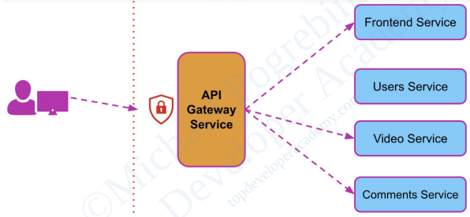

### Benefits of an API Gateway

1. **Seamless Internal Changes**:
   - Facilitates internal system changes without impacting external API consumers. For example, it enables the splitting of a frontend service into different services for various devices without altering the external API.

2. **Consolidated Security**:
   - Centralizes security, authentication, and authorization. The API Gateway can handle SSL termination, enforce rate limits, and control access, ensuring secure interactions and protecting against malicious requests.

3. **Improved Performance**:
   - **Request Routing**: Routes client requests to the appropriate backend services and aggregates responses into a single response, reducing the number of client-side calls.
   - **Caching**: Stores responses to common requests, improving response times by serving cached data instead of querying backend services repeatedly.

4. **Enhanced Monitoring and Alerting**:
   - Provides real-time visibility into system traffic patterns and load. Enables monitoring and alerting for traffic anomalies, helping in system observability and proactive issue management.

5. **Protocol Translation**:
   - Handles protocol and format translation between clients and backend services. Supports integration with various external systems by converting different protocols and data formats as needed.

### Best Practices and Anti-Patterns

1. **Avoid Business Logic**:
   - The API Gateway should not include business logic. Its primary functions should be API composition and request routing. Adding business logic can lead to a monolithic architecture and undermine the benefits of service decomposition.

2. **Single Point of Failure**:
   - An API Gateway can become a single point of failure. To address this, deploy multiple instances behind a load balancer and ensure robust release management to prevent service disruptions.

3. **Performance Overhead**:
   - While an API Gateway introduces some performance overhead, the overall benefits generally outweigh this. Avoid bypassing or over-optimizing the API Gateway, as this can reintroduce tight coupling and complicate client interactions.

## API Gateway Solutions & Cloud Technologies

### Open Source API Gateways

#### Netflix Zuul
- **Description**: Zuul is a free and open-source application gateway written in Java.
- **Capabilities**: Provides dynamic routing, monitoring, resiliency, security, and more.

### Cloud-Based API Gateways

#### Amazon API Gateway
- **Description**: A fully managed service for creating, publishing, maintaining, monitoring, and securing APIs at any scale.
- **Supports**: RESTful APIs and WebSocket APIs (bi-directional communication between client and server).

#### Google Cloud Platform API Gateway
- **Description**: Enables secure access to services through a well-defined REST API consistent across all services.
#### Microsoft Azure API Management
- **Description**: Helps organizations publish APIs to external, partner, and internal developers to unlock the potential of their data and services.

## Load Balancer

A **load balancer** is a fundamental building block in software architecture, especially for large-scale systems. Its primary role is to distribute incoming network traffic across multiple servers, ensuring no single server is overwhelmed. This distribution helps achieve high availability and horizontal scalability by running multiple instances of an application on different servers.

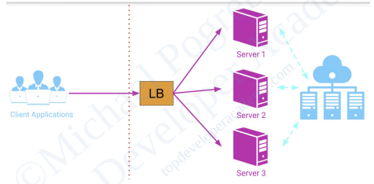

### Motivation for Using Load Balancers

Without a load balancer, a client application would need to know the addresses and number of server instances directly. This tight coupling makes it challenging to modify the system's internal structure without affecting the client application. Load balancers provide an abstraction layer, making the entire system appear as a single server with immense computing power and memory.

### Quality Attributes Provided by Load Balancers

1. **High Scalability**: 
   - Allows for scaling the system horizontally by adding or removing servers based on demand. In cloud environments, this can be automated with policies that react to metrics like request rate and bandwidth usage.

2. **High Availability**: 
   - Load balancers can monitor server health and route traffic only to healthy servers, ensuring continuous availability even if some servers fail.

3. **Performance**: 
   - While load balancers may introduce minimal latency, they enable higher throughput by distributing requests across multiple servers.

4. **Maintainability**: 
   - Facilitates rolling updates and maintenance by allowing servers to be taken offline for upgrades without disrupting the overall system.

#### Types of Load Balancers

1. **DNS Load Balancing**:

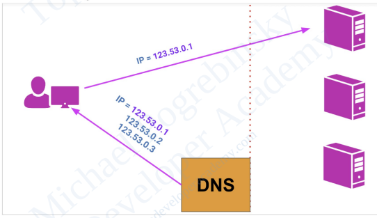

   - Uses DNS to map a domain name to multiple IP addresses. The list of addresses is rotated, balancing the load. However, this method lacks health checks and only supports simple round-robin strategies, making it less reliable and secure.

2. **Hardware Load Balancers**:
   - Dedicated devices optimized for load balancing tasks. They offer features like health checks, intelligent traffic distribution, and can secure the system by hiding internal server details.

3. **Software Load Balancers**:
   - Programs running on general-purpose hardware. They provide similar features to hardware load balancers but can be more flexible and cost-effective.

4. **Global Server Load Balancer (GSLB)**:

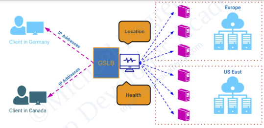

   - Combines DNS and load balancer functionalities, intelligently routing users based on location, server load, response time, and more. GSLBs are essential for multi-data center deployments and disaster recovery scenarios.

### Load Balancing Solutions & Cloud Technologies

#### Open Source Software Load Balancing Solutions

##### HAProxy
HAProxy is a free and open-source, reliable, high-performance TCP/HTTP load balancer. It is particularly well-suited for high-traffic websites and powers many of the world's most visited ones. HAProxy is considered the de-facto standard open-source load balancer and is included with most mainstream Linux distributions. It supports most Unix-style operating systems.

##### NGINX
NGINX is a free, open-source, high-performance HTTP server and reverse proxy (load balancer). Known for its performance, stability, rich feature set, and simple configuration, NGINX is a popular choice for many applications. 

#### Cloud-Based Load Balancing Solutions

##### AWS - Elastic Load Balancing (ELB)
Amazon ELB is a highly scalable load balancing solution designed for use with AWS services. It operates in four modes:
- **Application (Layer 7) Load Balancer**: Ideal for advanced load balancing of HTTP and HTTPS traffic.
- **Network (Layer 4) Load Balancer**: Ideal for load balancing TCP and UDP traffic.
- **Gateway Load Balancer**: Ideal for deploying, scaling, and managing third-party virtual appliances.
- **Classic Load Balancer (Layer 4 and 7)**: Ideal for routing traffic to EC2 instances.

##### GCP - Cloud Load Balancing
Google Cloud Platform Load Balancer is a scalable and robust load-balancing solution. It allows you to put your resources behind a single IP address that is either externally accessible or internal to your Virtual Private Cloud (VPC) network. Available load balancer types include:
- **External HTTP(S) Load Balancer**: Externally facing HTTP(s) (Layer 7) load balancer.
- **Internal HTTP(S) Load Balancer**: Internal Layer 7 load balancer.
- **External TCP/UDP Network Load Balancer**: Externally facing TCP/UDP (Layer 4) load balancer.
- **Internal TCP/UDP Load Balancer**: Internally facing TCP/UDP (Layer 4) load balancer.

##### Microsoft Azure Load Balancer
Microsoft Azure provides three types of load balancers:
- **Standard Load Balancer**: Public and internal Layer 4 load balancer.
- **Gateway Load Balancer**: High performance and high availability load balancer for third-party Network Virtual Appliances.
- **Basic Load Balancer**: Ideal for small-scale applications.

#### GSLB Solutions

##### Amazon Route 53
Amazon Route 53 is a highly available and scalable cloud Domain Name System (DNS) web service.

##### AWS Global Accelerator
AWS Global Accelerator is a networking service that improves the availability, performance, and security of public applications.

##### Google Cloud Platform Load Balancer & Cloud DNS
Google Cloud Platform offers reliable, resilient, low-latency DNS services from its worldwide network, with comprehensive domain registration, management, and serving capabilities.

##### Azure Traffic Manager
Azure Traffic Manager provides DNS-based load balancing.

## Message Brokers: The Building Block for Asynchronous Architectures

A message broker is a software component that uses the queue data structure to store and manage messages between senders and receivers. Unlike load balancers, which manage external traffic and are visible to clients, message brokers operate internally within a system and are not exposed externally.

### Synchronous Communication Drawbacks

In synchronous communication, both the sender and receiver must be active and maintain an open connection for the transaction to complete. This can lead to several issues:
- **Connection Dependence**: Both services must be healthy and running simultaneously.
- **Long Processing Times**: Services that take a long time to process requests can cause delays and hold up the entire system.
- **Traffic Handling**: Synchronous communication lacks the ability to handle sudden increases in traffic effectively.

**Example**: In a ticket reservation system, a frontend service must wait for the backend service to complete several operations before providing a response to the user. This creates a delay and can be problematic if the backend service crashes or if there’s a sudden spike in requests.

### Benefits of Message Brokers

#### Decoupling and Asynchronous Processing

Message brokers allow services to communicate without requiring them to be available simultaneously. For instance:
- **Asynchronous Responses**: In the ticket reservation system, the user receives an immediate acknowledgment and the system processes the ticket reservation and payment in the background.
- **Service Decoupling**: Services can be broken down into smaller components, each handling a part of the transaction, and communicate through the message broker.

#### Buffering and Handling Traffic Spikes

Message brokers can queue messages, helping absorb traffic spikes. For example:
- **Order Fulfillment**: In an online store, orders can be queued during high traffic periods and processed sequentially when the load decreases.

#### Publish-Subscribe Pattern

Message brokers support the publish-subscribe pattern where:
- **Multiple Subscribers**: Different services can subscribe to the same channel to receive notifications or updates.
- **Flexible Integration**: New services can be added without altering existing systems, such as adding analytics or notification services.

### Quality Attributes of Message Brokers

- **Fault Tolerance**: Message brokers enhance fault tolerance by allowing services to communicate even if some are temporarily unavailable.
- **Message Reliability**: They prevent message loss, contributing to higher system availability.
- **Scalability**: They help the system scale to handle high traffic by buffering messages.

### Performance Considerations

While message brokers provide superior availability and scalability, they introduce some latency due to the indirection involved. However, this performance penalty is generally minimal for most systems.

### Message Brokers Solutions & Cloud Technologies

### Open Source Message Brokers

- **Apache Kafka**: The most popular open-source message broker today. Apache Kafka is a distributed event streaming platform used by thousands of companies for high-performance data pipelines, streaming analytics, data integration, and mission-critical applications.

- **RabbitMQ**: A widely deployed open-source message broker used globally by both small startups and large enterprises.

### Cloud-Based Message Brokers

- **Amazon Simple Queue Service (SQS)**: A fully managed message queuing service that enables you to decouple and scale microservices, distributed systems, and serverless applications.

- **GCP Pub/Sub and Cloud Tasks**: Publisher/Subscriber and message queue solutions offered by Google Cloud Platform. 

- **Microsoft Azure**:
  - **Service Bus**: A fully managed enterprise message broker with message queues and publish-subscribe topics.
  - **Event Hubs**: A fully managed real-time data ingestion service that allows streaming millions of events per second from any source. Integrates seamlessly with Apache Kafka clients without code changes. Ideal for Big Data.
  - **Event Grid**: A reliable, serverless event delivery system at a massive scale. Uses the publish-subscribe model and is dynamically scalable. It offers a low-cost pay-as-you-go model and guarantees "at least once delivery of an event."

## Content Delivery Networks (CDNs)

### Problem Addressed by CDNs
Even with distributed web hosting and technologies like Global Server Load Balancing, significant latency remains due to the physical distance between users and hosting servers, as well as the multiple network hops between routers.

### Example of Latency Without CDN
- **User Location**: Brazil
- **Server Location**: East Coast, USA
- **Initial Latency**: 200 milliseconds
- **TCP Connection Latency**: 600 milliseconds (3-way handshake)
- **HTTP Request Latency**: 400 milliseconds
- **Asset Loading Latency**: 2,000 milliseconds
- **Total Latency**: Over 3 seconds

### Introduction to CDNs
- **Definition**: A Content Delivery Network (CDN) is a globally distributed network of servers designed to speed up content delivery to end users.
- **Purpose**: Reduces latency by caching content on edge servers closer to users.
- **Usage**: Delivers webpage content, assets (images, text, CSS, JavaScript), and video streams.

### Benefits of CDNs
1. **Faster Page Loads**: Reduces total latency to under one second by serving cached content from edge servers.
2. **Improved Availability**: Content is distributed, reducing the impact of server issues.
3. **Enhanced Security**: Protects against DDoS attacks by distributing traffic across multiple servers.

### CDN Caching Strategies

#### Pull Strategy

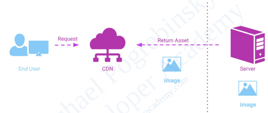

- **How It Works**: CDN caches content on first request, subsequent requests are served from the cache.
- **Advantages**: Lower maintenance, CDN manages cache updates.
- **Drawbacks**: Initial latency for uncached assets, potential traffic spikes when assets expire simultaneously.

#### Push Strategy

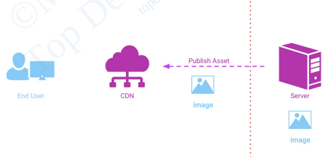

- **How It Works**: Content is manually or automatically uploaded to the CDN. Updates require re-publishing.
- **Advantages**: Reduces traffic to the origin server, maintains high availability even if the origin server is down.
- **Drawbacks**: Requires active management to update content, risk of serving outdated content if not updated.

### CDN Solutions & Cloud Technologies

### Cloudflare
- **Description**: Offers ultra-fast static and dynamic content delivery over a global edge network.
- **Benefits**: Reduces bandwidth costs and provides built-in unmetered DDoS protection.

### Fastly
- **Description**: Deliver@Edge is a modern, efficient, and highly configurable CDN.
- **Benefits**: Provides control over content caching to deliver user-requested content quickly.

### Akamai
- **Description**: Offers a variety of services including API Acceleration, Global Traffic Management, Image & Video Management, and Media Delivery.

### Amazon CloudFront
- **Description**: A high-performance CDN service built for security and developer convenience.
- **Use Cases**: Delivers fast, secure websites, accelerates dynamic content and APIs, supports live streaming, and video-on-demand.

### Google Cloud Platform CDN
- **Description**: Provides fast, reliable web and video content delivery with global scale and reach.

### Microsoft Azure Content Delivery Network
- **Description**: Offers global coverage, full integration with Azure services, and a simple setup.

# Scalability Patterns

## Load Balancing in Scalable System Architectures

Load balancing is a software architecture pattern used to distribute incoming requests across multiple servers, allowing systems to scale efficiently and maintain performance under high traffic conditions. Single cloud servers are insufficient for handling high volumes of requests, leading to crashes or performance issues. Upgrading servers only postpones the problem. A dispatcher routes incoming requests to available worker servers, enabling load distribution and scalability.

### Use Cases

- **HTTP Requests:** Distributes front-end requests (web/mobile) to back-end servers.
- **Microservices Architecture:** Manages service instances, enabling independent scaling for each service.

### Implementation Methods

- **Cloud Load Balancing Services:**
  - Managed services that route requests and can scale automatically.
  - Avoid becoming a single point of failure.
    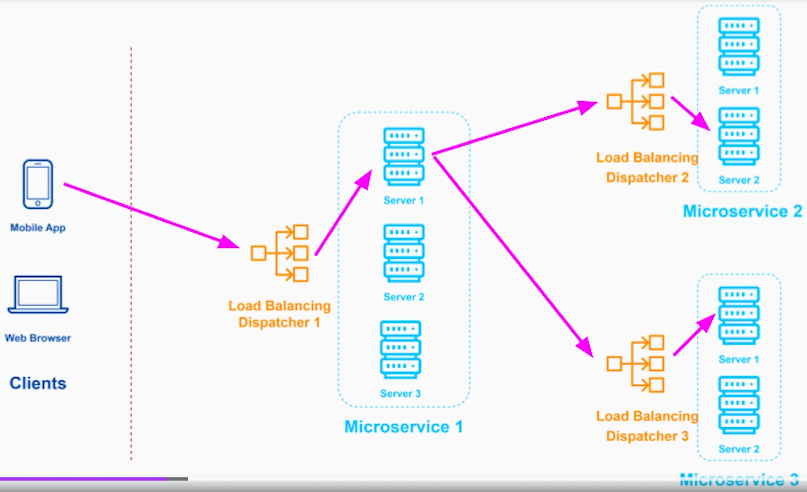
- **Message Brokers:**
  - Used for asynchronous, one-directional communication between services.
  - Useful for internal load balancing of message queues.
    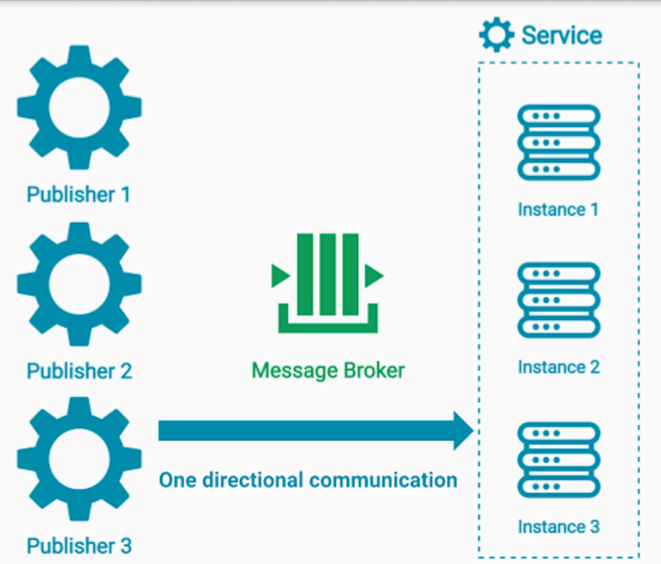

### Routing Algorithms

- **Round Robin:** Sequentially distributes requests, suitable for stateless applications. Example: Most of the stateless API's
- **Sticky Sessions:** Routes requests from the same client to the same server, ideal for stateful applications. Example: Banking, Financial transactions, Multipart file upload.
- **Least Connection:** Directs requests to servers with the fewest active connections, suitable for long-term connections. Example: SQL, LDAP.

### Auto Scaling Integration

- **Auto Scaling:** Automatically adjusts the number of servers based on metrics like CPU usage and traffic.
- Works in conjunction with load balancing to optimize resource use and cost.

#### Example of Auto Scaling Integration

**Scenario:**
A cloud-based e-commerce platform experiences variable traffic, with peaks during sales events and lower traffic during off-peak hours.

**Auto Scaling Integration Steps:**

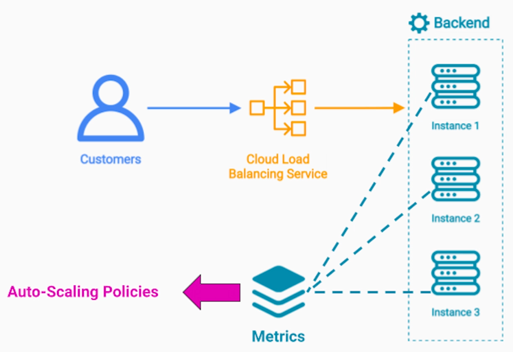

1. **Monitoring and Metrics Collection:**

   - Server instances in the cloud environment run monitoring agents to collect metrics such as CPU utilization, memory usage, and network traffic.

2. **Defining Auto Scaling Policies:**

   - Policies are established based on the collected metrics. For example:
     - **Scale Up Policy:** Add more server instances if the average CPU utilization exceeds 70% for 5 consecutive minutes.
     - **Scale Down Policy:** Remove server instances if the average CPU utilization drops below 30% for 10 consecutive minutes.

3. **Load Balancer Coordination:**

   - The load balancer is configured to recognize the dynamic pool of server instances. It automatically adjusts the routing of incoming requests based on the current set of available instances.

4. **Implementation Example:**
   - **Cloud Load Balancer:** Utilizes a cloud provider's load balancing service to distribute incoming traffic across a pool of identical web server instances.
   - **Auto Scaling Group:** The web server instances are managed as an auto-scaling group within the cloud provider's infrastructure.
   - **Elasticity in Action:**
     - During a flash sale, the traffic spikes, causing the average CPU utilization to rise above 70%. The auto-scaling policy triggers, launching additional server instances to handle the increased load.
     - The load balancer detects the new instances and routes traffic to them, balancing the load.
     - After the sale, as traffic decreases, the average CPU utilization falls below 30%. The auto-scaling policy triggers the removal of excess instances, reducing costs.

**Benefits:**

- **Dynamic Scalability:** Automatically adapts to traffic changes, ensuring optimal performance.
- **Cost Efficiency:** Reduces infrastructure costs by scaling down during low-traffic periods.
- **Resilience:** Prevents server overload and potential crashes by distributing the load and adding capacity when necessary.

This example illustrates how auto scaling, combined with a load balancer, efficiently manages variable workloads in a cloud environment, providing both scalability and cost-effectiveness.

References

- [Google Compute Engine Autoscaling Groups](https://cloud.google.com/compute/docs/autoscaler)
- [GKE Cluster Autoscaling](https://cloud.google.com/kubernetes-engine/docs/concepts/cluster-autoscaler)
- [Amazon EC2 Autoscaling](https://docs.aws.amazon.com/autoscaling/ec2/userguide/what-is-amazon-ec2-auto-scaling.html)

### Considerations

- **Session Management:** Choosing the right routing algorithm depends on whether the application is stateless or stateful.
- **Scalability and Cost Efficiency:** Combining load balancing with auto scaling helps in dynamically resizing the backend infrastructure, ensuring optimal resource utilization and cost savings.

This documentation outlines the essential aspects of implementing and managing load balancing in scalable system architectures, highlighting methods, algorithms, and practical considerations for effective deployment.

## Pipes and Filters Architecture Pattern

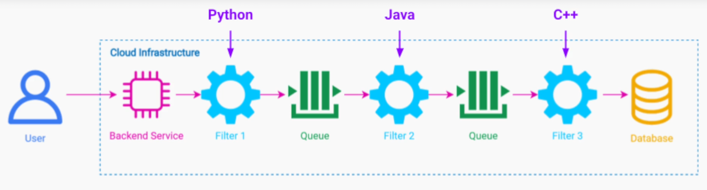

### Overview

- **Analogy:** Data flows like water through a series of pipes and filters.
- **Components:**
  - **Data Source:** Origin of the data, e.g., backend services, sensors.
  - **Filters:** Isolated software components that process data.
  - **Pipes:** Mechanisms like distributed queues or message brokers that connect filters.
  - **Data Sink:** Final destination for processed data, e.g., databases, external services.

### Key Concepts

- **Filters:** Perform single operations, unaware of the rest of the pipeline.
- **Pipes:** Can store data temporarily or use message systems for notifications.

### Benefits

1. **Decoupling:**
   - Allows different processing tasks to use different programming languages and technologies.
2. **Hardware Optimization:**
   - Each task can run on the most suitable hardware (e.g., specialized hardware for machine learning).
3. **Scalability:**
   - Each filter can be scaled independently based on workload needs.

### Real-World Use Cases

- **Digital Advertising:** Processing streams of user activity data.
- **Internet of Things (IoT):** Data processing from end devices.
- **Media Processing:**
  - Video and audio processing pipelines, including chunking, thumbnail creation, resolution resizing, adaptive streaming, and captioning.

### Example: Video Sharing Service

1. **Video Processing Pipeline:**

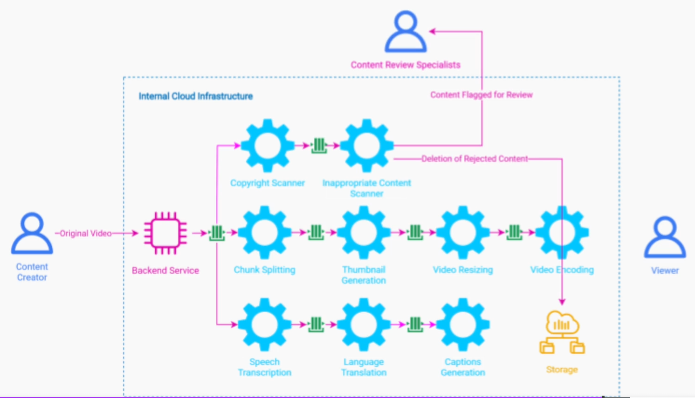

- **Chunking:** Split video into smaller chunks.
- **Thumbnail Extraction:** Select frames as thumbnails.
- **Resolution and Bitrate Adjustment:** Resize chunks for adaptive streaming.
- **Encoding:** Encode chunks into different formats.

2. **Audio Processing Pipeline:**
   - **Transcription:** Convert speech to text.
   - **Captioning and Translation:** Provide captions and translate into different languages.
   - **Content Moderation:** Detect copyrighted or inappropriate content.

### Considerations

1. **Complexity:**
   - Maintaining this architecture can be complex, especially with granular filters.
2. **Stateless Filters:**
   - Each filter should be independent and stateless.
3. **Transaction Handling:**
   - Not suitable for scenarios requiring a single transaction across the entire pipeline.

The pipes and filters pattern is valuable for scenarios needing flexible, scalable, and decoupled processing pipelines but may not be ideal for transactional data processing.

## Scatter-Gather Architecture Pattern

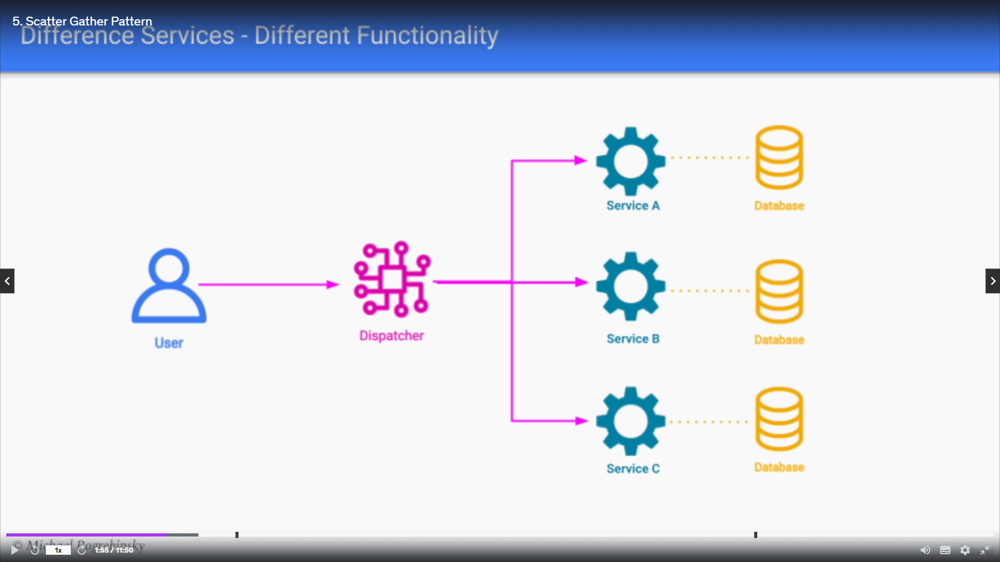

### Overview

- **Components:**
  - **Sender/Requester:** Initiates the request.
  - **Workers:** Respond to the request; can be internal or external services.
  - **Dispatcher:** Distributes the request to all workers and collects responses.
  - **Aggregator:** Combines responses from workers into a single response.

### Key Concepts

- **Parallel Processing:**
  - Requests are sent to all workers simultaneously, allowing for parallel processing.
  - Workers can be diverse, performing different functions or accessing different data.

### Use Cases

1. **Search Services:**

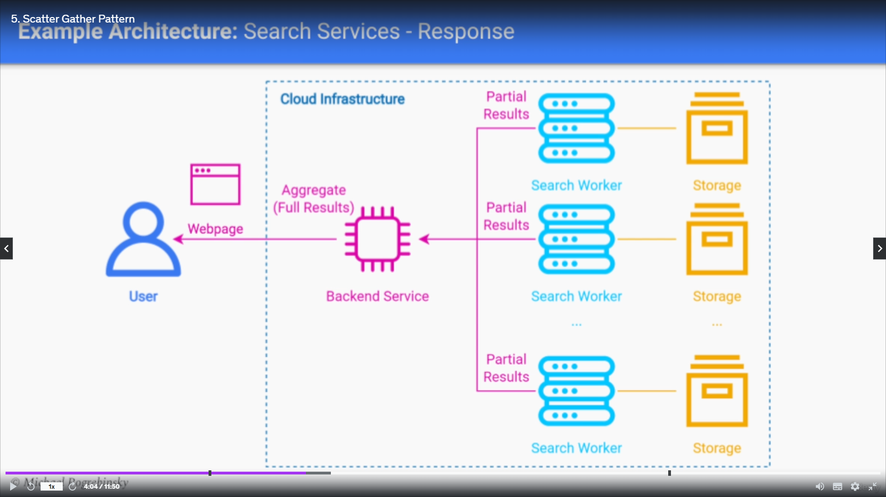

   - Users send a query, and internal workers search through various data subsets.
   - Results are aggregated and returned as a ranked list.

2. **Hospitality Services:**

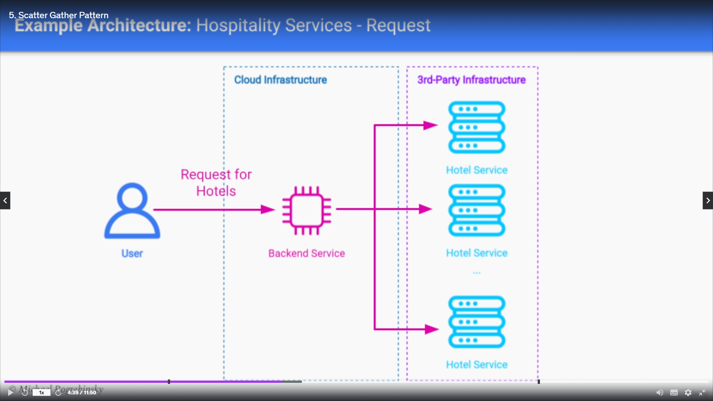

   - A request for hotel availability is sent to multiple hotels.
   - Responses are collected and sorted based on criteria like price or rating.

### Considerations

1. **Timeouts:**
   - Set an upper limit for waiting for worker responses to avoid delays due to unresponsive workers.
2. **Decoupling:**
   - Use a message broker to decouple the dispatcher and workers, facilitating asynchronous communication.
3. **Long-running Tasks:**
   - For tasks requiring extensive processing, separate the dispatcher and aggregator.
   - Use unique identifiers for tracking and retrieving results.

### Example Workflow

1. **Immediate Response Use Case:**

   - Dispatcher sends a request to workers.
   - Workers process and return responses quickly.
   - Aggregator compiles the results and sends them to the user.

2. **Long-running Task Use Case:**
   - Dispatcher assigns a unique ID to the request and sends it to workers.
   - Workers return partial results with the same ID.
   - Aggregator stores and compiles results, accessible via the unique ID.

#### Benefits

- **Scalability:**
  - Supports high scalability by enabling parallel processing across numerous workers.
- **Flexibility:**
  - Can integrate diverse internal and external services.
- **Resilience:**
  - Can continue processing even if some workers are unavailable or slow.

The scatter-gather pattern is versatile and widely used in many production systems, providing efficient parallel processing and aggregation of results.

## Execution Orchestrator Pattern

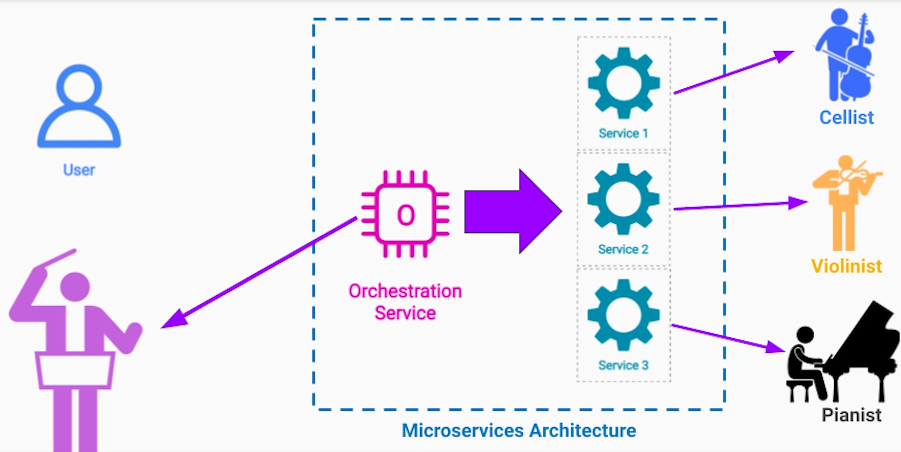

### Overview
- **Purpose:** Manages a sequence of operations across multiple services in microservices architecture.
- **Analogy:** Like a conductor in an orchestra, the orchestrator directs services without performing the business logic itself.

### Key Concepts
- **Execution Orchestrator:** A centralized service that:
  - Calls different services in the right order.
  - Handles exceptions and retries.
  - Maintains the state of the flow until completion.
- **Microservices:** Individual services responsible for specific business logic, typically stateless and independently scalable.

### Use Case Example: Video on Demand Service

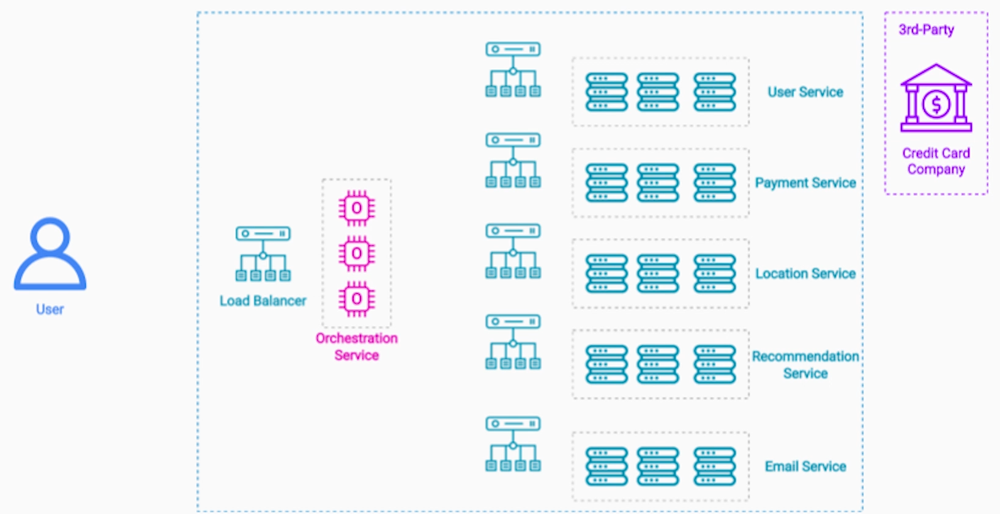

- **User Registration Flow:**
  1. User fills out a registration form (username, password, payment).
  2. **Orchestrator Service** handles:
     - **User Service:** Validates username and password.
     - **Payment Service:** Authorizes credit card via a third-party API.
     - **Location Service:** Registers user location for content access.
     - **Recommendation Service:** Sets up user preferences.
     - **Email Service:** Sends a confirmation email with details.

### Considerations
1. **Scalability:** 
   - Orchestrator and microservices can be scaled independently.
   - Orchestrator can be deployed across multiple instances for reliability.
2. **Failure and Recovery:**
   - Orchestrator handles errors, retries, and manages the flow's state.
   - Maintains a database to persist the state for recovery in case of failures.
3. **Avoiding Monolithic Tendencies:**
   - Keep the orchestrator focused on coordination, not business logic.

### Benefits
- **Decoupling:** Microservices operate independently and are unaware of the orchestration.
- **Efficiency:** Supports parallel and sequential operations.
- **Flexibility:** Easy to modify the flow by updating the orchestrator.

This pattern is particularly useful in complex systems requiring coordination of multiple independent services, offering a scalable and maintainable solution for executing business logic workflows.

## Choreography Pattern

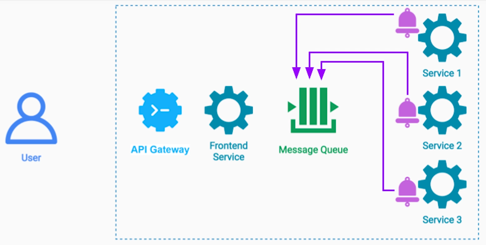

### Overview
- **Purpose:** Helps scale complex flows of business transactions in microservices architecture.
- **Comparison:** Unlike the orchestration pattern, choreography uses asynchronous events without a central orchestrator.

### Key Concepts
- **Microservices:** Decoupled services that communicate through a message broker.
- **Message Broker:** A distributed message queue that stores and distributes events.

### Advantages
- **Loose Coupling:** Services operate independently and are not tightly coupled through a central orchestrator.
- **Scalability:** Easy to add or remove services and scale operations.
- **Cost Efficiency:** Services can be implemented as functions that only run when triggered, saving resources.

### Example: Job Search Service

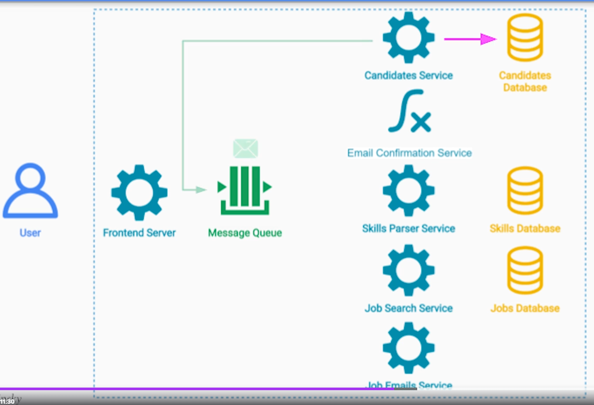

1. **User Registration:** 
   - User submits a form with their details and resume.
   - **Candidate Service:** Stores data and emits an event.
2. **Email Confirmation:** 
   - Triggered by the event, an email confirmation is sent to the user.
3. **Skills Parsing:** 
   - **Skills Parser Service:** Extracts and stores skills data, then emits an event.
4. **Job Search:** 
   - **Job Search Service:** Searches for job matches and emits results as an event.
5. **Job Notifications:** 
   - **Candidate Service:** Updates user records.
   - **Email Service:** Sends job notifications based on user preferences.

### Considerations
1. **Debugging Challenges:** 
   - Troubleshooting issues can be difficult due to lack of a central coordinator.
   - Harder to trace the flow of events and identify issues.
2. **Testing Complexity:** 
   - Requires complex integration tests to catch issues before production.
   - Becomes more challenging as the number of services grows.

# Performance Patterns

## MapReduce Pattern
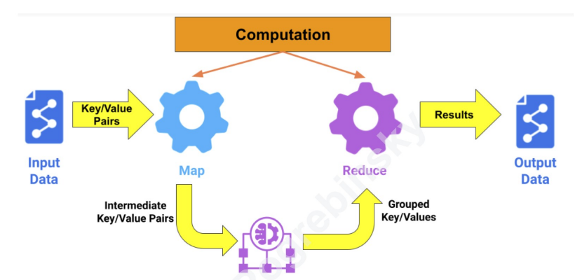

### Overview
- **Origin:** Introduced by Jeff Dean and S.J. Ghemawat from Google in 2004.
- **Purpose:** Simplifies processing of large data sets by distributing computation across many machines.

### Key Concepts
- **Map Function:** Transforms input key-value pairs into intermediate key-value pairs.
- **Reduce Function:** Aggregates and processes intermediate pairs to produce final output.

### Example: Word Count in Text Files
1. **Input:** Key-value pairs (filename, content).
2. **Map Function:** Emits (word, 1) for each word in the content.
3. **Shuffle and Sort:** Groups intermediate pairs by word.
4. **Reduce Function:** Sums the counts for each word.

### Architecture

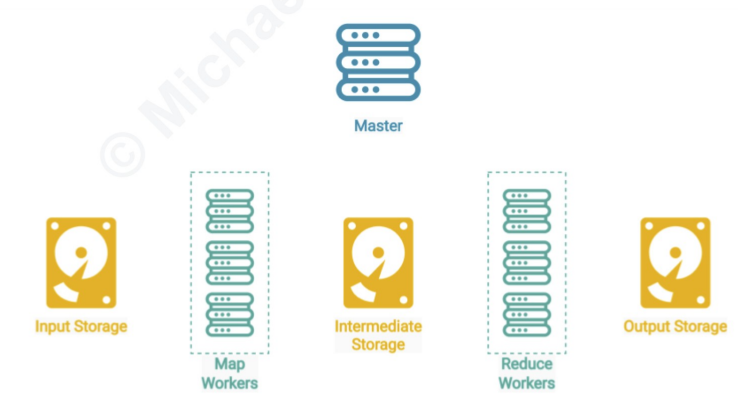
> TODO: Add backup master and snapshot storage in the image

- **Master Node:** Orchestrates the computation, schedules tasks, and handles failures.
- **Worker Nodes:** Execute map and reduce tasks in parallel.
- **Data Distribution:** Input data is split into chunks for parallel processing.

### Fault Tolerance
- **Worker Failures:** Master reassigns tasks and notifies reduce workers of new data locations.
- **Master Failures:** Can either restart the process or use a backup master to continue.

### Cloud Integration
- **Scalability:** Cloud environments provide access to many machines, enabling large-scale data processing.
- **Cost Efficiency:** MapReduce's batch processing nature means paying only for resources used during the job, not for maintaining idle machines.

## Saga Pattern

### Introduction
- **Context:** Microservices architecture, where each service has its own database.
- **Problem:** Ensuring data consistency across multiple databases without a central database, losing traditional ACID transactions.

### Solution: Saga Pattern

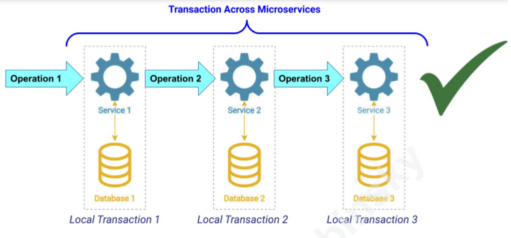
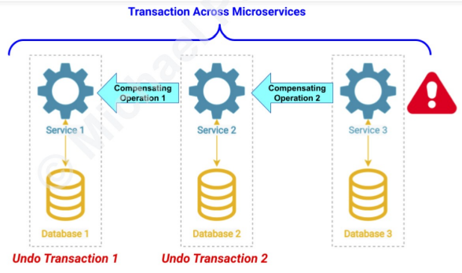

- **Definition:** Manages data consistency in distributed transactions by breaking them into a series of local transactions. If an operation fails, compensating transactions are executed to roll back.

### Implementation Methods
1. **Execution Orchestrator Pattern:**
   - A central orchestrator service manages the transaction flow, calling services sequentially.
   - Decides whether to continue or rollback based on service responses.

2. **Choreography Pattern:**
   - No central orchestrator; services communicate through a message broker.
   - Each service listens for events and triggers subsequent steps or compensations as needed.

### Example Scenario: Ticket Reservation System

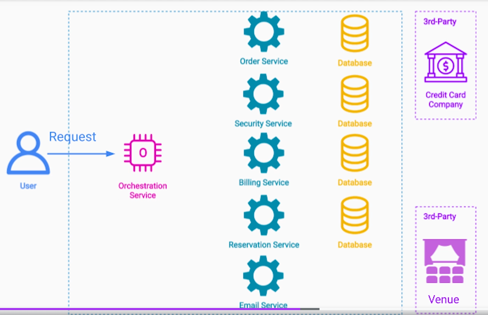

1. **Services Involved:** Order, Security, Billing, Reservation, Email, (Orchestration if using orchestrator pattern).
2. **Process:**
   - **Order Service:** Registers an order and sets it to pending.
   - **Security Service:** Validates the user (not a bot or blacklisted).
   - **Billing Service:** Authorizes the pending transaction on the user's credit card.
   - **Reservation Service:** Reserves the ticket for the user.
   - **Email Service:** Sends a confirmation email.

3. **Failure Handling:**
   - If any service returns a failure, compensating operations are triggered:
     - Cancel pending transactions.
     - Remove records from databases.
   - Compensating operations ensure consistency by undoing previous steps if necessary.

### Conclusion
- **Purpose:** Maintains data consistency in a microservices environment by handling distributed transactions.
- **Flexibility:** Can be implemented using either the execution orchestrator pattern or the choreography pattern.
- **Resilience:** Provides mechanisms to complete transactions or roll back in case of failures.

The saga pattern is crucial for ensuring reliable operations and consistency in complex systems with distributed architectures.

## Transactional Outbox Pattern

### Overview
- **Problem:** In event-driven architectures, ensuring that a database update and an event publication occur together reliably can be challenging. Specifically, there's a risk of losing events or data if a system crash occurs between these operations.

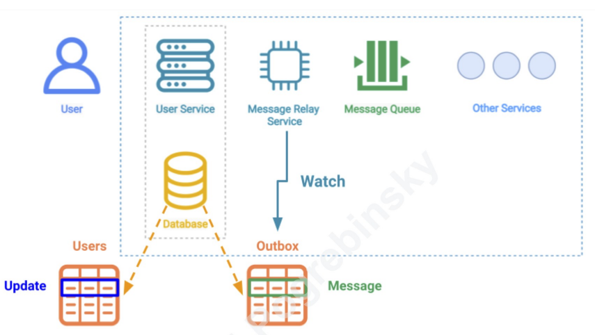

### Solution: Transactional Outbox Pattern
- **Concept:** Involves adding an **Outbox Table** to the database to store messages intended for the message broker. Updates to both the business logic table (e.g., users) and the Outbox Table are performed within a single database transaction.

### Implementation Steps
1. **Database Update and Message Logging:**
   - Instead of sending an event directly to the message broker, the service logs the message to the Outbox Table along with updating the primary business logic table.
   - Ensures atomicity: Both tables are updated together, or neither is, preventing partial updates.

2. **Message Sender/Relay Service:**
   - A separate service monitors the Outbox Table for new messages.
   - Upon finding a new message, it sends it to the message broker and marks it as sent (or deletes it).

### Addressing Potential Issues
1. **Duplicate Events:**
   - **Cause:** A crash between sending a message and marking it as sent can result in duplicate events.
   - **Solution:** Implement "at least once" delivery semantics. Each message gets a unique ID. Consumers track processed message IDs to discard duplicates.

2. **Lack of Transaction Support:**
   - **Scenario:** Some databases, especially NoSQL ones, may not support multi-collection transactions.
   - **Solution:** Embed the Outbox message directly within the same document (or object) in the database. The sender service queries for documents with messages, sends them, and then clears the messages.

3. **Ordering of Events:**
   - **Problem:** Ensuring the order of related events, such as a user signup followed by a cancellation.
   - **Solution:** Assign each message a sequential ID. The sender service can then sort and send messages in the correct order based on these IDs.

### Conclusion
- **Benefits:** The transactional outbox pattern provides a robust solution for ensuring data consistency and reliable event publication in distributed systems.
- **Considerations:** Addressing potential issues like duplicate events, lack of transaction support, and event ordering is crucial for effective implementation.

The transactional outbox pattern is an essential tool for maintaining consistency in microservices architectures, particularly in systems that rely heavily on event-driven communication.

## Materialized View Pattern

### Overview
- **Purpose:** To optimize performance and cost efficiency in data-intensive applications by pre-computing and storing query results.

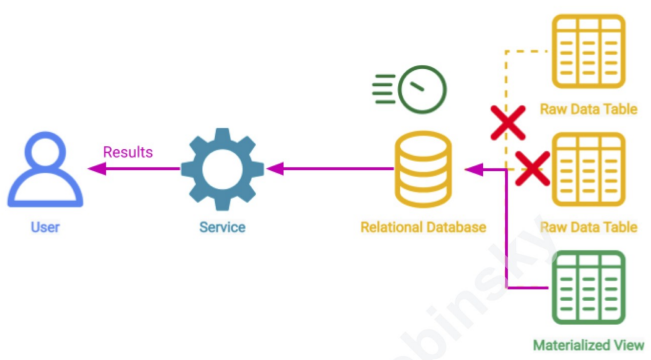

### Problem Statement
1. **Performance:** Complex queries, especially those involving multiple tables or databases, can be slow.
2. **Cost:** Repeatedly running the same complex queries can be resource-intensive, leading to high costs in a cloud environment.

### Solution: Materialized View
- **Concept:** Create a read-only table (materialized view) that stores the pre-computed results of a specific query. This allows for quick data retrieval without recalculating the query each time.

### Implementation
1. **Data Storage:**
   - Store materialized views as separate tables in the same database or in a read-optimized separate database.
   - In cases of frequent data updates, the materialized view can be regenerated immediately or on a fixed schedule.

2. **Example Use Case:**
   - **Scenario:** An online education platform with tables for courses and reviews.
   - **Need:** Display top courses based on average ratings for a specific topic.
   - **Solution:** Create a materialized view storing pre-computed course ratings, which can be filtered quickly based on the topic.

3. **Benefits:**
   - **Performance:** Significantly reduces query time by avoiding complex aggregations and joins.
   - **Cost Efficiency:** Saves resources by reducing the need for repeated complex query execution.

### Considerations
1. **Storage Space:** Materialized views require additional storage, increasing costs. The trade-off between performance and space must be evaluated.
2. **Update Frequency:** 
   - **Same Database:** If the database supports materialized views, updates can be automatic and efficient.
   - **External Storage:** Requires manual or programmatic updates, which can add complexity.

### Conclusion
- The materialized view pattern is a powerful tool for optimizing the performance of data-intensive applications. By pre-computing and storing query results, this pattern improves user experience and reduces operational costs, especially in environments where resource usage incurs significant expenses.

## CQRS (Command and Query Responsibility Segregation)

### Overview
- **Purpose:** To separate the command (write) and query (read) responsibilities in a system into distinct services and databases, optimizing each for its specific workload.

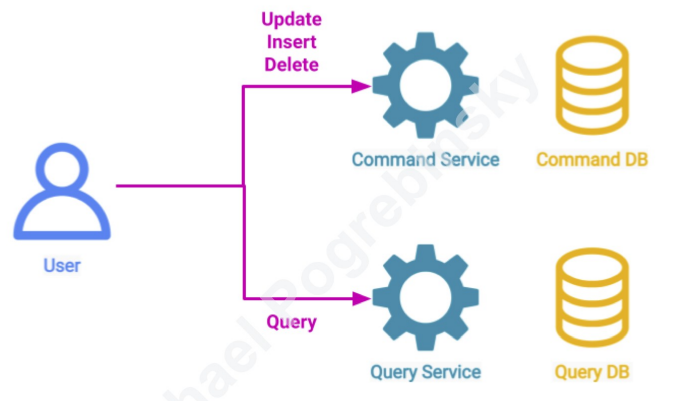

### Key Concepts
1. **Command Operations:** Actions that mutate data, such as insertions, updates, and deletions.
2. **Query Operations:** Actions that read and return data without altering it.

### Benefits of CQRS
1. **Separation of Concerns:** 
   - Command service handles business logic, validations, and data mutations.
   - Query service focuses solely on data retrieval and presentation.
2. **Independent Scalability:** 
   - The number of instances for each service can be scaled independently based on demand.
3. **Optimized Data Models:** 
   - Command database can be optimized for write operations.
   - Query database can be optimized for read operations, often using different database technologies.

### Example Use Case: Online Store
- **Command Side:** 
  - Stores user reviews in a relational database.
  - Ensures business logic, such as validating purchases and review content.
- **Query Side:** 
  - Stores reviews and average ratings in a NoSQL database, optimized for quick retrieval.
  - Contains pre-aggregated data to minimize real-time computations.

### Synchronization
- **Event Publishing:** 
  - On data mutation, the command service publishes events to keep the query database updated.
  - Can use message brokers or functions-as-a-service for event handling and data synchronization.
- **Eventual Consistency:** 
  - The system guarantees eventual consistency between command and query databases but not strict consistency.

### Considerations
- **Complexity:** 
  - Requires managing multiple services, databases, and synchronization mechanisms.
  - Adds overhead but provides significant performance benefits.
- **Eventual Consistency:** 
  - Suitable for scenarios where eventual consistency is acceptable, not for strict consistency requirements.

## Combining CQRS and Materialized View Patterns in Microservices

### Overview
- **Problem:** In a microservices architecture, data is often split across multiple services and databases, making it challenging to aggregate data efficiently for queries.
- **Solution:** Use a combination of CQRS and materialized view patterns to optimize data retrieval and maintain synchronization across services.

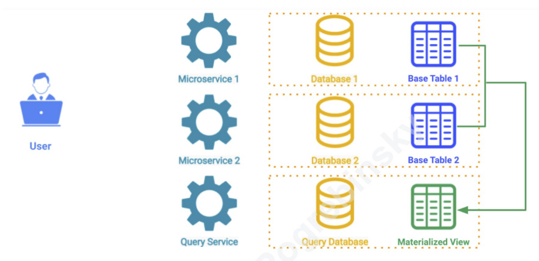

### Key Concepts
1. **Microservices Split:** 
   - Initially, all data might reside in a single database. Splitting into microservices involves dividing this data into separate databases, each handled by a specific service.
   - This division prevents traditional join operations across different microservices' databases.

2. **Performance Challenges:** 
   - Aggregating data across multiple services requires API calls, database queries, and programmatic joins, leading to significant performance overhead.

### Solution: Combining Patterns
1. **CQRS (Command and Query Responsibility Segregation):**
   - Create a new microservice with a read-optimized database specifically for querying aggregated data.
   - This microservice only handles queries and does not perform data mutations.

2. **Materialized View:**
   - A materialized view is created to pre-aggregate and store relevant data from multiple microservices.
   - The view includes data necessary for user queries, combining information from different microservices.

### Synchronization Methods
1. **Message Broker:**
   - Each microservice publishes events to a message broker when data changes.
   - The query microservice listens to these events and updates the materialized view accordingly.

2. **Cloud Function:**
   - A function as a service monitors tables in different services' databases.
   - On detecting changes, the function updates the materialized view in the query database.

### Real-World Example: Online Education Platform
- **Setup:**
  - *Courses Microservice:* Manages course data (name, description, price).
  - *Reviews Microservice:* Handles reviews and ratings.
  - *Course Search Service:* New service with a materialized view that includes course details and reviews.

- **Data Flow:**
  - Changes in the course details or reviews trigger events.
  - The Course Search Service updates its materialized view based on these events, ensuring quick access to aggregated data.

### Benefits
- **Efficient Data Aggregation:** 
  - Combines data from multiple microservices into a single, query-optimized view.
- **Performance Optimization:** 
  - Reduces the need for complex, runtime data joins and minimizes latency.
- **Scalability and Maintainability:** 
  - Isolates query logic, making it easier to maintain and scale based on query load.

### Conclusion
- The combination of CQRS and materialized views effectively addresses the challenges of data aggregation in microservices architectures. This approach optimizes data retrieval, maintains synchronization, and allows for scalable and maintainable systems.

## Event Sourcing Pattern

### Overview
Event sourcing is an architecture pattern where the state of an application is derived from a sequence of events rather than storing the current state directly.

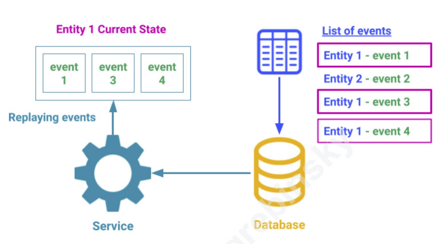 

### Traditional Data Handling
- **CRUD Operations:** Applications typically use Create, Read, Update, and Delete operations to manage data, focusing on the current state.
- **Current State:** The database stores the current state of entities, and any modifications overwrite previous states.

### Need for Event Sourcing
- **Limited by Current State:** In some cases, knowing only the current state isn't sufficient. Historical data or the sequence of changes may be crucial.
- **Examples:**
  - **Banking:** Clients need to see transaction histories, not just current balances.
  - **E-commerce:** Merchants might need to understand inventory changes, not just the current stock level.

### Event Sourcing Explained
- **Events Over State:** Instead of the current state, the system stores events that describe changes or facts about entities.
- **Immutability:** Events are immutable; once logged, they cannot be changed.
- **Replaying Events:** The current state is derived by replaying all events related to an entity.

### Benefits of Event Sourcing
- **Complete History:** Retains a full history of changes, useful for auditing and troubleshooting.
- **Performance:** Improved write performance, as events are appended rather than updating a state.

### Storing Events
1. **Database:** Each event can be stored as a record, allowing for complex queries and analytics.
2. **Message Broker:** Events can be published for consumption by other services, ensuring order and scalability.

### Challenges and Optimizations
- **Replaying All Events:** Reconstructing state by replaying all events can be inefficient.
  - **Snapshots:** Periodically save the current state to reduce the number of events replayed.
  - **CQRS (Command Query Responsibility Segregation):** Separate systems for handling commands (writes) and queries (reads). This allows for efficient read operations using a read-optimized database.

### Combining Event Sourcing and CQRS
- **Eventual Consistency:** Combining these patterns often results in eventual consistency, which may be acceptable depending on the use case.
- **Benefits:**
  - **Auditing and History:** Complete record of all changes.
  - **Efficient Writes and Reads:** Separate systems optimize performance.

## Big Data Processing and Lambda Architecture

### Overview

In big data processing, two main strategies exist: batch processing and real-time processing. Batch processing allows for deep insights into historical data and the fusion of data from various sources, but it has a higher delay between data collection and availability for querying. Real-time processing provides immediate visibility and response to incoming data but is limited to recent information without deep historical context.

### The Challenge

Deciding between batch and real-time processing can be difficult, as many systems require the benefits of both strategies. For instance, systems that aggregate logs and performance metrics, or those used in ride-sharing services, need both real-time insights for immediate actions and historical analysis for detecting patterns and optimizing performance.

### Lambda Architecture

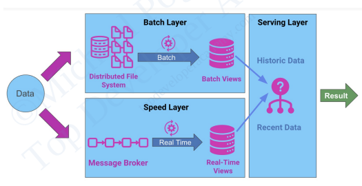

The Lambda Architecture addresses this challenge by combining batch and real-time processing, offering the best of both worlds. It consists of three layers:

1. **Batch Layer**: 
   - Manages the master dataset as a system of records, storing immutable data.
   - Pre-computes batch views for in-depth analysis and data corrections.
   - Operates on the entire dataset for perfect accuracy.

2. **Speed Layer**: 
   - Handles real-time data processing to provide low-latency views.
   - Processes data as it arrives and updates real-time views.
   - Focuses on recent data without complex corrections or historical context.

3. **Serving Layer**: 
   - Merges data from both batch and real-time views.
   - Responds to ad-hoc queries, providing a comprehensive view combining historical and real-time data.

### Practical Application

A practical example of Lambda Architecture is in the ad tech industry, where advertisers and content producers interact through an ad-serving system. The system must process three types of events: ad views, ad clicks, and user purchases. These events are processed by both the batch and speed layers to provide:

- Real-time data, such as the number of users currently viewing ads.
- Combined data for queries like the total ads shown in the last 24 hours, merging batch and speed layer data.
- In-depth analysis, like determining the return on investment for advertisers, which requires historical data fusion and analytics.

### Conclusion

Lambda Architecture effectively handles scenarios requiring both real-time and batch processing capabilities. It allows for comprehensive data analysis and immediate responsiveness, making it a versatile solution for modern big data systems.

# Software Extensibility Patterns 

## Extensibility Patterns: Sidecar

### Overview
The **Sidecar** pattern is an extensibility pattern used to extend the functionality of a service without embedding additional logic directly into the service. This approach allows for modular and scalable systems.

### Problem to Solve
- **Additional Functionality Needs:** Services often require extra capabilities like logging, monitoring, or configuration management, beyond their core business logic.
- **Challenges:**
  - **Library Reuse:** In a multi-language environment, reusing libraries across services is impractical and can lead to inconsistencies.
  - **Separate Services:** Deploying shared functionalities as separate services can be excessive and complex.

### Sidecar Pattern

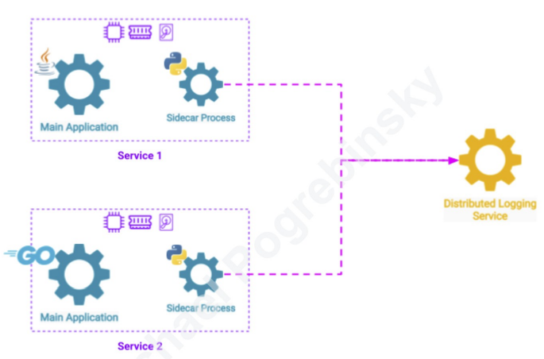

- **Analogy:** Like a sidecar on a motorcycle, this pattern adds extra functionality as a separate process or container alongside the main service.
- **Benefits:**
  - **Isolation:** Provides separation between the core service and the sidecar, reducing potential conflicts.
  - **Shared Resources:** Both the main service and the sidecar share the same host, allowing fast and reliable communication.
  - **Language Independence:** Sidecars can be implemented in any language and reused across different services.
  - **Simplified Updates:** Updates to sidecar functionalities can be rolled out across all services simultaneously.

### Ambassador Sidecar
- **Function:** A specific type of sidecar that acts as a proxy for handling network requests.
- **Advantages:**
  - **Complexity Offloading:** Manages network communication complexities, including retries, authentication, and routing.
  - **Simplified Core Service:** Keeps the core service focused on business logic, while the ambassador handles network concerns.
  - **Distributed Tracing:** Enables instrumentation and tracing across services, aiding in troubleshooting and isolating issues.

## Anti-Corruption Adapter Pattern

### Introduction
The **Anti-Corruption Adapter Pattern** is a crucial software architecture pattern used to manage interactions between systems with different technologies, protocols, or data models. It prevents the corruption of a new system by the legacy system during integration or migration processes.

### Scenarios and Solutions

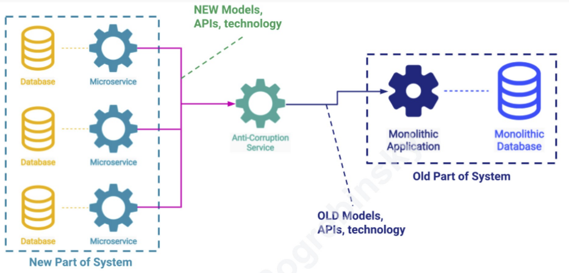

1. **Migration from Monolith to Microservices:**
   - **Problem:** During migration from a monolithic system to microservices, new services may need to interact with old technologies, APIs, or data models. This can corrupt the clean design of new services.
   - **Solution:** Implement an Anti-Corruption Adapter (ACA) service that acts as a mediator. The ACA translates communications, allowing new microservices to interact with the monolithic application using modern technologies, while the monolith continues to operate as before.

2. **Coexistence with Legacy Systems:**
   - **Problem:** Sometimes, parts of the legacy system cannot be fully migrated or replaced due to various constraints, such as high costs or critical dependencies.
   - **Solution:** The ACA enables the new system to leverage legacy components without inheriting outdated logic or technologies. This allows the legacy system to remain as-is, while the new system evolves independently.

### Benefits
- **Isolation:** The ACA isolates new and old systems, preventing legacy logic from contaminating new architectures.
- **Seamless Integration:** It allows for smooth interaction between systems with different technologies or data models.
- **Gradual Migration:** Facilitates gradual migration from old to new systems without disrupting business operations.

### Challenges
- **Development and Maintenance:** The ACA itself is a service that requires development, testing, and maintenance like any other component.
- **Performance Overhead:** The translation process can introduce latency and may require scaling to avoid becoming a bottleneck.
- **Cost:** In a cloud environment, the ACA can incur additional costs, particularly if run continuously. Deploying it as a Function-as-a-Service (FaaS) can help mitigate these costs if usage is infrequent.

### Conclusion
The Anti-Corruption Adapter Pattern is valuable for maintaining the integrity and cleanliness of new systems while interacting with legacy components. It is particularly useful in scenarios involving system migration or the need for long-term coexistence with legacy systems. However, it comes with trade-offs, including potential latency and additional costs.

This pattern helps balance the evolution of technology stacks while minimizing disruption and preserving system integrity.

## Backends for Frontends (BFF) Pattern

### Introduction
The **Backends for Frontends (BFF)** pattern addresses the challenges of supporting different frontend applications (e.g., web, mobile, desktop) with a single monolithic backend. This pattern involves creating separate backend services, each tailored to the specific needs and features of a particular frontend.

### Problem Statement
In a typical e-commerce system with a microservices architecture:
- The frontend code running in browsers interacts with a backend that serves static and dynamic content.
- Over time, as the system grows and more frontend types (e.g., mobile, desktop) are introduced, the backend becomes complex, supporting diverse features and device-specific needs.
- This complexity leads to a monolithic backend that struggles to provide optimal experiences for different devices.

### Solution: BFF Pattern

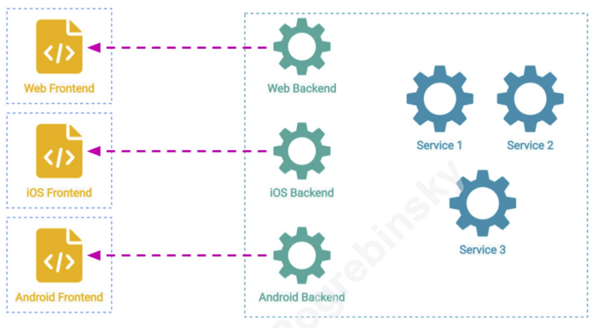

The BFF pattern proposes creating distinct backend services for each frontend type:
- **Frontend-Specific Backends:** Each backend service is dedicated to a particular frontend, containing only the relevant functionality. This results in smaller, more manageable codebases and services that can be optimized for specific devices (e.g., mobile vs. desktop).
- **Full Stack Teams:** Teams can work as full stack developers, managing both the frontend and the corresponding backend, streamlining the development and deployment process.

### Benefits
- **Optimized User Experience:** Each backend is tailored to the unique capabilities and needs of its corresponding frontend, providing a better user experience.
- **Reduced Complexity:** Smaller, frontend-specific backends are easier to manage and evolve.
- **Independent Development:** Teams can work independently without depending on a separate backend team, reducing coordination overhead.

### Challenges
1. **Shared Functionality:**
   - **Duplication Risk:** There may be shared logic or business rules needed across multiple backends (e.g., authentication, checkout process).
   - **Solutions:** 
     - **Shared Libraries:** Suitable for small, stable pieces of logic but can lead to tight coupling and maintenance issues.
     - **Separate Services:** Creating dedicated services for shared functionality with clear APIs and ownership, ensuring consistency without duplication.

2. **Granularity Decision:**
   - Determining the appropriate level of granularity depends on the uniqueness of the experiences across different platforms. For example, separate backends for Android and iOS are justified if their user experiences are significantly different.

3. **Cloud Deployment Considerations:**
   - In a cloud environment, smaller and less powerful virtual machines can replace the original monolithic backend. The choice of hardware can be optimized for the specific demands of each frontend (e.g., CPU or memory requirements).
   - Load balancing can be used to route requests to the appropriate backend, using URL paths, parameters, or HTTP headers like the user agent.

### Conclusion
The BFF pattern helps manage the complexity and scalability of systems supporting multiple frontend types by creating dedicated backends. This approach improves user experience, reduces development friction, and allows for independent and efficient development. However, it requires careful management of shared functionality and thoughtful decisions regarding service granularity.

# Reliability & Error Handling Patterns

## Throttling or Rate Limiting Pattern

### Introduction
The **Throttling or Rate Limiting** pattern is designed to enhance system reliability by controlling the rate at which resources are consumed. It helps prevent overconsumption of system resources, whether due to malicious activity, legitimate high traffic, or interactions with external services.

### Problem Statement

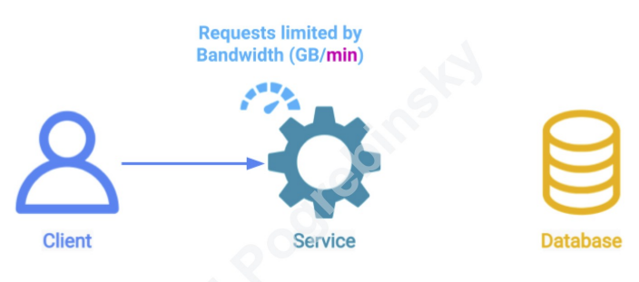

Two main issues this pattern addresses:
1. **Overconsumption of Resources:** 
   - High request rates can lead to system overload, potentially causing slowdowns or outages.
   - Unexpected traffic spikes can trigger costly auto-scaling, resulting in financial strain.
2. **Overspending on External Services:** 
   - Systems interacting with external APIs or cloud services can accidentally consume more resources than budgeted, leading to unexpectedly high costs.

### Types of Throttling
1. **Server-Side Throttling:** 
   - Limits the number of requests to protect the system's backend from overconsumption.
   - Common in scenarios where the system serves multiple clients through an API.

2. **Client-Side Throttling:** 
   - Prevents a client from exceeding a predetermined budget when calling external services.
   - Used when a system consumes external APIs or cloud services to avoid overspending.

### Strategies for Handling Exceeding Limits
1. **Dropping Requests:** 
   - Requests exceeding the rate limit are dropped. An error response (e.g., HTTP 429 "Too Many Requests") can inform the client.
   - Suitable for non-critical services like fetching real-time data (e.g., stock prices).

2. **Queuing Requests:** 
   - Requests are queued and processed later when capacity allows.
   - Useful for critical operations like executing trades, where delaying is preferable to dropping.

3. **Service Degradation:** 
   - Adjust service quality instead of dropping or delaying requests, such as reducing video quality in streaming services.
   - Can also set an upper limit on resource usage, like the number of media items accessed per day.

### Considerations for Implementation
1. **Global vs. Customer-Based Throttling:**
   - **Global Throttling:** A single limit applies to all clients, ensuring overall system stability but risking unfair resource allocation.
   - **Customer-Based Throttling:** Individual limits for each client, ensuring fair resource distribution but complicating total request rate management.

2. **External vs. Service-Based Throttling:**
   - **External Throttling:** Limits based on the overall number of API calls from clients, straightforward but can lead to internal service overload.
   - **Service-Based Throttling:** Specific limits for internal services, requiring complex tracking but better protecting individual system components.

### Conclusion
Throttling is crucial for maintaining system reliability and controlling costs. The choice between different throttling strategies—global vs. customer-based, external vs. service-based—depends on the specific use case and system requirements. Understanding these considerations helps in implementing an effective throttling strategy that balances performance, cost, and resource allocation.

## Retry Pattern

### Introduction
The **Retry Pattern** is a reliability architecture pattern used to handle errors by retrying operations that have failed. This pattern helps recover from transient issues in a system, such as network failures or temporary unavailability of services.

### Problem Statement
In cloud environments, errors can occur at any time due to software, hardware, or network issues. When a client calls a service, which in turn may call another service, these errors can cause delays, timeouts, or outright failures. The Retry Pattern aims to handle such situations by retrying failed operations.

### Key Considerations

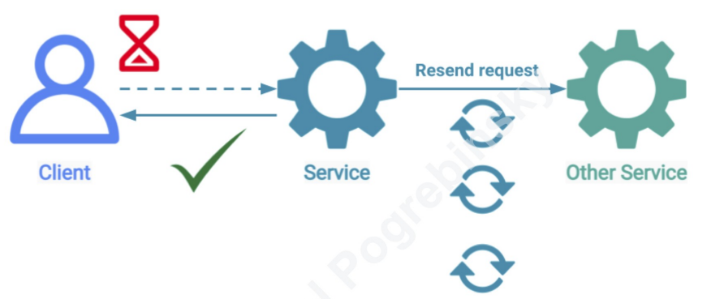

1. **Error Categorization:**
   - **User Errors:** Errors caused by invalid user actions (e.g., HTTP 403 Unauthorized). These should not be retried; instead, return the error to the user.
   - **System Errors:** Internal errors that may be transient and recoverable (e.g., HTTP 503 Service Unavailable). These are candidates for retries.

2. **Choosing Errors to Retry:**
   - Only retry errors that are likely to be temporary and recoverable, such as timeouts or service unavailability.

3. **Delay and Backoff Strategies:**
   - **Fixed Delay:** A constant delay between retries (e.g., 100 ms).
   - **Incremental Delay:** Increasing the delay gradually after each retry (e.g., 100 ms, 200 ms, 300 ms).
   - **Exponential Backoff:** Exponentially increasing delay (e.g., 100 ms, 200 ms, 400 ms, 800 ms) to reduce load on recovering services.

4. **Randomization (Jitter):**
   - Adding randomness to the delay helps spread out retry attempts, reducing the chance of overloading the system simultaneously.

5. **Retry Limits and Time Boxing:**
   - Set limits on the number of retries or a maximum time period for retries to prevent indefinite retry attempts.

6. **Idempotency:**
   - Ensure that retrying an operation does not cause unintended side effects, such as double billing in a payment system. Only idempotent operations should be retried safely.

7. **Implementation Strategies:**
   - **Shared Library:** Implement retry logic in a reusable library or module.
   - **Ambassador Pattern:** Separate the retry logic from the main application code by running it as a separate process on the same server.

### Conclusion
The Retry Pattern is a simple yet effective method for handling transient errors in a system. However, careful implementation is crucial to avoid pitfalls like retry storms, and to ensure retries are applied only in appropriate situations. Properly applying the Retry Pattern can enhance system reliability and provide a smoother experience for users.

## Circuit Breaker Pattern

### Introduction
The **Circuit Breaker Pattern** is a software architecture pattern used to handle long-lasting errors and prevent cascading failures. It contrasts with the Retry Pattern, which is used for short, recoverable issues. The Circuit Breaker Pattern prevents requests from being sent to a failing service, thus saving resources and improving system stability.

### Real-Life Example
Consider an online dating service that fetches profile images from an image service. If the image service is down for a significant time, retrying requests is futile. Instead, using a circuit breaker can prevent further attempts and conserve resources.

### Key Concepts

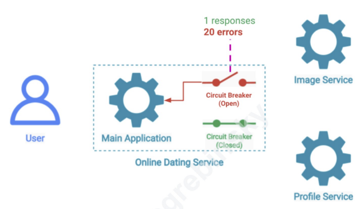

1. **Circuit States:**
   - **Closed:** All requests are allowed through, and the system tracks success and failure rates.
   - **Open:** No requests are allowed through; failures are assumed to continue. The system immediately returns errors.
   - **Half-Open:** A limited number of requests are allowed to test if the service has recovered.

2. **Operation**
   - The circuit starts in a **Closed** state, allowing requests and tracking failures. If failures exceed a certain threshold, the circuit moves to an **Open** state, blocking requests. After a timeout, it transitions to a **Half-Open** state to test the service's health. Depending on the results, it either closes the circuit or returns to the open state.

### Implementation Considerations

1. **Handling Requests in Open State:**
   - **Drop Requests:** Simply ignore them, with proper logging for analysis.
   - **Log and Replay:** Record the requests for later processing, useful in critical systems like e-commerce.

2. **Response Strategy in Open State:**
   - **Fail Silently:** Return empty responses or placeholders (e.g., a placeholder image in a dating app).
   - **Best Effort:** Provide cached or old data if available.

3. **Separate Circuit Breakers for Each Service:**
   - Each external service should have its own circuit breaker to prevent one failing service from affecting others.

4. **Asynchronous Health Checks:**
   - Instead of real requests in the Half-Open state, use small, asynchronous health checks to determine service recovery. This approach conserves resources and reduces impact on the recovering service.

5. **Implementation Location:**
   - As with the Retry Pattern, the Circuit Breaker can be implemented as a shared library or through an Ambassador Sidecar, especially useful for services in different programming languages.

### Conclusion
The Circuit Breaker Pattern is crucial for managing long-lasting errors, preventing resource waste, and improving system resilience. It involves careful consideration of how to handle failed requests, the state management of the circuit, and the method of implementation. Properly implementing this pattern can significantly enhance the stability and reliability of a distributed system.

## Dead Letter Queue Pattern

### Overview
The **Dead Letter Queue (DLQ)** pattern is designed to handle message delivery failures in an event-driven architecture. It helps manage errors in publishing and consuming messages through a message broker or distributed messaging system.

### Event-Driven Architecture

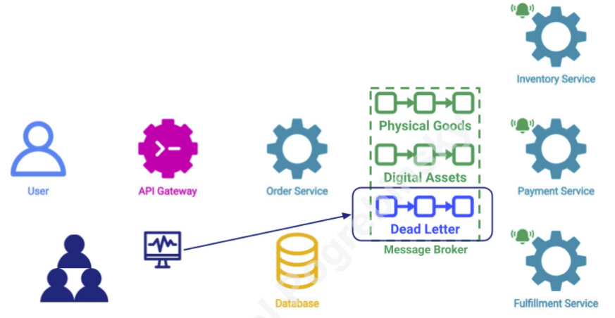

In an event-driven system, three key components are involved:
- **Event Publishers:** Produce messages or events.
- **Message Broker:** Manages channels, topics, or queues for message distribution.
- **Consumers:** Read and process incoming messages.

While this architecture offers benefits like decoupling and scalability, it also introduces potential points of failure.

### Real-Life Example
Consider an online store with:
- **Order Service:** Publishes order events.
- **Inventory, Payment, Fulfillment Services:** Subscribe to these events and process them based on the product type (physical vs. digital).

Potential issues include:
- Order service publishing to a non-existent or full queue.
- Consumers facing issues reading or processing messages, which could clog the queue and delay other messages.

### Dead Letter Queue (DLQ)

1. **Purpose:**
   - A special queue for messages that cannot be delivered or processed successfully.
   - Helps in isolating problematic messages and preventing them from affecting the main queue.

2. **Message Entry into DLQ:**
   - **Programmatic Publishing:** Consumers or publishers manually move messages to the DLQ if they encounter issues.
   - **Automated Configuration:** Message brokers can be configured to automatically move messages to the DLQ due to delivery failures or other issues.

3. **Configuration Support:**
   - Most open-source or cloud-based message brokers support DLQ functionality.

4. **Processing Messages in DLQ:**
   - **Monitoring and Alerting:** Regular monitoring ensures that messages in the DLQ are addressed and not forgotten.
   - **Error Details:** Attach headers or additional information to messages to understand and fix issues.
   - **Handling:**
     - **Automatic Republishing:** Once issues are resolved, messages can be moved back to the original queue for normal processing.
     - **Manual Processing:** Rare cases or special scenarios might require manual intervention.

# Deployment Patterns

## Rolling Deployment

**Overview:**
The Rolling Deployment pattern is used for upgrading production servers without significant downtime. It involves gradually replacing application instances with a new version while maintaining service availability.

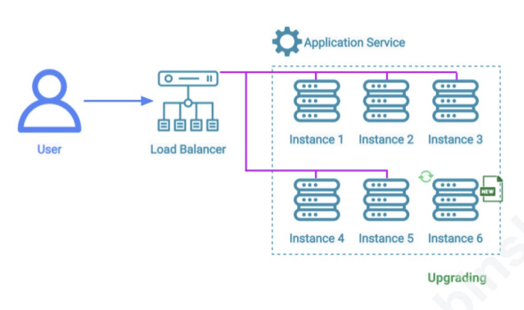

**How It Works:**
1. **Load Balancing:** Stop sending traffic to one server at a time using a load balancer.
2. **Upgrade:** Replace the old application instance with the new version on the server.
3. **Testing:** Optionally run tests on the upgraded server.
4. **Reintegration:** Add the updated server back into the load balancer's rotation.
5. **Repeat:** Continue the process for all servers until all are running the latest version.

**Benefits:**
- **No Downtime:** The system remains operational throughout the upgrade.
- **Gradual Release:** New versions are released gradually, reducing risk compared to a "big bang" approach.
- **Cost-Effective:** No need for additional hardware or infrastructure.

**Downsides:**
- **Cascading Failures:** New versions might cause failures that could impact old servers still in operation.
- **Compatibility Issues:** Running two versions side by side may cause issues if the new version is not fully compatible with the old one.

## Blue Green Deployment

**Overview:**
The Blue Green Deployment pattern is used to release a new version of software by maintaining two separate environments—Blue and Green. This approach aims to minimize risks and ensure a smooth transition between versions.

**How It Works:**

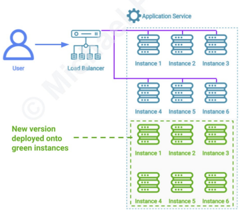

1. **Blue Environment:** The old version of the application continues running on this set of servers.
2. **Green Environment:** A new set of servers is provisioned, and the new version of the application is deployed here.
3. **Verification:** After deployment, the new instances in the Green environment are tested to ensure they work as expected.
4. **Traffic Shift:** Traffic is gradually redirected from the Blue environment to the Green environment using a load balancer.
5. **Rollback:** If issues are detected, traffic can be switched back to the Blue environment. If all is well, the Blue environment can be decommissioned or kept for the next release cycle.

**Benefits:**
- **No Downtime:** The Blue environment remains operational during the transition, ensuring continuous service availability.
- **Safe Rollbacks:** If problems arise, traffic can be easily shifted back to the old version, minimizing risk.
- **Consistent User Experience:** Customers experience only one version of the software at a time, reducing compatibility issues.

**Downsides:**
- **Increased Costs:** Running both Blue and Green environments simultaneously means needing twice the server capacity during the release.
- **Resource Usage:** Additional servers are required, which can lead to higher operational costs.

## Canary Release and A/B Testing

**Canary Release:**
The Canary Release pattern blends elements from both rolling and blue-green deployment strategies to offer a balanced approach to deploying new software versions.

**How It Works:**

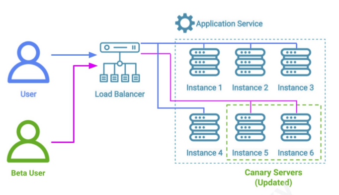

1. **Initial Deployment:** Deploy the new version of the software to a small subset of existing servers (the Canary servers).
2. **Traffic Management:** Redirect either all or a subset of traffic (e.g., internal users or beta testers) to these Canary servers.
3. **Monitoring:** Observe the performance and functionality of the Canary servers compared to the rest of the servers running the old version.
4. **Rollout Decision:** If the Canary version performs well, gradually update the rest of the servers using a rolling release approach. If issues arise, traffic can be shifted back to the old servers.

**Benefits:**
- **Reduced Risk:** Issues affect only a small subset of users, making it easier to manage and rollback if needed.
- **Informed Decisions:** Provides confidence in the new version before a full-scale deployment.
- **Selective Traffic:** Directs traffic from internal users or beta testers to mitigate potential impacts.

**Challenges:**
- **Monitoring Complexity:** Requires clear success criteria and effective automation to monitor performance.
- **Resource Allocation:** Needs careful management to ensure that monitoring and rollback processes are efficient.

**A/B Testing:**
A/B Testing is similar to Canary Release but focuses on testing new features rather than full software versions.

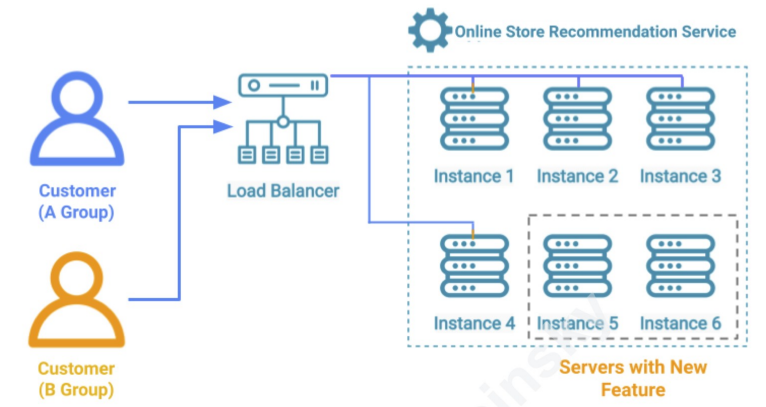

**How It Works:**
1. **Experimental Deployment:** Deploy a new feature or version on a small subset of servers.
2. **User Segmentation:** Redirect a portion of real user traffic to these experimental servers.
3. **Data Collection:** Gather data on user interactions and performance metrics.
4. **Evaluation:** Analyze the results to determine if the new feature should be rolled out to all users or if changes are needed.

**Benefits:**
- **Real User Feedback:** Provides genuine insights into how users interact with the new feature.
- **Informed Decisions:** Helps make data-driven decisions about future features or changes.
- **Testing in Production:** Allows testing of features under real-world conditions.

**Challenges:**
- **User Awareness:** Users are typically unaware they are part of an experiment, which can complicate feedback collection.
- **Reversion Process:** Requires careful handling to revert back to the original version after testing.

## Chaos Engineering

**Overview:**
Chaos Engineering is a production testing technique used to improve the resilience and reliability of distributed systems by deliberately injecting controlled failures into a live environment. This approach helps identify and address potential weaknesses before they lead to catastrophic issues during unexpected real-world events.

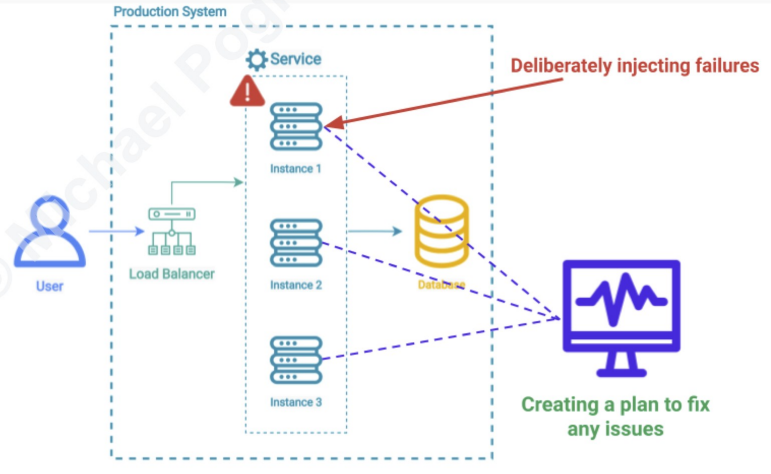

**Why Chaos Engineering?**
- **Inevitability of Failures:** In distributed systems, failures are inevitable due to infrastructure issues, network problems, or third-party outages.
- **Limitations of Traditional Testing:** Traditional testing methods (unit tests, integration tests) may not capture all possible failure scenarios, especially those that occur in production environments.

**Key Concepts:**
1. **Controlled Failures:** Introduce failures such as server terminations, latency, resource exhaustion, or loss of access to simulate potential issues.
2. **Monitoring and Analysis:** Observe how the system responds to these failures and analyze the performance.
3. **Improvement:** Identify and fix any issues found during testing to enhance system resilience.

**Common Failures to Inject:**
- **Server Termination:** Randomly terminate servers to test system recovery and redundancy.
- **Latency Injection:** Introduce delays between services or between a service and its database.
- **Resource Exhaustion:** Fill up disk space or other resources to observe how the system handles resource limitations.
- **Traffic Restrictions:** Disable traffic to specific zones or regions to test failover mechanisms.

**Process of Chaos Engineering:**
1. **Baseline Measurement:** Establish a performance baseline before injecting failures.
2. **Hypothesis Formation:** Define expected behavior and system responses.
3. **Failure Injection:** Introduce the failure and monitor its impact.
4. **Documentation:** Record findings and observations during the test.
5. **Restoration:** Restore the system to its original state post-testing.
6. **Continuous Improvement:** Address identified issues and continuously test to ensure ongoing resilience.

**Considerations:**
- **Minimize Blast Radius:** Ensure failures are contained and do not excessively impact the system.
- **Error Budget:** Avoid promising 100% availability; maintain flexibility for unexpected and deliberate failures.

# Ways of Communicating Between Different Components of Software

There are several ways of communicating between different components of software, each suited to specific use cases and architectural requirements. Some common methods of communication include:

1. **Synchronous Communication:**

   - **Remote Procedure Calls (RPC):** In RPC, a client component invokes a procedure or method on a remote server and waits for a response before proceeding. This communication method is often used in client-server architectures for synchronous interactions between components.

2. **Asynchronous Communication:**

   - **Message Queues:** Message queues enable asynchronous communication between components by decoupling producers and consumers of messages. Components send messages to a queue, and consumers retrieve and process messages from the queue at their own pace. Message queues are commonly used in distributed systems for tasks such as workload distribution, event-driven processing, and integration between disparate systems.
   - **Publish-Subscribe (Pub/Sub):** Pub/Sub messaging involves publishers broadcasting messages to a topic or channel, which multiple subscribers can then receive and process asynchronously. Pub/Sub messaging is widely used for event-driven architectures, real-time data processing, and broadcasting updates to multiple subscribers.
   - **Event Bus:** An event bus facilitates communication between components by enabling them to publish and subscribe to events. Components can publish events to the bus, and other components can subscribe to receive and process those events asynchronously. Event buses are commonly used in microservices architectures and event-driven systems for loosely coupled communication between components.

3. **Remote Communication Protocols:** **HTTP/HTTPS:** Hypertext Transfer Protocol (HTTP) and its secure variant HTTPS are widely used for communication between web-based components, APIs, and services over the internet. HTTP-based communication is stateless and follows a request-response model, making it suitable for client-server interactions in distributed systems. Here are differnt achitectural patterns when using HTTP/HTTPS
   - **RESTful APIs:** Representational State Transfer (REST) is an architectural style for designing networked applications, typically using HTTP as the communication protocol. RESTful APIs provide a uniform interface for accessing and manipulating resources using standard HTTP methods (GET, POST, PUT, DELETE) and resource identifiers (URLs).
   - **GraphQL**: GraphQL is a query language and runtime for APIs that enables clients to request specific data from servers. It allows clients to specify the structure of the data they need, reducing over-fetching and under-fetching of data compared to traditional REST APIs. GraphQL is commonly used in modern web applications to improve efficiency and flexibility in data fetching.
   - **Web Services**: Web services enable communication between software components or systems over the internet using standardized protocols such as SOAP (Simple Object Access Protocol) and REST (Representational State Transfer). Web services provide interoperability between different platforms and languages, allowing components to communicate regardless of their underlying technologies.
   - **WebSocket:** WebSocket is a communication protocol that enables bidirectional, full-duplex communication between web clients and servers over a single, long-lived connection. WebSocket is commonly used for real-time web applications, chat applications, and streaming data processing.

4. **Peer-to-Peer (P2P) Communication:** In P2P communication, components communicate directly with each other without relying on centralized servers or intermediaries. P2P networks enable decentralized data exchange, distributed computing, and collaboration among peers.

   - **BitTorrent Protocol:** BitTorrent is a widely used protocol for distributed file sharing and peer-to-peer file transfer. It enables peers (nodes) in a network to collaborate in sharing and downloading files by dividing them into smaller pieces and distributing them among peers. BitTorrent uses a combination of TCP (Transmission Control Protocol) and UDP (User Datagram Protocol) for data transfer between peers.
   - **Napster Protocol:** Napster was one of the earliest P2P protocols used for sharing music files over the internet. It employed a centralized server to index and coordinate file sharing among peers. However, it was eventually shut down due to legal issues related to copyright infringement.
   - **Gnutella Protocol:** Gnutella is a decentralized P2P protocol used for distributed file sharing and communication. It allows peers to connect directly to each other without relying on centralized servers. Gnutella uses a query-response mechanism for searching and downloading files from other peers in the network.
   - **Kademlia Protocol:** Kademlia is a distributed hash table (DHT) protocol used for decentralized P2P networks, such as those used in distributed storage systems and cryptocurrency networks (e.g., Ethereum). It organizes nodes in the network into a peer-to-peer overlay network and provides efficient lookup and storage of key-value pairs.
   - **IPFS (InterPlanetary File System):** IPFS is a protocol and network designed to create a distributed file system that can be used to store and share content in a P2P manner. It uses content-addressable storage and cryptographic hashes to ensure data integrity and supports features such as content addressing, versioning, and peer-to-peer file sharing.

These are just a few examples of protocols used in P2P networks. Depending on the specific application and requirements, other protocols or custom protocols may also be used to facilitate communication and data exchange among peers in a P2P network.

5. **Inter-Process Communication (IPC):**

   - **Shared Memory:** Shared memory allows multiple processes to access and modify shared data structures residing in the same memory space. This communication method is often used for high-performance data exchange between closely coupled processes running on the same machine.
   - **Inter-Process Communication (IPC) Mechanisms:** IPC mechanisms such as pipes, sockets, and message passing enable communication between processes running on the same machine or across networked systems. These mechanisms facilitate data exchange, synchronization, and coordination between independent processes or components.

## Data Formats

- **JSON (JavaScript Object Notation):** JSON is a lightweight data interchange format commonly used for serializing and transmitting structured data between components in web-based systems and APIs.
- **XML (eXtensible Markup Language):** XML is a markup language for encoding structured data in a human-readable format. Although less common than JSON, XML is still used in certain contexts for data exchange and interoperability between systems.
- **Protocol Buffers (protobuf):** Protocol Buffers is a binary serialization format developed by Google for efficiently encoding structured data. Protocol Buffers are often used in performance-critical applications and microservices architectures for fast and compact data transmission.
- **GraphQL (Graph Query Language):** GraphQL is a query language and runtime for APIs that enables clients to request specific data from servers. It provides a flexible and efficient alternative to traditional REST APIs by allowing clients to specify the structure of the data they need, reducing over-fetching and under-fetching of data. GraphQL is commonly used in modern web applications for data fetching and manipulation.
- **Apache Avro:** Avro is a binary serialization format developed within the Apache Hadoop project for efficient data serialization and data exchange between systems. It provides features such as schema evolution, data compression, and rich data types, making it suitable for use in big data processing frameworks such as Apache Kafka, Apache Spark, and Apache Hadoop.
- **MessagePack:** MessagePack is a compact binary serialization format designed for efficient data serialization and exchange between systems. It encodes data in a space-efficient binary format, resulting in smaller message sizes and faster data transmission compared to JSON or XML. MessagePack supports a wide range of data types and is commonly used in high-performance applications and network protocols.
- **Thrift:** Thrift is a binary serialization and RPC (Remote Procedure Call) framework developed by Facebook for efficient communication and data exchange between services. It provides a schema-based approach to define data types and services, enabling cross-language compatibility and efficient serialization and deserialization of data. Thrift is commonly used in large-scale distributed systems for inter-service communication.
- **Apache Arrow:** Apache Arrow is a cross-language development platform for in-memory data processing. It provides a columnar memory layout and standardized data interchange format for efficient data exchange between different systems and programming languages. Apache Arrow is commonly used in data processing frameworks such as Apache Spark, Apache Flink, and Pandas for high-performance data analytics and processing.
- **Cap'n Proto:** Cap'n Proto is a data interchange format and RPC framework developed by the creators of Protocol Buffers. It offers high-performance serialization and deserialization of data using a zero-copy, memory-mapped approach. Cap'n Proto supports schema evolution, efficient data encoding, and cross-language compatibility, making it suitable for use in distributed systems and network protocols.

These communication methods and protocols provide a range of options for facilitating communication between different components of software, allowing developers to choose the most appropriate approach based on the specific requirements, constraints, and architectural considerations of their systems.

# Data Storage

## Introduction to Data Storage Techniques

In today's digital age, data is one of the most valuable assets for organizations. Efficient and reliable data storage techniques are essential for managing, accessing, and protecting this data. Whether it's structured data like databases, unstructured data such as documents and media files, or semi-structured data like JSON and XML files, choosing the right storage solution can significantly impact performance, scalability, and cost-efficiency.

### Key Considerations in Data Storage

1. **Scalability**: As the volume of data grows, the storage system must be able to scale seamlessly.
2. **Performance**: The speed at which data can be read, written, and processed is crucial, especially for applications requiring real-time access.
3. **Durability and Reliability**: Data integrity and availability must be ensured, even in the event of hardware failures or disasters.
4. **Security**: Protecting sensitive data from unauthorized access and ensuring compliance with regulatory requirements.
5. **Cost**: Balancing the cost of storage solutions with the performance and features required by the organization.
6. **Consistency**: Ensuring that data remains accurate and consistent across all storage nodes, which is particularly important in distributed systems.

### Common Data Storage Techniques

1. **Databases**:
   - **Relational Databases (SQL)**: Use structured query language for data management and support ACID (Atomicity, Consistency, Isolation, Durability) properties. Examples include MySQL, PostgreSQL, and Oracle.
   - **NoSQL Databases**: Include a variety of database technologies that handle large volumes of unstructured or semi-structured data. Types include key-value stores, document stores, column-family stores, and graph databases. Examples include MongoDB, Cassandra, and Redis.

2. **File Storage**:
   - **Network Attached Storage (NAS)**: Provides file-level access to data over a network, suitable for centralized data storage and sharing.
   - **Distributed File Systems**: Allow data to be stored across multiple machines. Examples include Hadoop Distributed File System (HDFS) and Google File System (GFS).

3. **Object and Cloud Storage**:
   - **Object Storage**: Stores data as objects, each with a unique identifier, metadata, and the actual data. It is highly scalable and ideal for large amounts of unstructured data.
   - **Cloud Storage**: A form of object storage provided by cloud service providers, offering scalable and flexible solutions without the need for on-premises infrastructure. It includes various storage classes for different access patterns and durability requirements. Examples include Amazon S3, Azure Blob Storage, and Google Cloud Storage.

4. **Block Storage**:
   - Offers low-level storage for data blocks, suitable for applications requiring fast access and high performance. Commonly used for databases and virtual machines. Examples include Amazon EBS and Azure Disk Storage.

### Conclusion

Selecting the appropriate data storage technique depends on the specific needs of the organization, including data type, access patterns, performance requirements, and budget. By understanding the strengths and limitations of each storage solution, businesses can ensure efficient data management and maintain a competitive edge in the digital landscape.

## Techniques for Improving Database Performance, Availability, and Scalability

In large-scale systems, the performance, availability, and scalability of databases are critical. This lecture covers three essential techniques to enhance these aspects: **indexing**, **replication**, and **partitioning**.

### 1. Indexing

**Indexing** is a technique used to speed up the retrieval of records from a database. It achieves this by creating a separate structure, known as an index, that maps column values to their corresponding rows.

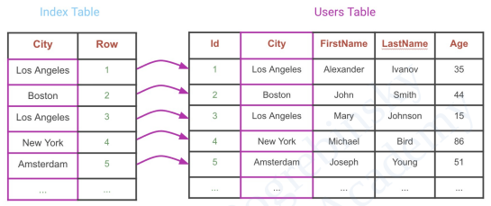

- **Purpose**: Speed up queries by avoiding full table scans.
- **Examples**:
  - Searching for users in a specific city.
  - Sorting users by last name, age, or income.
- **How It Works**: 
  - Single-column index: Maps column values to records.
  - Composite index: Maps a combination of column values to records.
  - Can be stored in data structures like hashmaps (for fast lookups) or B-Trees (for sorted views).
- **Trade-offs**: 
  - Increases read query speed but can slow down write operations due to the need to update indexes.
  - Requires additional storage space.

### 2. Database Replication

**Database replication** involves creating copies of the database on multiple servers. This enhances fault tolerance and availability by ensuring that if one instance fails, others can continue to serve queries.

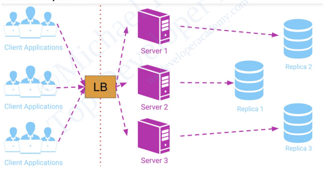

- **Benefits**:
  - **High Availability**: Multiple replicas ensure that data is available even if one instance fails.
  - **Increased Throughput**: Distributes the load among multiple instances, handling more queries.
- **Challenges**:
  - **Consistency**: Managing concurrent updates and ensuring data consistency across replicas can be complex.
  - **Complexity**: Requires careful design and management, especially for write operations.

### 3. Database Partitioning (Sharding)

**Database partitioning**, or sharding, divides a database into smaller, more manageable pieces that can be distributed across different servers. Each partition holds a subset of the data, which can significantly improve performance and scalability.

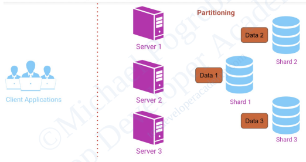

- **Advantages**:
  - **Scalability**: Allows for more data storage and handling larger datasets by distributing data.
  - **Performance**: Enables parallel processing of queries on different shards.
- **Considerations**:
  - **Complexity**: Increases the complexity of the system, especially with query routing and maintaining balanced data distribution across shards.
  - **Supported Features**: Less common in relational databases due to the complexity of handling multi-record transactions and joins across shards.

### Conclusion

These three techniques—**indexing**, **replication**, and **partitioning**—are fundamental in designing robust, large-scale database systems. They are not mutually exclusive and are often used together to provide a balance of performance, availability, and scalability. Proper implementation of these techniques requires understanding the trade-offs and complexities involved, particularly in distributed systems.

In summary, by leveraging these techniques, we can create database systems that efficiently handle large volumes of data and high request loads, ensuring a responsive and reliable experience for users.

# Specialized Storage

5. **In-Memory Databases**: In-memory databases store data entirely in RAM (random-access memory) for faster access and lower latency compared to disk-based storage. They are commonly used for caching, real-time analytics, and high-performance data processing. Examples include Redis, Memcached, and Apache Ignite.

6. **Time-Series Databases**: Time-series databases specialize in storing and analyzing time-stamped data points or events. They are optimized for time-series data, such as sensor data, metrics, and logs, and provide features for efficient storage, indexing, and querying of time-series data. Examples include InfluxDB, Prometheus, and TimescaleDB.

7. **Search Indexes**: Search indexes store and index textual data for fast and efficient full-text search operations. They are commonly used in applications requiring search functionality, such as e-commerce platforms, content management systems, and document repositories. Examples include Elasticsearch, Apache Solr, and Amazon CloudSearch.

8. **Blockchain**: Blockchain is a distributed and decentralized ledger that stores data in a chain of blocks, each containing a cryptographic hash of the previous block, transaction data, and a timestamp. Blockchain is commonly used for storing immutable and tamper-resistant records, such as cryptocurrency transactions and supply chain data.

9. **Memory-Mapped Files**: Memory-mapped files allow data to be stored in files on disk and mapped directly into memory, enabling efficient access and manipulation of large datasets. They are commonly used for working with large files, databases, and data-intensive applications where direct memory access can improve performance.

# Relational Databases

Relational databases are a fundamental component of many software systems, offering a structured approach to storing and managing data. Let's explore the key aspects of relational databases:

## Overview

Relational databases organize data into tables, where each table consists of rows and columns. The relationships between tables are defined by primary and foreign keys, enforcing referential integrity and enabling complex data querying and manipulation.

## Key Components

- Tables: Tables represent entities or relationships in the database schema. Each table has a defined structure with columns representing attributes and rows representing individual records.
- Columns: Columns define the attributes or fields of a table, such as data types (e.g., integer, string, date) and constraints (e.g., primary key, foreign key, not null).

### Primary Keys

Primary keys uniquely identify each record in a table and enforce entity integrity. They must be unique and not null.

### Foreign Keys

Foreign keys establish relationships between tables by referencing the primary key of another table. They enforce referential integrity and maintain data consistency across related tables.

### Indexes

Indexes improve query performance by enabling fast retrieval of data based on specified columns. They are created on columns frequently used in search and retrieval operations.

### Constraints

Constraints enforce data integrity rules, such as uniqueness, referential integrity, and domain integrity, ensuring that data meets specified criteria.

## Operations

Relational databases support various operations for data management:

- **CRUD Operations:** Create, Read, Update, and Delete operations for manipulating data.
- **Querying:** Retrieval of data using SQL (Structured Query Language) queries, including filtering, sorting, and aggregation.
- **Transactions:** Grouping multiple operations into atomic units, ensuring data consistency and integrity.
- **Schema Management:** Defining and modifying database schema, including tables, columns, indexes, and constraints.

## Examples

Relational databases are widely used in various domains, including:

- **Enterprise Applications:** Managing customer data, inventory, orders, and transactions in ERP (Enterprise Resource Planning) systems.
- **Online Retail:** Storing product catalogues, customer profiles, orders, and payments in e-commerce platforms.
- **Banking and Finance:** Managing accounts, transactions, and financial records in banking systems.
- **Human Resources:** Storing employee information, payroll data, and performance evaluations in HR systems.

## Advantages

- **Data Integrity:** Enforces data integrity through constraints, primary keys, and foreign keys.
- **Structured Querying:** Supports powerful SQL queries for complex data retrieval and manipulation.
- **Normalization:** Promotes data normalization to minimize redundancy and improve data consistency.
- **ACID Properties:** Provides transactional support with ACID (Atomicity, Consistency, Isolation, Durability) properties for reliable data operations.

## Challenges

- **Scalability:** Scaling relational databases for high-volume and high-velocity data can be challenging.
- **Schema Changes:** Modifying database schema may require downtime and impact application availability.
- **Complexity:** Managing complex relational schemas with multiple tables and relationships can be difficult to design and maintain.
- **Performance:** Poorly optimized queries and lack of indexes can degrade performance, especially with large datasets.

## When to Choose?

- **Structured Data Requirements:** When your application deals with structured data that can be organized into tables with well-defined relationships.
- **ACID Transactions:** When your application requires ACID (Atomicity, Consistency, Isolation, Durability) transactions for reliable data operations and data integrity.
- **Complex Queries:** When your application needs to perform complex SQL queries involving joins, aggregations, and subqueries for data retrieval and manipulation.
- **Data Integrity:** When maintaining data integrity through constraints, primary keys, foreign keys, and referential integrity is critical for your application.
- **Normalization:** When your data model benefits from normalization to minimize redundancy and improve data consistency.
- **Enterprise Applications:** When building enterprise-level applications such as ERP (Enterprise Resource Planning) systems, CRM (Customer Relationship Management) systems, and financial applications that require robust data management capabilities.
- **Compliance Requirements:** When your application needs to comply with regulatory requirements and industry standards that mandate the use of relational databases.
- **Scalability Requirements:** When your application can initially leverage the scalability features provided by relational databases, such as sharding, replication, and read replicas.
- **Strong Community Support:** When you require a mature and widely adopted database system with a large community of users, extensive documentation, and ecosystem support.

Relational databases remain a cornerstone of data management in many applications, offering a robust and proven approach to storing and accessing structured data. However, they are complemented by other storage solutions, such as NoSQL databases and cloud-based data stores, to address specific scalability and performance requirements.

# NoSQL Databases

NoSQL databases, also known as "Not Only SQL" databases, are a category of databases that provide a flexible and scalable approach to storing and managing data. Let's explore the key aspects of NoSQL databases:

## Overview

NoSQL databases diverge from the traditional relational database model by offering schema flexibility, horizontal scalability, and support for semi-structured and unstructured data. They are designed to handle large volumes of data and support distributed computing architectures.

## Key Characteristics

### Schema Flexibility

NoSQL databases allow for dynamic schema design, where each record (document, key-value pair, or column) in the database can have its own structure. This flexibility is well-suited for handling diverse and evolving data types.

### Scalability

NoSQL databases are designed for horizontal scalability, allowing them to distribute data across multiple nodes in a cluster. This enables seamless scaling to accommodate growing data volumes and high-velocity data ingestion.

### Data Models

NoSQL databases support various data models, including:

- **Document Stores:** Store data as flexible, JSON-like documents.
- **Key-Value Stores:** Store data as key-value pairs for fast retrieval.
- **Column-Family Stores:** Store data in columns rather than rows, enabling efficient storage and retrieval of large datasets.
- **Graph Databases:** Store data in nodes and edges, facilitating the representation and traversal of graph structures.

## Use Cases

NoSQL databases are commonly used in the following scenarios:

- **Big Data:** Handling large volumes of structured, semi-structured, and unstructured data in big data analytics and processing.
- **Real-Time Analytics:** Analyzing streaming data and events in real-time to extract insights and trigger actions.
- **Content Management:** Storing and managing diverse content types such as text, images, and videos in content management systems.
- **IoT and Sensor Data:** Collecting and processing data from IoT devices and sensor networks for monitoring and analysis.
- **Caching and Session Management:** Caching frequently accessed data and managing user sessions in web applications for improved performance and scalability.

## Advantages

- **Scalability:** NoSQL databases offer horizontal scalability, allowing them to handle large-scale data growth and high-velocity data ingestion.
- **Flexibility:** NoSQL databases provide schema flexibility, enabling developers to store and query diverse data types without rigid schema constraints.
- **Performance:** NoSQL databases are optimized for high-performance data retrieval and processing, particularly in distributed computing environments.
- **Fault Tolerance:** NoSQL databases are designed for fault tolerance, with built-in replication and partitioning mechanisms to ensure data availability and durability.

## Challenges

- **Consistency:** NoSQL databases often sacrifice strong consistency for scalability and performance, leading to eventual consistency models.
- **Query Language:** NoSQL databases may have limited query capabilities compared to SQL-based relational databases, requiring developers to adapt to different query languages and data modelling techniques.
- **Data modelling Complexity:** Designing effective data models in NoSQL databases requires understanding of the specific data model and its implications on query performance and data retrieval.

## When to Choose?

- **Unstructured or Semi-Structured Data:** When your application deals with unstructured or semi-structured data that doesn't fit well into the rigid schema of relational databases.
- **Scalability Requirements:** When your application needs to handle large volumes of data or high-velocity data ingestion and requires horizontal scalability across distributed clusters.
- **Flexible Schema:** When your application requires schema flexibility, allowing for dynamic schema design and accommodating evolving data models without strict schema constraints.
- **High Performance:** When your application requires high-performance data retrieval and processing, particularly in distributed computing environments or real-time analytics scenarios.
- **Polyglot Persistence:** When your application requires support for multiple data models or specialized use cases that are better served by NoSQL databases, alongside relational databases.
- **Cloud-Native Architecture:** When building cloud-native applications that leverage modern infrastructure and distributed computing platforms, NoSQL databases offer seamless integration and scalability.
- **Real-Time Analytics:** When your application needs to analyze streaming data and events in real-time, NoSQL databases provide the flexibility and scalability to handle real-time analytics workloads.
- **High Availability:** When your application requires fault-tolerant data storage with built-in replication and partitioning mechanisms to ensure data availability and durability.
- **Internet of Things (IoT):** When collecting and processing data from IoT devices and sensor networks, NoSQL databases offer the scalability and flexibility to handle diverse data types and high-throughput data streams.

NoSQL databases have become an integral part of modern data management architectures, offering a scalable and flexible alternative to traditional relational databases for handling diverse data types and high-performance computing needs.

# Object Storage

Object storage is a storage architecture that manages data as objects, unlike traditional file systems that organize data in a hierarchical structure. Let's explore the key aspects of object storage:

## Overview

Object storage organizes data as objects, each containing data, metadata, and a unique identifier. Objects are stored in a flat namespace and can be accessed over a network using standard protocols such as HTTP and HTTPS. Object storage systems are designed for scalability, durability, and accessibility of large-scale data.

## Key Characteristics

- **Flat Namespace**: Object storage systems organize data in a flat namespace, eliminating the need for directory structures. Each object is identified by a unique key or identifier, allowing for efficient data access and retrieval.
- **Scalability**: Object storage systems are designed for horizontal scalability, allowing them to handle large volumes of data across distributed clusters of storage nodes. This scalability enables seamless expansion of storage capacity as data grows.
- **Redundancy and Durability**: Object storage systems typically employ redundancy mechanisms such as data replication or erasure coding to ensure data durability and availability. Data is replicated across multiple storage nodes or dispersed across multiple disks to protect against hardware failures and data loss.
- **Metadata**: Objects in object storage are associated with metadata, which provides additional information about the object, such as creation timestamp, size, content type, and custom attributes. Metadata enables efficient data management and retrieval based on metadata attributes.

## Use Cases

Object storage is commonly used in the following scenarios:

- **Data Backup and Archiving:** Storing backup copies of data and archival data for long-term retention and compliance requirements.
- **Content Distribution:** Hosting static assets such as images, videos, and documents for content delivery networks (CDNs) and web applications.
- **Data Lake:** Building data lakes for storing and analyzing large volumes of structured, semi-structured, and unstructured data for analytics and machine learning.
- **Cloud Storage:** Providing scalable and cost-effective storage solutions for cloud-based applications and services, including file storage, object storage, and archival storage.

## Advantages

- **Scalability:** Object storage systems offer horizontal scalability, allowing them to scale out to accommodate growing data volumes and performance requirements.
- **Durability:** Object storage systems provide high durability and data availability through data replication or erasure coding mechanisms.
- **Accessibility:** Objects stored in object storage can be accessed over standard protocols such as HTTP/HTTPS, making them accessible from anywhere with internet connectivity.
- **Cost-Effectiveness:** Object storage offers cost-effective storage solutions compared to traditional storage architectures, particularly for large-scale data storage and archival.

## Challenges

- **Consistency:** Achieving strong consistency in distributed object storage systems can be challenging due to network latency and eventual consistency models.
- **Data Management:** Managing metadata and lifecycle policies for large numbers of objects can be complex and require efficient data management tools and practices.
- **Performance:** While object storage systems offer scalability, achieving low-latency performance for small object access can be challenging, particularly in geographically distributed deployments.

## When to choose?

- **Large-Scale Data Storage:** When your application needs to store large volumes of unstructured or semi-structured data, such as multimedia files, documents, logs, or sensor data.
- **Scalability Requirements:** When your application requires a storage solution that can scale horizontally to accommodate growing data volumes without compromising performance or availability.
- **Durability and Redundancy:** When data durability and redundancy are critical requirements, and you need a storage solution that provides built-in mechanisms for data replication, erasure coding, or distributed storage.
- **Content Distribution:** When your application needs to distribute static assets, such as images, videos, or documents, to users or clients globally, object storage offers a cost-effective and scalable solution for content delivery.
- **Data Backup and Archiving:** When your application requires long-term data retention and archival storage for compliance, regulatory, or disaster recovery purposes, object storage provides a reliable and cost-effective solution for data backup and archiving.
- **Cloud-Native Applications:** When building cloud-native applications or services that require scalable and durable storage solutions in cloud environments, object storage integrates seamlessly with cloud platforms and offers pay-as-you-go pricing models.
- **IoT and Big Data Analytics:** When collecting and analyzing large volumes of data from IoT devices, sensors, or big data sources, object storage provides a scalable and flexible storage solution for ingesting, storing, and analyzing diverse data types.
- **Multitenant Applications:** When building multitenant applications or services that require isolated storage environments for different users or tenants, object storage offers efficient multi-tenancy support with flexible access control and security mechanisms.
- **Metadata-Driven Applications:** When your application relies heavily on metadata for data management, search, and retrieval, object storage systems provide rich metadata capabilities for organizing and categorizing data efficiently.
- **Web and Mobile Applications:** When developing web or mobile applications that require scalable and reliable storage for user-generated content, media files, or application data, object storage offers a cost-effective and scalable solution for storing and serving content to users.
- **Hybrid Cloud Deployments:** When deploying hybrid cloud architectures that span on-premises data centers and public cloud environments, object storage provides a unified storage solution for seamless data mobility and interoperability between on-premises and cloud-based applications.
- **DevOps and Continuous Integration/Continuous Deployment (CI/CD):** When implementing DevOps practices and CI/CD pipelines, object storage serves as a centralized repository for storing artifacts, code repositories, and build artifacts, enabling efficient collaboration and version control across distributed teams.
- **Immutable Data Storage:** When your application requires immutable data storage for preserving data integrity and preventing data tampering or modification, object storage systems offer append-only or write-once-read-many (WORM) capabilities for immutable data storage.

Object storage has become an essential component of modern data storage architectures, providing scalable, durable, and cost-effective storage solutions for a wide range of applications and use cases.

# File Systems

A file system is responsible for organizing data into files and directories, managing file storage and retrieval, and providing interfaces for accessing and manipulating files. File systems are an essential component of operating systems and storage devices, allowing users and applications to store, retrieve, and manage data efficiently.

## Key Characteristics

- **Hierarchical Structure**: File systems organize data in a hierarchical structure of directories (folders) and files, allowing users to organize and navigate data in a logical manner.
- **Metadata Management**: File systems store metadata associated with files, including file attributes such as name, size, type, permissions, creation date, and modification date.
- **Access Control**: File systems enforce access control mechanisms to regulate access to files and directories, ensuring that only authorized users or processes can read, write, or execute files based on permissions.
- **Data Integrity**: File systems implement mechanisms to ensure data integrity, such as checksums, journaling, or redundant data storage, to protect against data corruption and loss.

## Types of File Systems

### Disk-Based File Systems

Disk-based file systems are designed for traditional storage devices such as hard disk drives (HDDs) and solid-state drives (SSDs). Examples include NTFS (Windows), HFS+ (macOS), ext4 (Linux), and APFS (Apple File System).

### Network File Systems (NFS)

Network file systems allow remote access to files over a network, enabling file sharing and collaboration among multiple users and systems. Examples include NFS (Network File System) and SMB/CIFS (Server Message Block/Common Internet File System).

### Distributed File Systems

Distributed file systems distribute data across multiple storage nodes in a network, providing scalability, fault tolerance, and high availability. Examples include Google File System (GFS), Hadoop Distributed File System (HDFS), and Amazon S3 (Simple Storage Service).

### Cloud File Systems

Cloud file systems provide file storage services in cloud environments, allowing users to store, access, and manage files over the internet. Examples include Amazon EFS (Elastic File System), Azure Files, and Google Cloud Filestore.

## Use Cases

File systems are used in various scenarios, including:

- Personal and enterprise file storage
- Operating system file management
- Network file sharing and collaboration
- Data backup and archiving
- Content management and distribution
- Virtualization and container storage

## Advantages

- Organized data storage and retrieval
- Access control and security mechanisms
- Support for diverse storage devices and platforms
- Compatibility with operating systems and applications
- Scalability and fault tolerance in distributed environments

## Challenges

- Data fragmentation and disk fragmentation
- Limited scalability and performance for large-scale data
- Data inconsistency and integrity issues
- Compatibility issues across different file systems and platforms
- Complexity in managing and administering file systems

File systems play a crucial role in managing data storage and access in computing environments, providing a structured and efficient way to organize, store, and retrieve files and directories.

# Low Level Design 

Low-level design (LLD) refers to the detailed and technical aspects of designing a system or component, focusing on the implementation and structure. Unlike high-level design, which provides a broad overview of the system architecture and main components, low-level design dives into the specifics, detailing how individual components should function and interact.

Key aspects of low-level design include:

1. **Component Design**: Detailing the internal structure of each component, including classes, methods, data structures, and their relationships.

2. **Algorithm Design**: Defining the algorithms that components will use to perform their tasks, including the logic and steps involved.

3. **Data Structures**: Choosing appropriate data structures to store and manage data efficiently, considering factors such as access patterns, memory usage, and performance.

4. **Interfaces and APIs**: Specifying the interfaces and APIs for components, including input and output formats, and the methods through which components will interact.

5. **Error Handling and Edge Cases**: Planning for error conditions and edge cases, ensuring that the system can gracefully handle unexpected situations and maintain stability.

6. **Security Considerations**: Implementing security measures to protect data and prevent unauthorized access, including encryption, authentication, and authorization mechanisms.

7. **Performance Optimization**: Identifying and implementing techniques to optimize the system's performance, such as caching strategies, efficient algorithms, and resource management.

8. **Detailed Diagrams and Documentation**: Creating diagrams like class diagrams, sequence diagrams, and flowcharts to visually represent the system's structure and behavior, along with comprehensive documentation to guide implementation and maintenance.

Low-level design is crucial for translating high-level design concepts into functional and efficient systems. It requires a deep understanding of the problem domain, the chosen technology stack, and best practices in software development. A well-executed low-level design ensures that the system is not only functional but also maintainable, scalable, and efficient.

# Citations

The following notes is curated from 
- ChatGPT
- Udemy: The Complete Cloud Computing Software Architecture Patterns - Michael Pogrebinsky
- Udemy: Software Architecture & Design of Modern Large Scale Systems - Michael Pogrebinsky
- Udemy: SOLID Principles: Introducing Software Architecture & Design by George S

