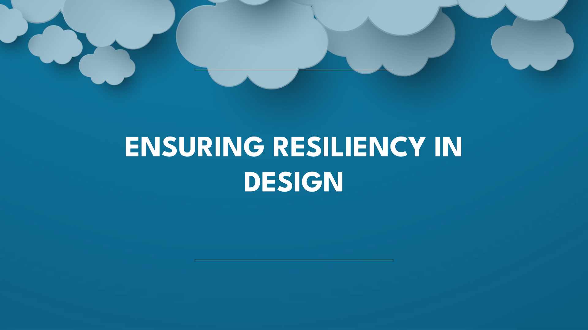
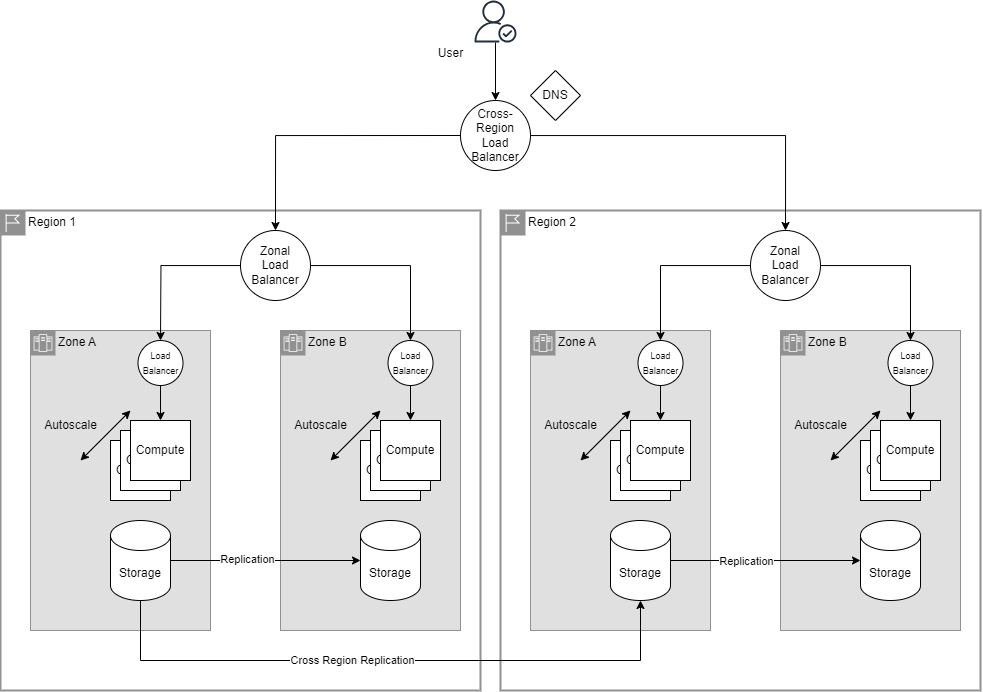
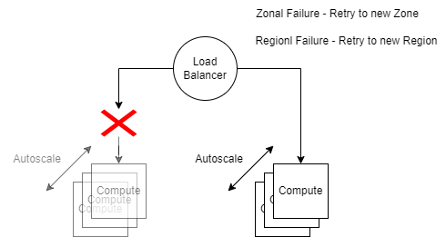
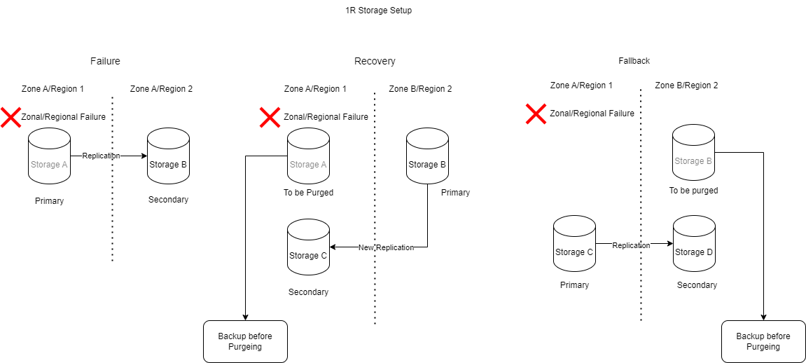
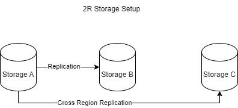

+++
title = "Ensuring Resiliency: High Availability and Disaster Recovery Strategies"
date = "2024-06-12T10:06:10+01:00"
tags = [ "architecture", "enterprise", "high availability", "disaster recovery" ]
author = "Me"
showToc = true
TocOpen = false
draft = false
hidemeta = false
comments = false
disableShare = false
disableHLJS = false
hideSummary = false
searchHidden = true
ShowReadingTime = true
ShowBreadCrumbs = true
ShowShareButtons = true
ShowPostNavLinks = true
ShowWordCount = true
ShowRssButtonInSectionTermList = true
UseHugoToc = true

[cover]
image = "./cover.png"
alt = "Image"
caption = "Guidlines for HA and DR"
relative = false
hidden = false
+++

**High Availability (HA)** and **Disaster Recovery (DR)** are critical strategies in cloud computing to ensure services are continuously available and resilient against failures.

## Designing HA & DR

Most of the services can be differentiated as compute and storage; these are the two key components when building resilient software architectures. Here is a generic diagram for HA and DR.

### HA Key Components

- **Auto-Scaling**: Adjusts the number of instances based on traffic demands.
- **Load Balancing**: Distributes incoming traffic across multiple instances.
- **Redundancy**: Duplication of critical components to prevent single points of failure.

### DR Key Components

- **Backup and Restore**: Regular data backups and efficient restore processes.
- **Replication**: Real-time data replication across different locations.
- **Failover Mechanisms**: Automatic switch to a standby system in case of failure.

## Handling Compute Failure

### Regional Failure

- **Solution**: Use a **cross-region load balancer**.
- **Action**: When a regional failure occurs, the request is automatically routed to another region.

### Zonal Failure

- **Solution**: Use a **zonal load balancer**.
- **Action**: In the event of a zonal failure, the request is redirected to another zone within the same region.

### Instance Failure

- **Solution**: Use an **internal load balancer**.
- **Action**: If an instance fails, the request is routed to another instance within the same zone. This is where **autoscaling** becomes very useful, as it can automatically adjust the number of instances based on demand.

## Choosing the Right Service for Resiliency

When it comes to cloud services, it’s essential to select the right tools to maximize resiliency while minimizing manual management. Here’s a review of some GCP services:

### Compute Engine

- **Capabilities**: Cannot automatically manage regional, zonal, or instance failures.
- **Management**: Requires a significant amount of manual intervention to handle failures.

### Kubernetes Engine

- **Capabilities**: Can manage **instance failures** by rerouting requests to a new instance.
- **Management**: Partially automates failure management but still requires some manual setup for higher-level failures.

### Cloud Run and Cloud Functions

- **Capabilities**: Can automatically manage **zonal failures**.
- **Management**: Highly automated, reducing the need for manual intervention and making them ideal for serverless applications.

## Handling Storage Failure

Storage can encompass various types, such as disks, databases, and object stores. Let's consider a single replication setup for a storage mechanism.

### Setup

- **Primary Storage (A)**: The main storage location.
- **Secondary Storage (B)**: A replicated copy in a different zone/region.

### Failure Scenario

- **Failure**: If Storage A fails, Storage B becomes the primary storage. At this point, replication is not active, and Storage A reaches a stale state.

### Recovery Process

- **Step 1**: Set up a new replication, Storage C, in the original zone/region once it’s back online.
- **Step 2**: Backup Storage A before purging it.
- **Step 3**: For zonal failures, consider regional backups. For regional failures, multi-regional backups are advisable.

> The new replication Storage C can be in an entirely new zone or region for simplicity that is ommited.

### Fallback

- **Step 1**: When reverting to the original region, create a replication from Storage C to Storage D.
- **Step 2**: Purge Storage B.
- **Step 3**: Return to the initial state with the new replication setup.

This simplified version of disaster recovery highlights the importance of backups and replication. More complex systems might involve both zonal and cross-regional replication to provide redundancy.

I will let the readers think about the HA and DR plans for these cases.

## Review of GCP Storage Solutions

### Cloud Storage

- **High Availability**: Offers multiple storage classes with options for regional and multi-regional availability.
- **Disaster Recovery**: Supports cross-region replication, ensuring data is backed up in multiple locations.

### Cloud SQL

- **High Availability**: Provides automatic failover and high availability configurations.
- **Disaster Recovery**: Includes automated backups and point-in-time recovery to protect against data loss.

### Cloud Spanner

- **High Availability**: Ensures global availability with synchronous replication.
- **Disaster Recovery**: Maintains data consistency and availability across regions, making it resilient against regional failures.

### Firestore

- **High Availability**: Manages real-time data with automatic scaling across multiple regions.
- **Disaster Recovery**: Offers strong consistency and automated multi-region replication for data protection.

## Leveraging SaaS Solutions for Resiliency

For maximum ease and reliability, consider using **Software as a Service (SaaS)** solutions. SaaS offerings such as Google Workspace or BigQuery eliminate the need for manual management of infrastructure, as provider handles all aspects of high availability and disaster recovery. These services are designed to be highly resilient, with built-in redundancy, automatic failover, and regular backups, ensuring that your applications and data remain available and secure with minimal effort on your part.

## Best Practices for High Availability and Disaster Recovery

To ensure the highest level of resiliency with applications:

1. **Use Managed Services**: Wherever possible, use managed services like Cloud Run and Cloud Functions to handle failures automatically.
2. **Deploy Across Multiple Regions**: Distribute your applications and data across multiple regions to safeguard against regional failures.
3. **Implement Load Balancers**: Utilize load balancing solutions to handle traffic rerouting efficiently during failures.
4. **Regularly Test Failover Mechanisms**: Conduct routine tests to ensure that your HA and DR strategies are functioning correctly.

## Conclusion

Ensuring the resiliency of your cloud services through effective high availability and disaster recovery strategies is paramount. On-premise environments often face significant complexity and challenges in implementing HA and DR, such as the need for extensive manual intervention, high costs, and difficulty in scaling. By leveraging the right tools, deploying across multiple regions, and utilizing automated solutions such as SaaS offerings, organizations can simplify these processes, minimize downtime, and protect against data loss. Regularly testing failover mechanisms and adopting best practices will further enhance the robustness of your cloud infrastructure, ensuring continuous availability and reliability.
