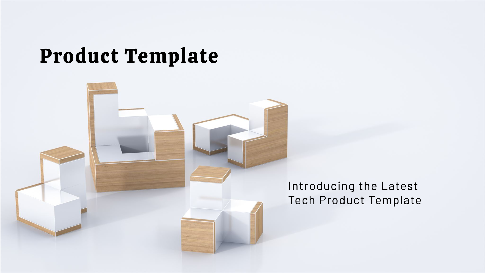

+++
title = "Product Template - Documentation"
date = "2024-06-25T10:06:10+01:00"
tags = [ "enterprise", "product", "template" ]
author = "Me"
showToc = true
TocOpen = false
draft = false
hidemeta = false
comments = false
disableShare = false
disableHLJS = false
hideSummary = false
searchHidden = true
ShowReadingTime = true
ShowBreadCrumbs = true
ShowPostNavLinks = true
ShowWordCount = true
ShowRssButtonInSectionTermList = true
UseHugoToc = true

[cover]
image = "./cover.jpeg"
alt = "Image"
caption = "Product Template - Documentation"
relative = false
hidden = false
+++

Tech Product Documentation Template serves as a comprehensive framework for organizing and communicating essential information about a technology product. It provides a structured approach to capturing the product's purpose, functionality, technical specifications, and operational requirements. This documentation not only outlines how the product works but also guides users on its installation, configuration, and usage.

By detailing everything from system requirements and architecture to deployment procedures and support channels, this template ensures that stakeholders—from developers and IT teams to end-users and managers—have a clear understanding of the product's capabilities and how to interact with it effectively. It facilitates consistency in development and deployment processes, promotes adherence to regulatory and compliance standards, and supports ongoing maintenance and support efforts.

Overall, the template acts as a vital tool for enhancing transparency, collaboration, and operational efficiency across all stages of the product lifecycle, from initial development to ongoing support and updates.

# Tech Product Documentation Template

## 1. Product Overview

### 1.1 Product Name

- **Name:** Placeholder for the specific name of the product.

### 1.2 Product Description

- **Description:** Brief overview describing the purpose and functionality of the product.

### 1.3 Key Features

- **Feature 1:** Detailed description of a significant feature or capability of the product.
- **Feature 2:** Description of another key feature that enhances the product's value.
- **Feature 3:** Explanation of an additional feature contributing to the product's utility.

### 1.4 Target Audience

- **Primary Audience:** Description of the main user group or demographic the product is designed for.
- **Secondary Audience:** Mention of secondary users or stakeholders who may also benefit from the product.

## 2. Technical Specifications

### 2.1 System Requirements

- **Operating System:** Specific operating systems supported by the product.
- **Hardware Requirements:** Minimum hardware specifications necessary to run the product effectively.
- **Software Requirements:** List of essential software components required for the product's operation.

### 2.2 Architecture

- **Architecture Overview:** High-level description of the system's architecture, outlining its components and how they interact.
- **Diagrams:** Links to visual representations (e.g., diagrams, charts) illustrating the system architecture for better understanding.

### 2.3 Technologies Used

- **Front-end Technologies:** List of technologies employed in the product's user interface.
- **Back-end Technologies:** Technologies utilized in the product's server-side or core functionality.
- **Databases:** Mention of databases utilized for storing and managing data within the product.
- **Other Tools and Services:** Any additional tools or services integrated into the product's development or deployment process.

### 2.4 Code Links

- **Repository:** Link to the source code repository where the product's codebase is stored and managed.
- **Branching Strategy:** Explanation of the strategy used for branching and managing code versions within the repository.

## 3. Requirements

### 3.1 Functional Requirements

This section outlines the expected functionalities that the product should be capable of performing to meet user needs and specifications.

### 3.2 Non-functional Requirements

These requirements focus on the performance, security, usability, reliability, scalability, and maintainability aspects that the product should adhere to, ensuring it meets quality attributes beyond mere functionality.

### 3.3 Regulatory and Compliance Requirements

Here, the section covers the regulatory standards, legal requirements, and compliance obligations that the product must satisfy to ensure it meets industry-specific guidelines and laws.

## 4. Installation / Deployment

### 4.1 Pre-requisites

- **Software Dependencies:** List the software components or libraries required for the product to function properly.
- **Hardware Dependencies:** Specify the hardware requirements needed to support the product's operation.

### 4.2 Configuration

- **Configuration Files:** Provide a list of configuration files used by the product, including their purposes and locations.
- **Environment Variables:** Describe the essential environment variables that need to be configured for the product to function correctly.

### 4.3 Steps

This section outlines the general process and considerations for deploying the product. It typically includes:

- Initial setup and preparation steps.
- Configuration of necessary resources and environments.
- Installation of the product and any required components.
- Validation or testing procedures post-deployment to ensure functionality.

## 5. Usage Guide

### 5.1 Getting Started

- **Quick Start:** Provide steps for users to quickly set up and start using the product.

### 5.2 Detailed Usage

Explain how to effectively utilize features in the product, including any specific instructions or tips to achieve desired outcomes.

- **Feature 1**
- **Feature 2**
- **Feature 3**

### 5.3 Best Practices

Describe recommended approaches or methods (best practices) for using the product efficiently, enhancing the user experience.

- **Best Practice 1**
- **Best Practice 2**

## 6. Monitoring and Testing

### 6.1 Monitoring

- **Monitoring Tools:** List the tools used to monitor the product's performance and health.
- **Metrics to Monitor:** Specify the key metrics that are monitored to ensure the product operates within acceptable parameters.

### 6.2 Testing

- **Testing Strategy:** Provide an overview of the approach taken to test the product, ensuring reliability and functionality.
- **Test Cases:** Outline the key test cases designed to validate different aspects of the product's functionality and performance.
- **Automated Tests:** Describe the automated testing processes implemented to streamline testing efforts and improve efficiency.

## 7. Disaster Recovery

### 7.1 Backup Strategy

- **Backup Frequency:** Specify how often backups are performed to ensure data integrity and recovery readiness.
- **Backup Locations:** Describe where backups are stored, ensuring redundancy and accessibility in case of data loss.

### 7.2 Recovery Steps

1. **Step 1:** Outline the first critical action taken during the recovery process.
2. **Step 2:** Detail the subsequent steps required to restore operations or data.
3. **Step 3:** Describe the final steps to fully recover and verify the system's functionality.

### 7.3 Business Continuity Plan

- **Plan Overview:** Provide an overview of the business continuity plan, outlining strategies to maintain essential functions during disruptions.
- **Roles and Responsibilities:** List the roles and their responsibilities during implementation of the business continuity plan, ensuring clarity and coordination.

## 8. ITSM Process and Procedures

### 8.1 Incident Management

- **Incident Reporting:** Describe how incidents are reported within the organization, including who should report them and through what channels.
- **Incident Resolution:** Explain the steps taken to resolve incidents, detailing the roles involved and the escalation process if needed.

### 8.2 Change Management

- **Change Request Process:** Outline how change requests are submitted, reviewed, and approved, including any documentation required.
- **Approval Workflow:** Describe the workflow followed for approving changes, specifying the roles responsible for each stage of approval.

### 8.3 Problem Management

- **Problem Identification:** Explain how problems are identified and categorized within the ITSM framework, including the tools or methods used.
- **Problem Resolution:** Detail the process followed to investigate and resolve problems, including root cause analysis and preventive actions.

## 9. Troubleshooting

### 9.1 Common Issues

Provide a description of a common issue that users may encounter with the product and its corresponding solution.

- **Issue 1**
- **Issue 2**
- **Issue 3**

### 9.2 FAQ

Answer a frequently asked question about the product.

- **Question 1**
- **Question 2**
- **Question 3**

## 10. Maintenance and Support

### 10.1 Maintenance Schedule

- **Routine Maintenance:** Describe the regular maintenance tasks performed to ensure the product's optimal performance and reliability.
- **Critical Updates:** Outline the process for implementing critical updates, including how and when these updates are communicated to users.

### 10.2 Support

- **Support Channels:** List the available support channels (e.g., email, phone, chat) through which users can get help.
- **Contact Information:** Provide contact details for accessing support, including any specific instructions or hours of availability.

## 11. Licensing and Legal

### 11.1 License

- **License Type:** Describe the type of license under which the product is distributed, including any key terms and conditions.

### 11.2 Terms of Service

- **Terms:** Provide a link to the terms of service, detailing the legal agreements between the service provider and the user.

### 11.3 Privacy Policy

- **Privacy Policy:** Provide a link to the privacy policy, outlining how user data is collected, used, and protected.

## 12. References

Provide a description and link to references, which could include technical papers, industry standards, or relevant articles to the product.

- **Reference 1:** [Description and link to reference 1]
- **Reference 2:** [Description and link to reference 2]
- **Reference 3:** [Description and link to reference 3]

## 13. Additional Resources

### 13.1 Documentation

- **User Manual:** Provide a link to the user manual, which includes detailed instructions on how to use the product.
- **API Documentation:** Provide a link to the API documentation, which includes information on how to integrate with and use the product's API.

### 13.2 Community

- **Forum:** Provide a link to the community forum where users can ask questions, share experiences, and get support from other users.
- **Social Media:** Provide links to the product's social media channels for updates, news, and community engagement.

## 14. Access Requests

### 14.1 Request Process

- **Request Form:** Provide a link to the form that users must fill out to request access to the product or system.
- **Approval Process:** Describe the steps involved in the approval process for access requests, including any necessary reviews and authorizations.
- **Roles and Permissions:** List and describe the various roles within the system and the permissions associated with each role, detailing what access each role grants.

## 15. RACI Matrix

### 15.1 RACI for Key Processes

- Process: The name or description of the process.
- Responsible: The team or individual responsible for executing the process.
- Accountable: The person or role accountable for the process outcome.
- Consulted: The stakeholders consulted during the process.
- Informed: The stakeholders informed about the process progress and outcomes.

| **Process** | **Responsible** | **Accountable** | **Consulted** | **Informed** |
| ----------- | --------------- | --------------- | ------------- | ------------ |
| Process 1   | [Role/Team]     | [Role/Team]     | [Role/Team]   | [Role/Team]  |
| Process 2   | [Role/Team]     | [Role/Team]     | [Role/Team]   | [Role/Team]  |
| Process 3   | [Role/Team]     | [Role/Team]     | [Role/Team]   | [Role/Team]  |

## 16. Escalation Matrix

### 16.1 Incident/Change/Problem Escalation

| **Level** | **Description** | **Contacts**   |
| --------- | --------------- | -------------- |
| Level 1   | [Description]   | [Contact info] |
| Level 2   | [Description]   | [Contact info] |
| Level 3   | [Description]   | [Contact info] |

---

This template not only kick-starts your product documentation process but also supports continuous improvement and adaptation as your product evolves and grows in its market presence.
